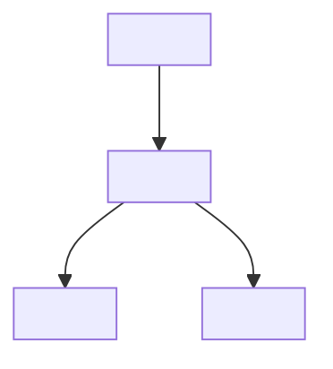
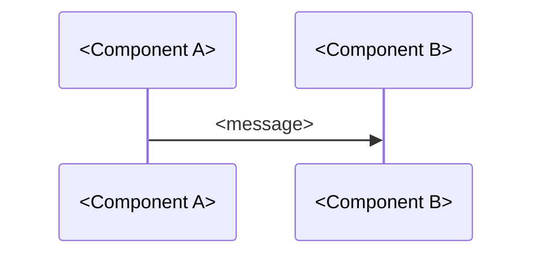

# <Repo Name> 源码学习

> 仓库：[<Repo Name>](<GitHub URL>)
> 技术栈：<Tech Stack>
> Stars: <star count>

## 仓库概览

<What this repo does, its purpose and scope>

## 架构图



## 模块职责

| 模块 | 职责 | 关键文件 |
|---|---|---|
| `<module>` | <responsibility> | `<file-path>` |

## 关键流程

### <Feature Name>



**核心代码：**

```<language>
// <file-path>:<line-range>
<key code snippet with comments>
```

## 设计决策与权衡

- <Why did authors choose this design?>
- <What trade-offs were made?>

## 与我已有知识的联系

- [[Related Note 1]] —— <connection>
- [[Related Note 2]] —— <connection>

## 待深入研究

- [ ] <Question or topic to explore further>
- [ ] <Question or topic to explore further>

## 个人思考

<My critical thinking, applications, or questions>
