# Claude Code 架构说明书

## 1. 文档目的

本文档用于系统化说明 `Claude Code`泄漏源码高度还原的架构、模块职责、启动流程、请求处理链路、工具系统、命令系统、状态管理、持久化、安全控制以及扩展方式。

这不是简单的目录介绍，而是站在“维护者 / 二次开发者 / 重构者”的视角，对整个仓库进行分层拆解。

适合以下场景：

- 你想快速理解这个仓库到底是怎么跑起来的
- 你想知道主入口、核心循环、工具系统分别在哪里
- 你准备二次开发，新增命令、工具、插件或 UI
- 你准备做结构优化，先摸清现有耦合关系
- 你想把这套项目作为自己的长期维护项目

---

## 2. 项目一句话概括

`Claude Code Aini` 是一个基于 **Bun + TypeScript + React + Ink**(从源码补环境还原的) 的终端 AI 编程助手。

它的本质不是一个“单纯调用模型 API 的 CLI”，而是一套完整的 **终端 Agent 运行时**，包含：

- 多入口 CLI
- 交互式 TUI 界面
- Headless / SDK 输出模式
- Tool Calling 工具执行系统
- Slash Command 命令系统
- MCP / LSP / Plugin / Skills 扩展机制
- 会话状态、历史、持久化、权限和安全控制
- 远程连接、工作树、任务、语音、桥接等增强能力

从架构上看，它更接近：

- **终端版智能 IDE 助手运行时**
- **可扩展的 Agent 平台内核**
- **围绕 query loop 构建的模块化 AI 编程环境**

---

## 3. 技术栈

| 类别 | 技术 | 说明 |
|------|------|------|
| 运行时 | Bun | 执行 TypeScript、加载入口、提供 `bun:bundle` 特性开关 |
| 语言 | TypeScript | 整个仓库的主语言 |
| 终端 UI | React + Ink | 用 React 方式构建 TUI |
| CLI 解析 | Commander.js | 命令行参数与子命令注册 |
| API SDK | `@anthropic-ai/sdk` | 模型调用客户端 |
| 校验 | Zod / AJV | 参数、Schema、配置校验 |
| 网络 / RPC | WebSocket / MCP / LSP | 外部工具、语言服务、远程连接 |
| 文件 / Shell | Bun + Node API + Bash/PowerShell | 文件编辑、搜索、命令执行 |
| 分析 / 实验 | GrowthBook / OpenTelemetry | 特性开关、观测、分析 |

---

## 4. 根目录关键文件

### 4.1 启动与配置

| 文件 | 作用 |
|------|------|
| `package.json` | 项目名称、版本、依赖、bin 入口、脚本定义 |
| `bin/claude-aini` | 外部 CLI 启动脚本，决定进入完整 CLI 还是降级 CLI |
| `preload.ts` | 在全局注入 `MACRO.VERSION`、`PACKAGE_URL`、`BUILD_TIME` 等元信息 |
| `.env` | 实际生效的本地环境变量配置 |
| `.env.example` | 配置模板 |
| `bun.lock` | Bun 依赖锁文件 |
| `tsconfig.json` | TypeScript 编译配置 |

### 4.2 文档

| 文件 | 作用 |
|------|------|
| `README.md` | 中文使用文档 |
| `docs/architecture.html` | 可视化架构图 |
| `docs/architecture.md` | 本文档，详细架构说明 |

---

## 5. `src/` 目录总体分层

当前仓库规模较大，`src/` 下模块数量很多：

- `components/`：大量 UI 组件
- `hooks/`：大量 React Hooks
- `commands/`：大量命令模块
- `tools/`：大量工具模块
- `services/`：外部能力与业务服务层
- `utils/`：通用工具和底层能力

从职责上，建议把 `src/` 理解为以下 9 层：

1. **入口层**
2. **启动编排层**
3. **交互与渲染层**
4. **Query Engine 核心循环层**
5. **Tool / Command 扩展层**
6. **服务集成层**
7. **状态与持久化层**
8. **安全与权限层**
9. **扩展机制层（MCP / Plugins / Skills / Agents）**

### 架构分层图

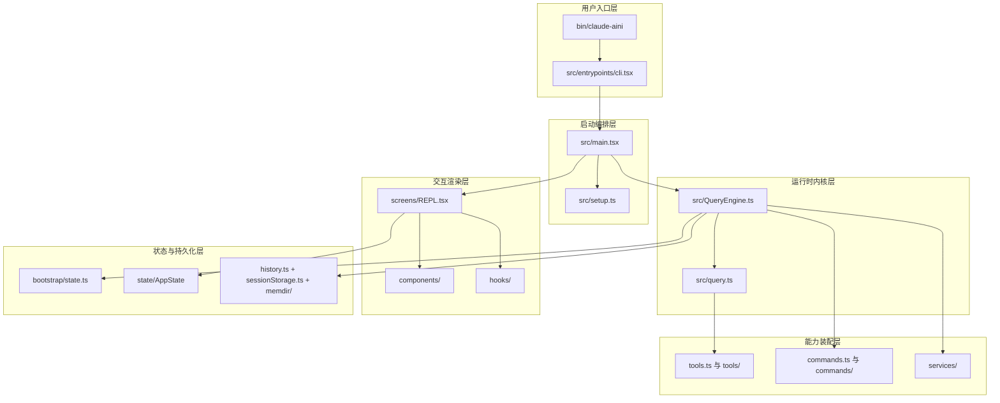

### 5.1 关键目录职责表

| 目录 / 文件 | 主要职责 |
|-------------|----------|
| `src/entrypoints/` | 各类入口逻辑 |
| `src/main.tsx` | 最大的主编排文件，负责 CLI、初始化、模式分流、REPL 启动 |
| `src/setup.ts` | 会话环境准备、cwd、worktree、tmux、hook 快照等 |
| `src/QueryEngine.ts` | 会话级查询引擎，管理消息、权限、状态、转录与 query loop |
| `src/query.ts` | 底层 query 执行与 tool loop 编排 |
| `src/tools.ts` | 工具注册总入口，是工具集合的核心来源之一 |
| `src/commands.ts` | Slash Command 加载、筛选、缓存与远程模式过滤 |
| `src/screens/` | 大型界面屏幕，尤其是 `REPL.tsx` |
| `src/components/` | 终端 UI 组件 |
| `src/hooks/` | 输入、语音、IDE、远程连接、权限等大量行为 Hook |
| `src/services/` | API、MCP、LSP、插件、分析、远程配置、语音等服务 |
| `src/state/` | 运行时状态结构 |
| `src/history.ts` | 历史输入记录与读取 |
| `src/memdir/` | 会话记忆目录与记忆提示相关逻辑 |
| `src/migrations/` | 配置 / 会话迁移 |
| `src/skills/` | 技能加载与内置技能 |
| `src/bridge/` / `src/server/` / `src/remote/` | 远程连接、桥接、服务端相关能力 |

---

## 6. 启动链路：从命令到界面

这是整个项目最重要的一条主线。

### 6.1 Shell 启动脚本：`bin/claude-aini`

`bin/claude-aini` 是用户直接执行的命令入口。

它做的事情很简单，但非常关键：

1. 切到项目根目录
2. 检查 `CLAUDE_CODE_FORCE_RECOVERY_CLI`
3. 如果开启，则执行 `src/localRecoveryCli.ts`
4. 否则走完整入口 `src/entrypoints/cli.tsx`

核心行为可以概括为：

```bash
./bin/claude-aini
  -> bun --env-file=.env ./src/entrypoints/cli.tsx
```

降级模式：

```bash
CLAUDE_CODE_FORCE_RECOVERY_CLI=1 ./bin/claude-aini
  -> bun --env-file=.env ./src/localRecoveryCli.ts
```

### 6.2 Bun 预加载：`preload.ts`

`preload.ts` 负责向 `globalThis.MACRO` 注入构建元信息，包括：

- `VERSION`
- `PACKAGE_URL`
- `NATIVE_PACKAGE_URL`
- `BUILD_TIME`
- `FEEDBACK_CHANNEL`

这类信息通常会被界面层、版本展示、日志、诊断或更新提示使用。

### 6.3 真正的 CLI 分发入口：`src/entrypoints/cli.tsx`

`cli.tsx` 的定位不是“完整业务入口”，而是**早期分发器**。

它会先做一批 **fast-path** 判断，把一些特定命令提前拦截掉，避免加载完整的主程序：

- `ps / logs / attach / kill / --bg / --background`
- 模板任务相关命令
- `environment-runner`
- `self-hosted-runner`
- `--worktree --tmux` 组合的快速跳转
- `--update / --upgrade` 纠正为 `update` 子命令

也就是说：

- 不是所有命令都会走完整的 `main.tsx`
- `cli.tsx` 先承担“命令路由分流”的职责
- 真正复杂的启动编排主要在 `main.tsx`

### 6.4 主编排层：`src/main.tsx`

`main.tsx` 是整个仓库最核心、最重的文件之一。

它做的事情非常多，可以理解为 **系统总调度中心**。

在当前实现里，它至少承担了以下职责：

- 启动阶段性能打点
- 提前触发 MDM / Keychain 等预取
- 提前解析 settings 标志位
- 执行 `init()` 初始化
- 读取和应用环境 / 配置 / 认证 / 远程设置
- 初始化工具权限上下文
- 初始化 bundled plugins / bundled skills
- 调用 `setup()` 做当前会话环境准备

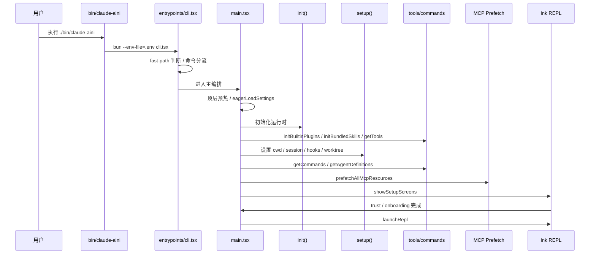

### 6.5 `main.tsx` 的启动阶段划分

可以把 `main.tsx` 的启动过程理解为 7 个阶段：

- **阶段 A**：顶层预热与 startup profiling
- **阶段 B**：尽早解析 settings 与环境参数
- **阶段 C**：执行 `init()` 建立运行时底座
- **阶段 D**：初始化 tools / plugins / skills / commands
- **阶段 E**：执行 `setup()` 准备 session 环境
- **阶段 F**：执行 trust / onboarding / setup screens
- **阶段 G**：进入最终模式，例如 `launchRepl()`、print、remote、server

---

## 7. `setup.ts`：运行环境准备层

`setup.ts` 负责在真正对话开始前准备运行前提。它的职责主要包括：

- **基础环境检查**：如 Node.js 版本检查
- **session 初始化**：处理 `customSessionId` 和 session 切换
- **消息通道准备**：非 bare 模式下初始化 UDS messaging
- **teammate 快照**：为 swarm / teammate 语义提供基础上下文
- **终端环境恢复**：恢复 iTerm2 / Terminal.app 备份状态
- **工作目录设置**：设置 `cwd`、`originalCwd`、`projectRoot`
- **recovery 快速返回**：在最小模式下缩短启动路径
- **hook 与 watcher 初始化**：捕获 hook 快照、监听文件变化
- **worktree / tmux 创建**：为隔离会话准备独立工作环境

---

## 8. 运行模式总览

这个项目不是单模式 CLI，而是多模式运行时：

- **Interactive TUI 模式**：完整 Ink 界面，主工作台是 `REPL.tsx`
- **Headless / Print 模式**：适合脚本、CI、自动化调用
- **Local Recovery CLI 模式**：基于 `localRecoveryCli.ts` 的降级交互
- **MCP Server 模式**：对外暴露 MCP 能力
- **Remote / Server / SSH 模式**：支持 `server`、`open`、`ssh`、`assistant`、`remote-control`

---

## 9. 系统总分层图（Markdown 版）

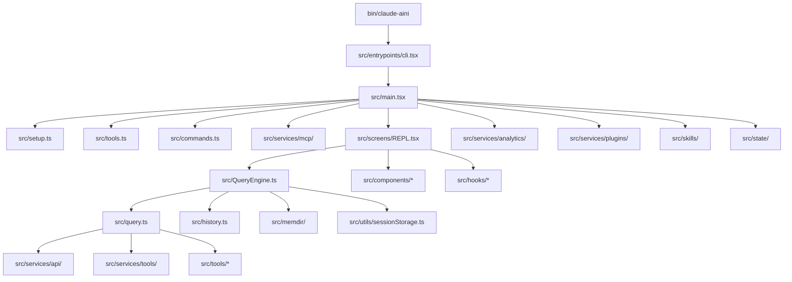

---

## 10. Query Engine：系统真正的对话内核

`QueryEngine.ts` 管理的是单个 conversation 的执行生命周期，而不是整个程序的启动过程。

它的职责包括：

- 持有消息链和 turn 状态
- 管理 read file cache
- 记录 permission denials
- 汇总 usage / cost
- 组装系统提示词相关上下文
- 调用 `query()` 进入底层循环
- 持续写入 transcript

如果 `main.tsx` 是总调度中心，那么 `QueryEngine` 就是会话执行控制器。

---

## 11. `query.ts`：底层 Query Loop 编排

`query.ts` 更像执行层心脏，负责连接：

- 模型请求
- tool loop
- token / budget 控制
- attachment 处理
- stop hooks / post-sampling hooks
- compact / snip / summary 等 feature-gated 能力

这意味着系统真正的“连续思考-调用工具-继续思考”循环，是在这一层被组织起来的。

---

## 12. 输入处理链路

用户输入并不会直接送往模型，而是先经过规范化和前置处理。

典型输入来源包括：

- REPL 输入框
- `-p/--print` prompt
- stdin
- 远程连接
- slash commands

`processUserInput(...)` 这类逻辑通常负责：

- slash command 解析
- pasted content / attachment 处理
- 消息数组改写
- 模型或局部配置调整

---

## 13. Tool 系统：模型能力执行层

Tool 系统可以分成 4 层：

1. **协议层**：`Tool.ts`
2. **注册层**：`tools.ts`
3. **执行编排层**：`services/tools/*`
4. **具体实现层**：`tools/<ToolName>/`

`tools.ts` 会按 feature、env、user type 裁剪当前可见工具集。真正执行时，一般会经过：

- `query.ts`
- `toolOrchestration.ts`
- `toolExecution.ts`
- 具体工具实现

这种分层有利于统一权限、并发、telemetry 和 hooks 管理。

---

## 14. Command 系统：交互命令层

Command 系统至少有两层：

- **CLI 子命令**：由 `main.tsx` 中的 Commander 注册，决定入口模式
- **REPL Slash Commands**：由 `commands.ts` 和 `commands/*` 提供，控制当前会话行为

### 命令系统注册图

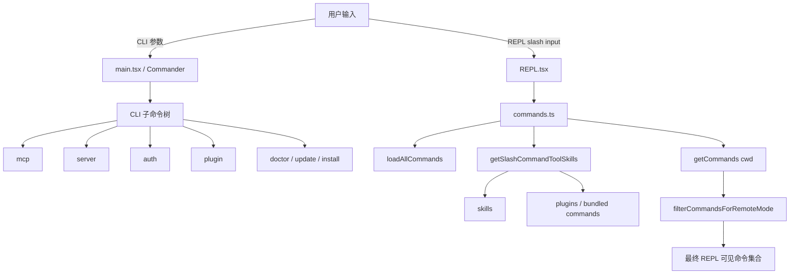

命令集合的真实可见性，还会受到 cwd、settings、auth、plugins、skills、remote mode 的共同影响。

---

## 15. UI 层：REPL / Components / Hooks / Ink

UI 层是这个仓库里非常重的一层：

- `REPL.tsx`：主工作台，整合输入框、消息列表、状态栏、快捷键、dialog
- `components/`：负责消息、输入、状态、diff、markdown、弹窗等渲染组件
- `hooks/`：负责输入、历史、权限、IDE、远程、语音、任务等交互逻辑
- `ink/`：终端渲染基础设施

---

## 16. 服务层：`src/services/`

服务层承担外部能力和跨模块公共业务。

### 16.1 API 服务

`services/api/` 主要负责：

- bootstrap
- files API
- 模型调用与日志
- dump prompts

### 16.2 MCP 服务

`services/mcp/` 负责：

- server 配置
- 连接管理
- 工具 / 命令 / 资源提取
- 资源预取
- 官方 registry 预取

`main.tsx` 中会显式接入：

- `getMcpToolsCommandsAndResources(...)`
- `prefetchAllMcpResources(...)`
- `prefetchOfficialMcpUrls()`

### MCP 接入图

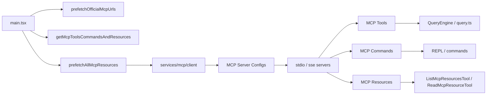

### 16.3 Analytics / Feature Gate

`services/analytics/` 负责 analytics sink、GrowthBook、gate 初始化和事件上报。

### 16.4 插件与扩展服务

还能看到：

- `plugins/`
- `oauth/`
- `lsp/`
- `remoteManagedSettings/`
- `policyLimits/`
- `settingsSync/`

### 16.5 Voice / SessionMemory / Compact

系统还具备：

- `voice`
- `SessionMemory`
- `compact`

---

## 17. 状态管理与持久化

状态与持久化并不在单一 store 中，而是分层存在：

- **进程级全局状态**：`bootstrap/state.ts`
- **UI 状态**：`src/state/` + AppState store
- **历史 / transcript / memory**：`history.ts`、`sessionStorage.ts`、`memdir/`

---

## 18. 请求处理全链路

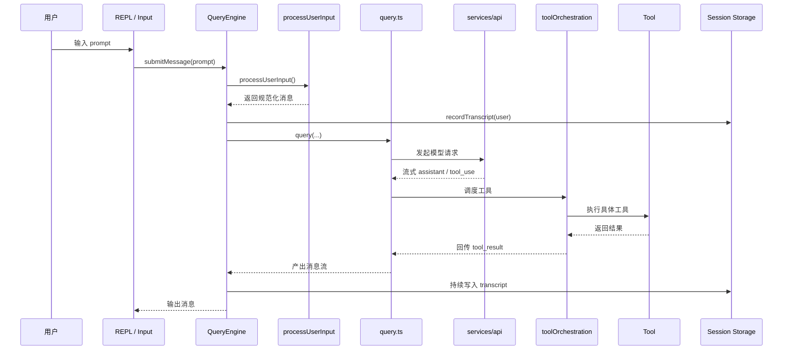

---

## 19. Feature Flags：隐藏但重要的一层架构

这个项目大量使用：

- `feature('KAIROS')`
- `feature('PROACTIVE')`
- `feature('DIRECT_CONNECT')`
- `feature('WORKFLOW_SCRIPTS')`
- `feature('COORDINATOR_MODE')`

这意味着真实能力面并不是固定的，而是会受到构建条件、环境变量、用户类型、auth 和 settings 的共同影响。

---

## 20. 安全与权限控制

对 Agent CLI 来说，安全不是附属能力，而是主流程的一部分。

### 20.1 工具权限上下文

`main.tsx` 负责初始化权限上下文，`QueryEngine` 会把 `canUseTool` 注入 query loop，运行时每次工具调用都可能重新判定。

### 权限判定流程图

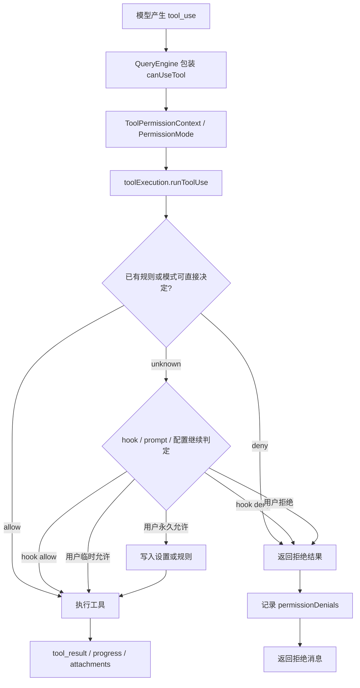

### 20.2 Permission Modes

常见模式包括：

- `default`
- `plan`
- `auto`
- `bypass`

### 20.3 Bash / Shell 安全

BashTool 不是简单执行 shell，而是受权限与安全约束控制。

### 20.4 Trust Gate

项目目录在 trust 建立前不应过早影响系统行为，这是工作区安全边界的一部分。

### 20.5 Remote / MCP 安全边界

某些命令会直接读取 `.mcp.json` 或跳过 trust dialog，因此只能在可信目录中使用。

---

## 21. Skills / Plugins / MCP / Agents：扩展能力层

这部分决定了项目为什么是一套可扩展运行时，而不是固定功能的机器人。

### 21.1 Skills

`src/skills/` 包含：

- `bundled/`
- `bundledSkills.ts`
- `loadSkillsDir.ts`
- `mcpSkillBuilders.ts`

### 21.2 Plugins

Plugins 贯穿：发现、安装、启用/禁用、市场源、运行时加载、命令和工具注入。

### 21.3 MCP

MCP 可以向系统注入 tools、commands 和 resources。

### 21.4 Agents / Teams / Coordinator

系统已经具备：

- agent 定义
- teammate / team
- coordinator mode
- send message / brief / workflow / task 等协作能力

### 多 Agent / Worktree 协作图

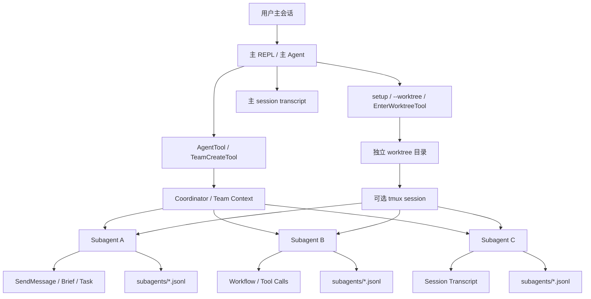

### 扩展体系关系图

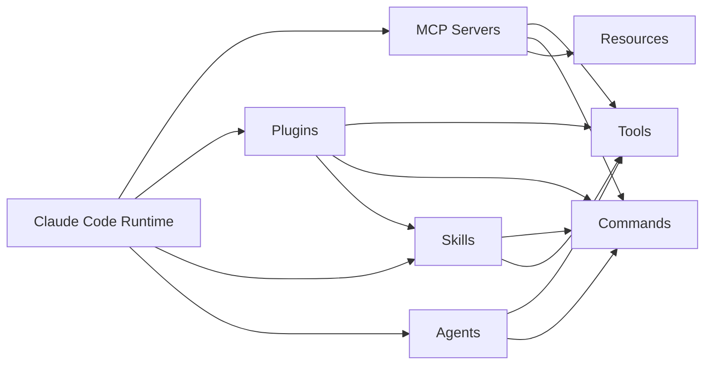

---

## 22. 为什么 `main.tsx` 和 `REPL.tsx` 是两个高耦合中心

从代码规模和职责上看，当前仓库最值得重点关注的两个中心文件是：

- `src/main.tsx`
- `src/screens/REPL.tsx`

### 22.1 `main.tsx` 的问题与价值

它的价值在于：

- 所有运行模式最终几乎都会在这里汇合或分流
- 你要理解系统启动过程，绕不开它

它的问题在于：

- 职责很多
- 模式分支多
- feature gate 多
- 很容易成为“系统总线式巨石文件”

### 22.2 `REPL.tsx` 的问题与价值

它的价值在于：

- 承载了用户最核心的交互体验
- 是 UI、状态、命令、工具反馈、快捷键等多种行为的汇合点

它的问题在于：

- 极易演化为巨型交互控制器
- UI 逻辑与业务联动复杂

### 22.3 对后续重构的建议

如果未来你想继续长期维护，最值得优先做的结构优化方向通常是：

1. 把 `main.tsx` 再拆成多个启动阶段模块
2. 把 `REPL.tsx` 的交互逻辑进一步下沉到 hooks / controllers
3. 把 query loop、tool orchestration、UI 状态边界再明确化
4. 把 feature-gated 分支集中归档，减少散落在全局的条件逻辑

---

## 23. 推荐的阅读顺序

如果你准备继续维护这个仓库，推荐按下面顺序阅读。

### 第一轮：看全局主线

1. `bin/claude-aini`
2. `preload.ts`
3. `src/entrypoints/cli.tsx`
4. `src/main.tsx`
5. `src/setup.ts`

### 第二轮：看核心运行时

6. `src/QueryEngine.ts`
7. `src/query.ts`
8. `src/Tool.ts`
9. `src/tools.ts`
10. `src/commands.ts`

### 第三轮：看交互层

11. `src/screens/REPL.tsx`
12. `src/components/Messages.tsx`
13. `src/components/TextInput.tsx`
14. `src/hooks/useCanUseTool.tsx`
15. `src/hooks/useTypeahead.tsx`

### 第四轮：看服务与持久化

16. `src/services/api/`
17. `src/services/mcp/`
18. `src/history.ts`
19. `src/memdir/`
20. `src/utils/sessionStorage.ts`

---

## 24. 二次开发入口指南

### 24.1 新增一个 Tool

通常需要经过这些位置：

1. 在 `src/tools/<YourTool>/` 下实现工具
2. 按 `Tool.ts` 协议暴露必要字段和行为
3. 在 `src/tools.ts` 中注册到工具集合
4. 根据需要增加 feature gate 或权限策略
5. 让 query loop 能看到它

### 24.2 新增一个 Slash Command

通常需要：

1. 在 `src/commands/` 下新增实现
2. 在 `src/commands.ts` 汇总导入
3. 让 `getCommands(cwd)` 能返回它
4. 如涉及远程模式，考虑是否需要加入远程安全过滤

### 24.3 新增一个 Commander 子命令

通常需要：

1. 在 `src/main.tsx` 注册 `program.command(...)`
2. 指向对应 handler
3. 若适合 fast-path，考虑是否提前在 `cli.tsx` 分流

### 24.4 新增一个 Skills 能力

通常需要：

1. 在 `src/skills/bundled/` 中增加内置技能
2. 或接入外部 skills 目录加载流程
3. 或通过 MCP builder 生成技能
4. 确保命令系统 / tool skills 能识别它

### 24.5 新增一个 UI 模块

通常需要：

1. 在 `components/` 中添加渲染组件
2. 在 `hooks/` 中抽离交互逻辑
3. 在 `REPL.tsx` 或相关 dialog launcher 接入

---

## 25. 功能模块总结

可以把整个仓库最终总结成下面这几个大模块：

| 模块 | 代表文件/目录 | 核心职责 |
|------|---------------|----------|
| 启动入口 | `bin/claude-aini`、`entrypoints/cli.tsx` | 接收命令、分流入口 |
| 主编排 | `main.tsx` | 初始化、模式判断、资源准备、进入主界面 |
| 运行环境准备 | `setup.ts` | cwd、session、worktree、hook、tmux 等 |
| 会话内核 | `QueryEngine.ts` | 单会话执行状态与 query 调度 |
| 查询循环 | `query.ts` | 模型循环、工具执行、hook、预算控制 |
| 工具系统 | `Tool.ts`、`tools.ts`、`tools/*` | 提供 Agent 可调用能力 |
| 命令系统 | `commands.ts`、`commands/*` | 用户交互命令、会话控制 |
| UI 层 | `screens/`、`components/`、`hooks/` | 终端界面与交互逻辑 |
| 服务层 | `services/*` | API、MCP、LSP、插件、分析、语音等 |
| 持久化层 | `history.ts`、`memdir/`、`sessionStorage.ts` | 历史、转录、记忆、恢复 |
| 安全层 | permissions / trust / bash security | 控制自动化边界与风险 |
| 扩展层 | skills / plugins / MCP / agents | 让系统可持续扩展 |

---

## 26. 结论

`Claude Code Aini` 的架构不是“一个调用模型 API 的小工具”，而是一套相当完整的终端 Agent 运行时。

它的核心架构特点可以概括为：

### 26.1 优点

- 分层比较明确
- 工具系统可扩展
- 命令系统可扩展
- 支持多种运行模式
- 有完整的会话、历史、记忆、恢复链路
- 有权限、安全、信任边界设计
- 有 MCP / Plugins / Skills / Agents 等长期扩展能力

### 26.2 复杂度来源

- `main.tsx` 与 `REPL.tsx` 职责非常重
- feature gate 多，真实能力面动态变化
- 远程、MCP、插件、agent、voice、worktree 等能力叠加后路径很多
- 配置、权限、上下文、记忆、工具之间存在较强联动

### 26.3 维护建议

如果后续继续长期维护，最重要的三件事通常是：

1. 继续强化分层边界
2. 控制主编排文件继续膨胀
3. 明确“启动层 / query 层 / UI 层 / 扩展层”的依赖方向

---

## 27. 与可视化架构图配合阅读

如果你已经打开了：

- `docs/architecture.html`

建议这样配合阅读：

- 先看 HTML 图，建立视觉分层印象
- 再看本文档，理解每一层具体职责
- 最后按“推荐阅读顺序”去源码里逐个对照

这样你会非常快地把整个仓库吃透。

---

## 28. 目录级模块地图（更细粒度）

前面的章节已经解释了系统分层，这里进一步把 `src/` 下的重要目录按“维护者视角”拆开，便于你在实际改代码时快速定位。

### 28.1 运行时核心目录

| 目录 / 文件 | 职责 | 维护时关注点 |
|-------------|------|--------------|
| `src/entrypoints/` | 各类入口封装 | 不同模式可能在这里做前置裁剪和分流 |
| `src/main.tsx` | 主启动编排、Commander 注册、模式路由 | 巨型入口，改动最容易产生连锁影响 |
| `src/setup.ts` | 当前会话环境准备 | `cwd`、session、hook、worktree、tmux 的关键边界都在这里 |
| `src/QueryEngine.ts` | 单会话 query 生命周期管理 | 消息流、权限、transcript、usage 汇总都从这里经过 |
| `src/query.ts` | 底层 query loop | 模型调用、工具调用回路、预算、hook 的核心执行链 |
| `src/tools.ts` | 工具能力总装配 | 工具启用条件、feature gate、环境差异都集中在这里 |
| `src/commands.ts` | slash command 汇总与动态加载 | 命令缓存、skills 注入、远程裁剪都在这里 |

### 28.2 交互与界面目录

| 目录 | 职责 | 说明 |
|------|------|------|
| `src/screens/` | 大屏级交互页面 | `REPL.tsx` 是主工作台，`Doctor.tsx`、`ResumeConversation.tsx` 是辅助屏幕 |
| `src/components/` | UI 组件库 | 消息、输入、状态栏、弹窗、差异视图、设置面板等大量组件 |
| `src/hooks/` | 交互行为层 | 输入法、键盘、工具权限、IDE 集成、远程会话、语音、任务等逻辑下沉在这里 |
| `src/ink/` | 终端渲染底层 | 对 Ink 的封装和终端控制能力，属于 TUI 根基 |

### 28.3 服务与集成目录

| 目录 | 职责 | 说明 |
|------|------|------|
| `src/services/api/` | 模型和远程 API 通信 | bootstrap、文件下载、模型请求等 |
| `src/services/mcp/` | MCP 客户端与资源整合 | 外部工具、资源、命令接入系统主循环 |
| `src/services/tools/` | Tool 编排执行层 | `toolOrchestration.ts`、`toolExecution.ts`、`StreamingToolExecutor.ts` 是工具执行栈核心 |
| `src/services/analytics/` | 观测、实验、事件上报 | GrowthBook、analytics sink、事件打点 |
| `src/services/plugins/` | 插件生命周期与能力接入 | 插件启动、管理、目录与集成逻辑 |
| `src/services/lsp/` | 语言服务相关 | LSP 集成和编辑器/语言能力扩展 |

### 28.4 数据、状态与恢复目录

| 目录 / 文件 | 职责 | 说明 |
|-------------|------|------|
| `src/bootstrap/state.ts` | 进程级全局状态 | session、cwd、成本、模型、telemetry、trust 等高优先级状态 |
| `src/state/` | React / AppState 相关状态 | UI 可观察状态存储和 provider 层 |
| `src/history.ts` | 用户历史输入记录 | 面向上箭头和搜索的历史，不等同于完整 transcript |
| `src/utils/sessionStorage.ts` | 会话 transcript 持久化 | `.jsonl` 写入、恢复、子 agent transcript、内容替换记录 |
| `src/memdir/` | 会话 memory 文件系统层 | memory prompt 与记忆目录逻辑 |
| `src/migrations/` | 配置与会话数据迁移 | 老版本结构平滑过渡 |

### 28.5 扩展与协作目录

| 目录 | 职责 | 说明 |
|------|------|------|
| `src/skills/` | 技能系统 | bundled skills、目录加载、MCP skill builders |
| `src/tools/AgentTool/` | agent 定义与加载 | agent 能力定义、颜色、元数据、目录读取 |
| `src/bridge/` | bridge / remote-control 相关 | 本地环境与远程会话桥接 |
| `src/server/` | 会话服务端 | 本地 server 模式、session manager、lockfile |
| `src/remote/` | 远程工作流 | remote session 相关支持代码 |
| `src/tasks/` | 任务运行时 | 本地 shell task、后台任务等 |

---

## 29. 启动链路时序（更细）

前面已经讲过主启动链路，这里把时序再精细化，方便你理解“某个功能为什么必须在某一步之前初始化”。

### 29.1 交互模式完整启动顺序

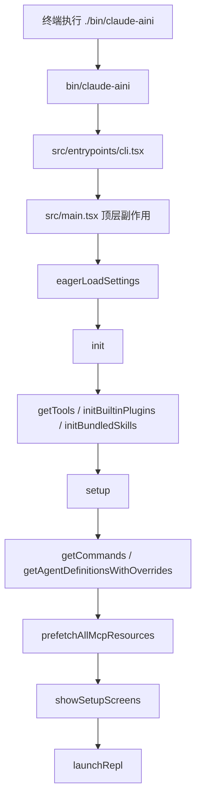

### 29.2 每一步到底在解决什么问题

#### 29.2.1 `bin/claude-aini`

- **职责**：决定走完整 CLI 还是 recovery CLI
- **关键点**：会统一带上 `--env-file=.env`

#### 29.2.2 `src/entrypoints/cli.tsx`

- **职责**：早期 fast-path 命令分流
- **关键点**：避免某些命令加载完整主程序，减少不必要的启动成本

#### 29.2.3 `src/main.tsx` 顶层副作用

- **职责**：抢时间做预热
- **关键点**：如 MDM 读取、keychain 预取、startup profiling

#### 29.2.4 `eagerLoadSettings()`

- **职责**：尽早解析 settings flag
- **关键点**：让后续初始化尽量在“已知配置”前提下运行，而不是先默认、后修正

#### 29.2.5 `init()`

- **职责**：建立更底层的运行时准备条件
- **关键点**：后续很多设置读取、环境变量应用、认证相关能力都依赖它

#### 29.2.6 `getTools()` + `initBuiltinPlugins()` + `initBundledSkills()`

- **职责**：先把系统能力面组装出来
- **关键点**：当前实现里，bundled skills/plugins 必须在某些命令加载之前完成初始化，否则命令/技能视图会缺项

#### 29.2.7 `setup()`

- **职责**：准备当前 session 的环境
- **关键点**：`cwd`、session、worktree、hook 快照、terminal backup、UDS messaging 都在这里

#### 29.2.8 `getCommands()` / `getAgentDefinitionsWithOverrides()`

- **职责**：把当前工作目录下可用的命令和 agent 定义加载出来
- **关键点**：这里已经依赖前面完成的 cwd、plugin、skill 初始化状态

#### 29.2.9 `prefetchAllMcpResources()`

- **职责**：预热 MCP tools / commands / resources
- **关键点**：非交互式模式会跳过或裁剪这一层，交互模式更依赖它来增强第一轮体验

#### 29.2.10 `showSetupScreens()`

- **职责**：处理 trust / onboarding / setup screen
- **关键点**：安全边界非常重要，很多项目级能力不应该在 trust 建立前过早生效

#### 29.2.11 `launchRepl()`

- **职责**：真正进入用户工作的主界面
- **关键点**：到这里之前，系统能力、状态、权限、命令、MCP、基础上下文都应该已经准备齐

### 29.3 交互模式与 `-p/--print` 模式的差异

| 项目 | 交互模式 | `-p/--print` |
|------|----------|--------------|
| Ink TUI | 启动 | 通常不启动完整界面 |
| Slash commands | 重要 | 弱化 |
| showSetupScreens | 会参与 | 多数路径下不会完整进入 |
| MCP 预取 | 更完整 | 更保守 |
| transcript | 依然有 | 依然有 |
| 输出形式 | TUI 消息流 | text / json / stream-json |

---

## 30. Tool 执行栈（从模型 tool_use 到结果回写）

Tool 系统不仅有“工具定义”，还存在一条很清晰的执行栈。

### Tool 执行流程图

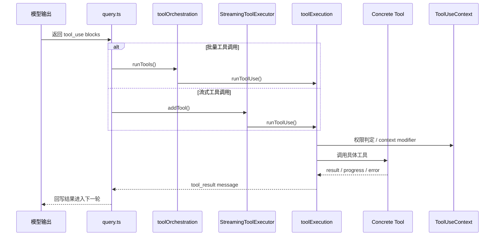

### 30.1 分层结构

```text
query.ts
  -> services/tools/toolOrchestration.ts
    -> services/tools/toolExecution.ts
      -> tools/<ConcreteTool>/...
```

如果是流式到达的工具调用，还会经过：

```text
query.ts
  -> services/tools/StreamingToolExecutor.ts
    -> services/tools/toolExecution.ts
      -> tools/<ConcreteTool>/...
```

### 30.2 `toolOrchestration.ts` 的职责

`runTools(...)` 是这一层的入口之一，它负责：

- 接收一批 `tool_use` blocks
- 根据 `isConcurrencySafe()` 对工具调用分批
- 把连续的只读 / 并发安全工具放进同一批次
- 非并发安全工具按串行执行
- 维护执行中的 tool use id 集合
- 在批次结束后统一回写 context modifier

这说明：

- 并发不是“所有工具都能一起跑”
- 并发能力由具体工具的 `isConcurrencySafe()` 决定
- tool context 的变化在并发场景下必须谨慎合并

### 30.3 `toolExecution.ts` 的职责

这是单个工具调用真正落地的执行层，职责非常重，包括：

- 根据工具名找到对应工具实现
- 输入 schema 校验
- 权限判定
- 执行 pre-tool hooks / post-tool hooks
- 上报 telemetry
- 错误分类和安全化日志输出
- 处理 tool result block
- 处理附件消息和进度消息

可以把它理解为：

> 单个工具调用的“统一执行中间层”。

### 30.4 `StreamingToolExecutor.ts` 的职责

这是处理“流式到达的工具调用”的关键实现。

它的几个重要特征：

- **按接收顺序维护结果输出**
- **并发安全工具可以并行跑**
- **非并发工具必须独占执行**
- **progress message 可以提前产出**
- **某个 sibling tool 出错时，可以中止同批相关执行**
- **在 streaming fallback 时，可以丢弃未完成工具结果并产出合成错误消息**

这说明系统非常重视：

- 输出顺序稳定性
- 并发工具的可控性
- 用户中断或 streaming fallback 时的一致性

### 30.5 Tool 并发模型的真实含义

并发模型不是“性能优化细节”，而是行为语义的一部分。

当前设计大意是：

- **只读 / 并发安全工具**：可以并发执行
- **有副作用工具**：必须串行执行
- **上下文修改**：并发批次结束后按原始 block 顺序合并

所以如果你未来新增工具，`isConcurrencySafe()` 绝不是随便返回 `true` 的地方。

---

## 31. 状态模型补充：全局状态、UI 状态、持久化状态的边界

这个仓库的状态不是单一 store，而是至少分成 3 类。

### 31.1 进程级全局状态：`src/bootstrap/state.ts`

这个文件非常关键，甚至源码里直接写了：

```ts
// DO NOT ADD MORE STATE HERE - BE JUDICIOUS WITH GLOBAL STATE
```

这不是普通注释，而是架构警告。

当前这里存放的状态类型非常多，主要包括：

- **路径类**：`originalCwd`、`projectRoot`、`cwd`
- **会话类**：`sessionId`、`parentSessionId`、`sessionProjectDir`
- **模型与成本类**：`modelUsage`、`totalCostUSD`、`lastAPIRequest`
- **运行模式类**：`isInteractive`、`kairosActive`、`isRemoteMode`
- **权限与 trust 类**：`sessionTrustAccepted`、`sessionBypassPermissionsMode`
- **插件 / channel / agent 类**：`inlinePlugins`、`allowedChannels`、`mainThreadAgentType`
- **持久化控制类**：`sessionPersistenceDisabled`
- **遥测类**：meter、logger、counter、promptId 等

### 31.2 为什么 `originalCwd` 和 `projectRoot` 要分开

从定义上可以看到：

- `projectRoot` 是稳定的项目身份
- `cwd` 可能在 session 中途变化

这意味着：

- **项目身份** 和 **当前操作目录** 不是一回事
- 历史、skills、session、归档应尽量绑定 `projectRoot`
- 文件操作、shell 操作则更依赖当前 `cwd`

这是维护时非常容易踩坑的一点。

### 31.3 UI 状态：`src/state/AppState.tsx`

UI 状态不是直接塞在 `bootstrap/state.ts` 里，而是走 React 外部 store 模型。

从 `AppStateProvider` 实现可以看出：

- 使用自定义 `createStore(...)`
- 用 `useSyncExternalStore` 做选择性订阅
- 暴露 `useAppState()`、`useSetAppState()`、`useAppStateStore()`
- 通过 `useSettingsChange(...)` 响应设置变化

这说明 UI 层状态设计目标是：

- 非 React 代码也能拿到 store
- React 组件只订阅自己关心的切片
- 尽量减少无意义重渲染

### 31.4 状态边界建议

| 状态类型 | 应放位置 | 原因 |
|----------|----------|------|
| 会影响整个进程的运行时状态 | `bootstrap/state.ts` | 供全局运行时读写 |
| 只影响界面呈现和交互 | `state/` + AppState store | 避免污染全局状态 |
| 需要跨会话保留 | `history.ts` / `sessionStorage.ts` / 配置文件 | 明确落盘边界 |

如果一个新状态既不是全局必要、也不是跨会话必要，优先放 UI store，而不是继续堆到 `bootstrap/state.ts`。

### 状态关系图

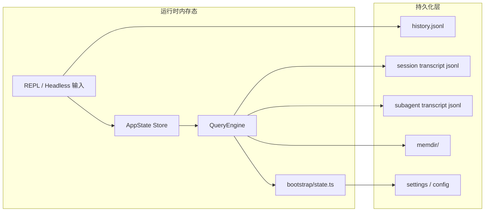

---

## 32. 落盘结构补充：历史、transcript、subagent 文件到底在哪里

这部分对维护、恢复、排查 bug 非常重要。

### 32.1 历史输入文件

`history.ts` 主要面向历史输入检索。

从实现可见：

- 历史文件位于 `getClaudeConfigHomeDir()/history.jsonl`
- 属于全局历史，而不是单个项目的 transcript
- 读取时会按当前 project 过滤和去重

### 32.2 会话 transcript 文件

`src/utils/sessionStorage.ts` 里：

- `getProjectsDir()` 返回 `~/.claude/projects`
- `getTranscriptPath()` 返回当前 session 的 `.jsonl` 路径
- `getTranscriptPathForSession(sessionId)` 支持根据 session 获取 transcript 路径

因此你可以把 transcript 理解为：

- **按项目分目录**
- **按 session 分文件**
- **采用 `.jsonl` 逐条追加写入**

### 32.3 子 agent transcript

`getAgentTranscriptPath(agentId)` 说明：

- 子 agent 也有自己的 transcript
- 路径位于主 session 路径下的 `subagents/...`
- 支持通过 `setAgentTranscriptSubdir(...)` 进一步分组，例如 workflow run

这对以后做多 agent 调试特别重要。

### 32.4 哪些消息会写入 transcript，哪些不会

`sessionStorage.ts` 明确区分了：

- **会进入 transcript 的消息**：`user`、`assistant`、`attachment`、`system`
- **不会进入 transcript 主链的消息**：某些 progress 类消息

尤其需要注意：

- progress 不是 transcript 主链参与者
- 它们不能参与 `parentUuid` 链
- 旧版本遗留 progress 需要在加载时桥接处理

这是一条非常关键的不变量。

### 32.5 transcript 读取限制

当前实现里还有：

- `MAX_TRANSCRIPT_READ_BYTES = 50MB`

这意味着：

- transcript 可能非常大
- 某些读路径必须避免把整个大文件一次性读进内存
- 如果你未来加“会话导出/搜索/聚合”功能，必须考虑这个约束

### transcript 拓扑图

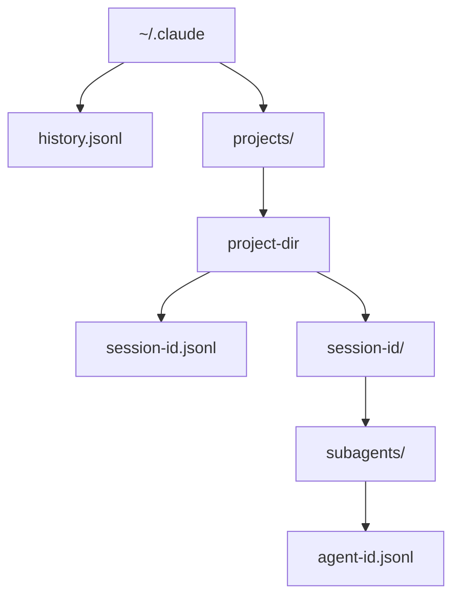

---

## 33. 维护者常见改动路线图

这一节是偏实战的，告诉你“想改某类功能，通常先看哪里”。

### 33.1 想改启动命令 / 启动参数

先看：

1. `bin/claude-aini`
2. `src/entrypoints/cli.tsx`
3. `src/main.tsx`
4. `src/setup.ts`

如果是模式切换相关，通常这四层都可能受影响。

### 33.2 想改默认模型、系统提示词、上下文拼装

先看：

1. `src/main.tsx`
2. `src/QueryEngine.ts`
3. `src/query.ts`
4. `src/context.ts`
5. `src/utils/model/*`
6. `src/utils/queryContext.js` 对应逻辑

### 33.3 想改工具权限、自动执行策略

先看：

1. `src/hooks/useCanUseTool.tsx`
2. `src/utils/permissions/*`
3. `src/services/tools/toolExecution.ts`
4. `src/main.tsx` 中的 permission setup

### 33.4 想新增或修改一个 Tool

先看：

1. `src/Tool.ts`
2. `src/tools.ts`
3. `src/services/tools/toolOrchestration.ts`
4. `src/services/tools/toolExecution.ts`
5. `src/tools/<YourTool>/...`

### 33.5 想修改 slash command 行为

先看：

1. `src/commands.ts`
2. `src/commands/<command>/`
3. `src/screens/REPL.tsx`
4. `src/utils/messageQueueManager.js` 相关路径

### 33.6 想修改 transcript / resume / 历史恢复

先看：

1. `src/history.ts`
2. `src/utils/sessionStorage.ts`
3. `src/utils/conversationRecovery.js`
4. `src/QueryEngine.ts`

### 33.7 想修改 MCP / 外部扩展接入

先看：

1. `src/services/mcp/`
2. `src/tools/ListMcpResourcesTool/`
3. `src/tools/ReadMcpResourceTool/`
4. `src/main.tsx` 中的 MCP 预取与注入逻辑

---

## 34. 高风险不变量（非常重要）

这部分是后续维护时最应该反复对照的内容。

### 34.1 `setup()` 必须在依赖 cwd 的逻辑之前完成关键路径设置

`setup()` 里对 `setCwd(cwd)`、`setOriginalCwd(cwd)`、`setProjectRoot(cwd)` 的调用，不是可有可无的。

如果你把依赖 cwd 的 hook、配置、worktree、history 逻辑提前到这之前，很容易出现路径漂移问题。

### 34.2 bundled skills / plugins 初始化时机不能随便挪

`main.tsx` 中先初始化 bundled skills / plugins，再去拉命令和 agent 定义，是有真实因果关系的。

如果顺序反过来，`getCommands()` 可能在缓存中拿到一个“能力不完整”的结果。

### 34.3 `projectRoot` 是身份，不只是路径

不要把 `projectRoot` 当成普通 cwd 别名。

它承担的是：

- 项目身份识别
- 历史归属
- skills / sessions 的稳定边界

而中途 `EnterWorktreeTool` 等场景可能只改变 cwd，不应该破坏项目身份。

### 34.4 progress 消息不能进入 transcript 主链

`sessionStorage.ts` 明确把 progress 视为 UI-only 状态。

如果你未来修改 transcript 逻辑时把 progress 再塞进 `parentUuid` 链，很容易导致 resume 链断裂或消息孤儿化。

### 34.5 工具并发一定要尊重 `isConcurrencySafe()`

工具并发安全不是 UI 标签，而是执行语义。

错误地把有副作用工具标记为并发安全，会直接造成：

- 文件覆盖顺序混乱
- 上下文合并错位
- 用户看到的结果和真实执行顺序不一致

### 34.6 `sessionProjectDir` 相关路径要一致

`sessionStorage.ts` 里已经专门处理了“当前 session transcript 路径”和“基于 `originalCwd` 推导路径”可能不一致的问题。

以后如果你改 transcript path 逻辑，一定要一起检查：

- 当前 session
- 其他 session
- subagent transcript
- hook 里拿到的 transcript path

### 34.7 `bootstrap/state.ts` 不是杂物间

源码自己已经发出警告：不要再无节制往里面加状态。

维护时的经验法则：

- **全进程都需要**：才考虑放这里
- **只有 UI 需要**：放 AppState
- **需要跨会话**：放持久化层

### 34.8 `AppStateProvider` 不能嵌套

这个约束是显式写在实现里的。

如果未来你做大的 UI 拆分或测试容器封装，记得不要无意中重复包裹 provider。

---

## 35. 从“维护者角色”看这套架构

如果把你之后的工作角色分成几类，这份仓库对应的关注点也不一样。

### 35.1 作为产品功能开发者

你最常打交道的是：

- `REPL.tsx`
- `components/`
- `hooks/`
- `commands/`
- `tools/`

### 35.2 作为平台维护者

你最常打交道的是：

- `main.tsx`
- `setup.ts`
- `QueryEngine.ts`
- `query.ts`
- `services/tools/`
- `bootstrap/state.ts`

### 35.3 作为稳定性/恢复链路维护者

你最常打交道的是：

- `history.ts`
- `utils/sessionStorage.ts`
- `memdir/`
- `migrations/`
- `conversationRecovery` 相关逻辑

### 35.4 作为扩展生态维护者

你最常打交道的是：

- `services/mcp/`
- `skills/`
- `services/plugins/`
- `commands.ts`
- `tools.ts`

---

## 36. 最后补一句：这份仓库真正难的地方是什么

这个项目真正难的地方，不在于某个单独模块“写得复杂”，而在于它把下面这些维度叠加在了一起：

- 终端 UI
- query loop
- tool calling
- slash command
- 配置系统
- 权限控制
- transcript / resume
- MCP / plugin / skills 扩展
- remote / bridge / server 模式
- feature gate

单看任何一层都不算特别夸张，但叠加之后，系统复杂度会显著上升。

所以后续维护的核心原则应该始终是：

1. **边界比功能更重要**
2. **时序比局部实现更重要**
3. **不变量比临时修复更重要**

如果你能一直按这三个原则维护，这个仓库就能继续稳定演进。
