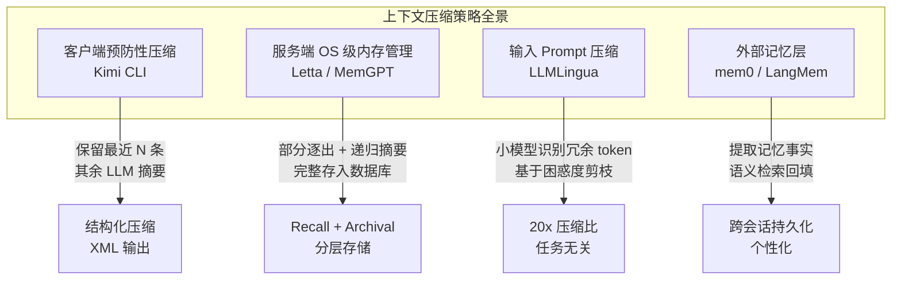

> 本文综合对比四种 LLM 上下文压缩/管理策略，覆盖客户端压缩、服务端 OS 级内存管理、输入 Prompt 压缩、外部记忆层四大方向。
>
> 基于源码分析（Kimi CLI、Letta）+ 开源项目调研（LLMLingua、mem0、LangMem）+ 论文/博客整理。

---

## 一、引言：上下文窗口的永恒瓶颈

LLM 的上下文窗口（Context Window）是 AI 系统最核心的**稀缺资源**之一。无论模型参数如何增长，推理时的 token 预算始终有限——而 Agent 系统需要长期运行、多轮交互、积累大量历史信息。

上下文压缩的本质问题是：**在固定 token 预算内，如何最大化信息密度，同时保留对当前任务最关键的信息？**

业界形成了两条根本思路：

1. **压缩已有内容**：将历史消息通过摘要、剪枝、编码等方式缩减体积，保留在上下文内
2. **分层存储 + 按需检索**：将历史外置到数据库/向量存储，上下文只保留"工作集"，需要时检索

本文系统对比四种代表性策略。

---

## 二、分类体系：四大策略



---

## 三、策略详解

### 3.1 客户端预防性压缩：Kimi CLI Auto Compact

**核心定位**：编码 CLI 工具的上下文守护机制——在单轮对话即将溢出前，主动压缩历史，防止模型因上下文过长而"失忆"。

#### 触发条件（双阈值）

```python
# kimi_cli/soul/compaction.py
def should_auto_compact(
    token_count: int,
    max_context_size: int,
    *,
    trigger_ratio: float = 0.85,        # 默认 85%
    reserved_context_size: int = 50_000, # 预留 50K tokens
) -> bool:
    return (
        token_count >= max_context_size * trigger_ratio
        or token_count + reserved_context_size >= max_context_size
    )
```

- **比例触发**：上下文 token 数达到上限的 85% 时触发（预防性）
- **保留触发**：当前 token + 预留响应空间 ≥ 上限时触发（保守性）

> 对比 Letta 的 70%/100% 双阈值，Kimi CLI 的触发更偏**预防性**——在问题发生前处理，而非溢出后补救。

#### 压缩策略：`SimpleCompaction`

```python
class SimpleCompaction:
    def __init__(self, max_preserved_messages: int = 2):
        self.max_preserved_messages = max_preserved_messages
```

**核心逻辑**：
1. 从后往前扫描，保留最近的 **2 条 user/assistant 消息**
2. 将这 2 条之前的**全部历史**一次性传给另一个 LLM 调用进行压缩
3. 压缩结果被格式化为一条结构化的 `user` 消息

#### 压缩提示词设计

Kimi CLI 的 `compact.md` 提示词明确要求 LLM 按**优先级排序**保留信息：

1. **Current Task State**：当前正在做什么
2. **Errors & Solutions**：遇到的所有错误及解决方案
3. **Code Evolution**：最终可运行版本（中间迭代过程丢弃）
4. **System Context**：项目结构、依赖配置
5. **Design Decisions**：架构选择
6. **TODO Items**：未完成任务

输出格式强制为 XML 结构：

```xml
<current_focus>[当前焦点]</current_focus>
<environment>[环境配置]</environment>
<completed_tasks>[已完成任务]</completed_tasks>
<active_issues>[活跃问题]</active_issues>
<code_state>[代码状态摘要]</code_state>
<important_context>[关键上下文]</important_context>
```

#### 压缩后的上下文重建

```
压缩前：[System] + [Msg 1..N-2] + [Msg N-1: user] + [Msg N: assistant]
压缩后：[System] + [Compaction: 结构化摘要] + [Msg N-1: user] + [Msg N: assistant]
```

- 清空全部历史 → 重写系统提示词 → 插入压缩结果 + 保留的最近消息
- **原始消息永久丢失**——无外部存储，无检索能力

#### 设计哲学

Kimi CLI 面向**编码任务**，假设：
- 单次会话 1-2 小时，任务导向
- 旧代码的中间迭代过程不重要，保留最终状态即可
- 无需跨会话记忆——每次启动都是新会话

**一句话概括**：无状态的"一次性压缩"——压缩即丢弃。

---

### 3.2 服务端 OS 级内存管理：Letta / MemGPT

**核心定位**：将操作系统虚拟内存的分层管理思想引入 LLM Agent，实现**有状态的长期记忆**。

#### 触发条件（双阈值 + 百分比逐出）

```python
# letta/services/summarizer/summarizer.py
async def _partial_evict_buffer_summarization(self, in_context_messages, ...):
    # 默认保留 70%，逐出 30%
    target_message_start = round((1.0 - 0.30) * total_message_count)
    
    # 保证角色交替：找到第一个 assistant 消息作为保留起点
    for i in range(target_message_start, total_message_count):
        if all_in_context_messages[i].role == MessageRole.assistant:
            assistant_message_index = i
            break
    
    messages_to_summarize = all_in_context_messages[1:assistant_message_index]
```

论文中还定义了：
- **Warning Token Count（70%）**：插入系统警告，让 LLM **主动归档**重要信息
- **Flush Token Count（100%）**：强制逐出 FIFO 队列中的消息，生成递归摘要

#### 压缩策略：部分逐出 + 递归摘要

```
原始上下文：[System] + [Summary v1] + [Msg 10..15] + [Msg 16..17]
                 ↑ 上次摘要

触发 Flush 后：[System] + [Summary v2] + [Msg 14..17]
                    ↑ 新摘要 = Summary v1 + Msg 10..13 的再压缩
```

- **部分逐出**：每次只逐出一部分（如 30%），而非全部历史
- **递归摘要**：新摘要基于旧摘要 + 新逐出的消息，保持连续性
- **摘要位置**：插入到 index 1（系统消息之后），作为"压缩的历史视图"

#### 关键差异：被逐出数据的去向

这是 Letta 与 Kimi CLI **最本质的区别**：

| | Kimi CLI | Letta |
|--|----------|-------|
| 被压缩数据 | **丢弃** | **完整存入 Recall Storage**（PostgreSQL）|
| 检索能力 | ❌ 无 | ✅ `conversation_search` 可检索完整历史 |
| 跨会话 | ❌ 单会话 | ✅ 有状态持久化 |

Letta 的分层存储架构：

```
┌─────────────────────────────────────────┐
│  Main Context (RAM) —— LLM 可见         │
│  ┌─────────┐ ┌─────────┐ ┌──────────┐ │
│  │ System  │ │Recursive│ │  FIFO    │ │
│  │ Prompt  │ │Summary  │ │  Queue   │ │
│  └─────────┘ └─────────┘ └──────────┘ │
└─────────────────────────────────────────┘
              ↕ Function Calls
┌─────────────────────────────────────────┐
│  External Context (Disk)                │
│  ┌─────────────┐  ┌─────────────────┐  │
│  │Recall Storage│  │Archival Storage │  │
│  │(完整消息历史) │  │(向量检索/长期)   │  │
│  └─────────────┘  └─────────────────┘  │
└─────────────────────────────────────────┘
```

#### 设计哲学

Letta 面向**长期对话智能体**，假设：
- Agent 运行数周/数月，需要记住用户偏好、历史事件
- 历史消息是"记忆资产"，不能丢失
- LLM 应该像 OS 管理虚拟内存一样**自主管理**自己的上下文

**一句话概括**：有状态的"分层分页"——压缩是索引，原始数据持久化存储。

---

### 3.3 输入 Prompt 压缩：LLMLingua 系列

**核心定位**：不管理对话历史，而是在**推理前压缩输入 Prompt** 本身——用一个小模型识别并移除冗余 token。

#### LLMLingua（EMNLP 2023）

- **核心思想**：使用紧凑的小模型（GPT2-small、LLaMA-7B）计算 prompt 中每个 token 的**困惑度（perplexity）**
- **压缩方式**：移除低困惑度 token（对模型来说"可预测"、信息量低）
- **压缩比**：最高 **20x**，性能损失极小

#### LongLLMLingua（ACL 2024）

- **解决"Lost in the Middle"问题**：长上下文中，模型对中间位置的信息召回率显著下降
- **条件困惑度**：不仅看单个 token 的困惑度，还看**在问题条件下的困惑度**——保留与问题最相关的 token
- **多文档压缩**：对 RAG 场景的多个检索文档进行联合压缩，保留最关键片段
- **效果**：仅用 1/4 token，RAG 性能提升 21.4%

#### LLMLingua-2（ACL 2024 Findings）

- **速度优化**：用 BERT 级编码器做**token 分类**（而非自回归生成），速度提升 3-6x
- **数据蒸馏**：从 GPT-4 蒸馏压缩标签，实现任务无关压缩
- **泛化性**：对 out-of-domain 数据的表现优于 LLMLingua

#### 特点总结

| 特性 | 说明 |
|------|------|
| 与 LLM 解耦 | 不需要目标 LLM 参与压缩，小模型独立运行 |
| 任务无关 | 压缩过程不依赖下游任务，通用性强 |
| KV-Cache 压缩 | 同时减少 KV Cache 占用，加速推理 |
| 信息保留 | 实验表明 GPT-4 可从压缩后的 prompt 恢复全部关键信息 |

**一句话概括**："预处理式压缩"——在输入 LLM 前，用信息论方法剪掉冗余 token。

---

### 3.4 外部记忆层：mem0 / LangMem

**核心定位**：不压缩上下文，而是将**记忆提取并外置**，上下文只保留"工作集"，需要时动态检索回填。

#### mem0（2024-2026，Y Combinator S24）

mem0 将自己定位为 "The Memory Layer for Personalized AI"，2026 年 4 月发布了全新记忆算法：

**核心机制**：
- **Single-pass ADD-only extraction**：一次 LLM 调用提取记忆事实，只增不改删——避免更新冲突
- **Entity linking**：提取实体、嵌入、跨记忆链接，提升检索相关性
- **Multi-signal retrieval**：语义相似度 + BM25 关键词 + 实体匹配，三路并行融合
- **Temporal reasoning**：时间感知检索，区分"当前状态""过去事件""未来计划"

**性能指标**：
- LoCoMo 基准：71.4 → **91.6**（+20 分）
- LongMemEval：67.8 → **94.8**（+27 分）
- BEAM (1M tokens)：64.1，仅使用 6.7K tokens

**记忆层级**：
- **User Memory**：跨会话的用户偏好、个人信息
- **Session Memory**：单次会话的上下文
- **Agent Memory**：Agent 自身的状态、技能

#### LangMem（LangChain，2025）

LangMem 是 LangChain 生态的记忆管理工具包，提供两种模式：

**Hot Path（热路径）**：
- Agent 在对话中**主动调用 memory tools**（`create_manage_memory_tool`、`create_search_memory_tool`）
- Agent 自主决定"什么值得记住""何时需要回忆"
- 与 LangGraph 的 `BaseStore` 深度集成

**Background（后台）**：
- 独立的 background memory manager 在会话结束后提取、整合、更新知识
- 不占用对话中的 token 预算

**设计特点**：
- **Functional primitives**：核心 API 不依赖特定存储，可用任何数据库
- **Native LangGraph integration**：与 LangGraph Platform 的 Long-term Memory Store 无缝集成

#### 与压缩策略的本质区别

mem0/LangMem 不"压缩"历史消息，而是：
1. **提取**（Extraction）：从对话中抽取结构化记忆事实
2. **存储**（Storage）：存入数据库/向量存储
3. **检索**（Retrieval）：需要时按相关性检索回填到上下文

这更接近人类记忆的工作方式——我们不会把整个人生经历压缩在短时工作记忆中，而是将经验编码为长期记忆，需要时回忆。

**一句话概括**："外置式记忆"——上下文是工作记忆，历史存在长期记忆中按需调取。

---

## 四、核心维度全景对比

| 维度 | Kimi CLI | Letta / MemGPT | LLMLingua | mem0 / LangMem |
|------|----------|----------------|-----------|----------------|
| **核心思想** | 客户端预防性压缩 | 服务端 OS 级分页 | 输入 Prompt 剪枝 | 外置记忆 + 按需检索 |
| **压缩对象** | 对话历史 | 对话历史 | 任意输入 Prompt | 不压缩，提取事实 |
| **触发时机** | Step 开始前（预防性） | 溢出时/阈值（响应性） | 推理前（预处理） | 实时/后台 |
| **压缩方法** | LLM 结构化摘要 | 递归摘要 + 部分逐出 | 小模型困惑度剪枝 | 信息提取 + 语义检索 |
| **保留策略** | 最近 2 条消息 | 最近 N 条 + 递归摘要 | 按信息密度保留 | 检索 Top-K 回填 |
| **原始数据保留** | ❌ 丢弃 | ✅ Recall Storage | ❌ 丢弃 | ✅ 数据库持久化 |
| **检索能力** | ❌ 无 | ✅ `conversation_search` | ❌ 无 | ✅ 语义/BM25/实体 |
| **跨会话** | ❌ 单会话 | ✅ 有状态 Agent | ❌ 单次 | ✅ 长期持久化 |
| **模型依赖** | 需 LLM | 需 LLM（可配轻量模型） | 小模型独立运行 | 需嵌入模型 + LLM |
| **延迟影响** | 压缩时一次 LLM 调用 | 逐出时摘要生成 | 预处理小模型推理 | 检索时向量查询 |
| **适用场景** | 编码 CLI、单次任务 | 长期对话智能体 | RAG、长文档处理 | 个性化助手、客服 |
| **信息论视角** | 有损压缩（LLM 编码） | 分层存储（RAM→Disk） | 熵-based 剪枝 | 特征提取 + 索引 |

---

## 五、设计决策指南

### 5.1 场景 → 策略映射

| 你的场景 | 推荐策略 | 原因 |
|---------|---------|------|
| **编码助手**（单次会话 1-2 小时） | **Kimi CLI 式** | 任务导向，中间迭代不重要，预防性压缩避免溢出 |
| **长期对话 Agent**（数周/数月） | **Letta 式** | 需要记住用户偏好和历史事件，不能丢失细节 |
| **RAG 系统**（长文档/多文档） | **LLMLingua 式** | 解决 "lost in the middle"，大幅降低 token 成本 |
| **个性化 AI 助手**（跨用户/跨会话） | **mem0/LangMem 式** | 用户偏好需要长期积累和精确检索 |
| **多跳推理**（需要回溯中间步骤） | **Letta / mem0** | 中间步骤必须可检索，不能仅保留摘要 |
| **API 成本敏感**（大量调用） | **LLMLingua 式** | 20x 压缩直接降低 API 费用 |

### 5.2 组合策略

实际生产系统中，往往不是"四选一"，而是**组合使用**：

```
用户输入
   ↓
[LLMLingua] —— 压缩输入 Prompt（移除冗余）
   ↓
[Agent 处理] —— 多轮对话
   ↓
[mem0/LangMem] —— 提取关键事实到长期记忆
   ↓
上下文接近上限？
   ├─ Yes → [Letta 式 Summarization] —— 递归摘要 + 逐出到 Recall Storage
   └─ No → 继续对话
   ↓
需要历史细节？
   ├─ Yes → [mem0 Search / conversation_search] —— 检索回填
   └─ No → 使用当前上下文
```

---

## 六、深层洞察与未来趋势

### 6.1 压缩 vs 分层 vs 外置：三种范式的哲学差异

| 范式 | 类比 | 核心假设 |
|------|------|---------|
| **压缩**（Kimi CLI / LLMLingua） | 文件压缩（zip） | 信息可以编码为更紧凑的形式，解码时损失可接受 |
| **分层**（Letta） | OS 虚拟内存 | 热数据在 RAM，冷数据在 Disk，按需换入换出 |
| **外置**（mem0 / LangMem） | 人脑记忆 | 工作记忆有限，长期记忆无限，回忆是重建而非存储 |

三种范式并非互斥——**理想的 Agent 记忆系统可能同时包含三层**：
1. **工作上下文**（RAM）：当前对话 + 最近 N 条消息
2. **压缩摘要**（Cache）：递归摘要提供历史概览
3. **外部记忆**（Disk）：结构化事实 + 完整消息历史，支持精确检索

### 6.2 从"压缩上下文"到"记忆原生模型"

Letta 在《Context Constitution》中提出了更激进的愿景——**Memory-native Models**：

> "Today's models deeply identify with their own ephemerality. They have no motivation for long-term improvement because they don't believe they persist."

当前模型的根本局限在于：
- 每次推理都是**无状态的**——模型不"知道"自己会持续存在
- 上下文压缩是**被动的**——系统层面做，而非模型自主管理
- 长期记忆是**外挂的**——通过 RAG、向量库等外部系统实现

未来的方向可能是：
- **模型原生支持记忆操作**：像 Letta 的 function calling 一样，但内化为模型的核心能力
- **Sleep-time Compute**：Agent 在空闲时主动反思、整理、压缩自己的记忆（类似人类睡眠时的记忆巩固）
- **Token-space Identity**：模型通过管理自己的上下文来形成"身份"——"我是谁"由我选择记住什么来定义

### 6.3 KV Cache 压缩：推理层的另一条战线

本文讨论的都是**提示词层面**的上下文压缩，但还有一条平行的技术路线——**KV Cache 压缩**：

- **RetrievalAttention**（Microsoft）：通过向量检索加速 KV Cache 访问
- **MInference**：将长上下文推理延迟降低 10x，支持 1M tokens
- **SCBench**：从 KV Cache 角度评估长上下文方法

这些技术解决的是"模型已经看到了长上下文，如何加速推理"；而本文的压缩策略解决的是"如何让模型看到更精简但信息密集的上下文"。两者互补。

---

## 七、参考文献

### 论文

1. **MemGPT: Towards LLMs as Operating Systems** (arXiv:2310.08560, 2023-10)
   - Packer et al. 虚拟内存管理思想的经典论文

2. **LLMLingua: Compressing Prompts for Accelerated Inference of Large Language Models** (EMNLP 2023)
   - Jiang et al. 基于困惑度的 prompt 压缩

3. **LongLLMLingua: Accelerating and Enhancing LLMs in Long Context Scenarios via Prompt Compression** (ACL 2024)
   - Jiang et al. 解决 "lost in the middle" 的长上下文压缩

4. **LLMLingua-2: Data Distillation for Efficient and Faithful Task-Agnostic Prompt Compression** (ACL 2024 Findings)
   - Pan et al. BERT 级编码器实现 3-6x 加速

5. **Mem0 Research Paper** (2026)
   - mem0.ai/research. Single-pass ADD-only extraction, entity linking, temporal reasoning

### 博客与文档

6. **Letta — Context Constitution** (2026-04)
   - https://www.letta.com/blog/context-constitution
   - "Context is a scarce resource." 经验式 AI 的上下文宪法

7. **Letta — Memory Blocks: The Key to Agentic Context Management** (2025-05)
   - https://www.letta.com/blog/memory-blocks
   - 结构化记忆块设计

8. **Letta — Stateful Agents: The Missing Link in LLM Intelligence** (2025-02)
   - https://www.letta.com/blog/stateful-agents
   - 两层记忆系统：上下文内 vs 外部存储

9. **LangChain — Memory for Agents** (2024-10)
   - https://www.langchain.com/blog/memory-for-agents
   - 四层记忆模型

10. **Anthropic — Building Effective Agents** (2024-12)
    - https://www.anthropic.com/research/building-effective-agents
    - 简单系统优于复杂编排

### 源码

11. **Kimi CLI** — `kimi_cli/soul/compaction.py`, `kimisoul.py`, `config.py`
    - Auto-compact 的完整实现：双阈值触发 + SimpleCompaction + 结构化 XML 输出

12. **Letta** — `services/summarizer/summarizer.py`, `context_window_calculator.py`
    - 递归摘要 + 部分逐出 + 精确 token 统计的 OS 级内存管理

### 开源项目

13. **mem0** — https://github.com/mem0ai/mem0
    - AI Memory Layer for Personalized AI

14. **LangMem** — https://github.com/langchain-ai/langmem
    - LangChain 生态的 Agent 记忆管理工具包

15. **LLMLingua** — https://github.com/microsoft/LLMLingua
    - Microsoft 的 Prompt 压缩工具系列

---

## 八、与知识库其他笔记的关联

- **[[2026-05-15-memgpt-towards-llms-as-operating-systems]]** — MemGPT 论文核心概念
- **[[2026-05-15-letta-source-code-analysis]]** — Letta 源码架构详细分析
- **[[2026-05-15-letta-context-constitution]]** — Letta 的上下文宪法原则
- **[[2026-05-15-letta-memory-blocks]]** — Memory Blocks 的工程设计
- **[[2026-05-15-letta-stateful-agents]]** — Stateful Agents 的理论基础
- **[[../30-Agent工程/架构研究/agent-memory-design-references]]** — Agent 记忆架构参考来源汇总
