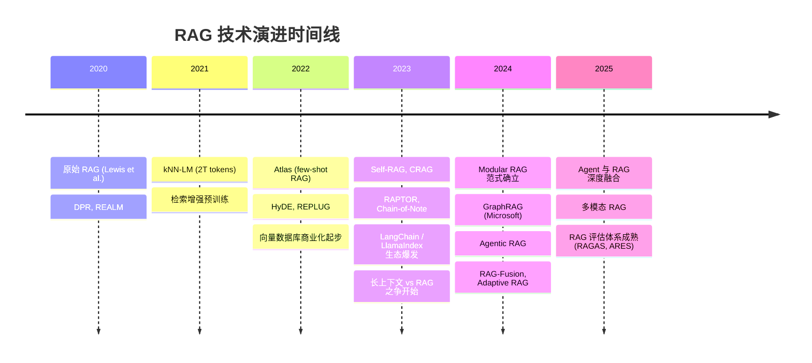
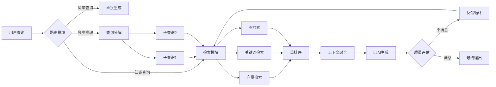

# RAG 发展历程 —— 从起源到 Agentic RAG

> 检索增强生成（Retrieval-Augmented Generation, RAG）是将外部知识检索与大语言模型生成能力结合的核心技术。
> 本文梳理 RAG 从 2020 年诞生至今的完整演进脉络，涵盖关键论文、技术范式、评估体系与未来方向。

---

## 一、起源：RAG 的诞生（2020）

### 开山之作

**Retrieval-Augmented Generation for Knowledge-Intensive NLP Tasks**  
- 作者：Lewis et al. (Facebook AI / Meta)  
- 时间：2020-05  
- 论文：https://arxiv.org/abs/2005.11401  

**核心思想：**
- LLM 将事实知识存储在参数中，但**访问和精确操控知识的能力有限**
- 在知识密集型任务上，性能落后于任务特定的检索架构
- 提出结合**参数记忆**（预训练 seq2seq 模型）与**非参数记忆**（Wikipedia 稠密向量索引）的通用微调方案

**两种 RAG 形式：**

| 形式 | 机制 | 特点 |
|------|------|------|
| **RAG-Sequence** | 整个生成序列基于相同的检索段落 | 检索一次，用于整个回答 |
| **RAG-Token** | 每个 token 可以使用不同的检索段落 | 每步动态检索，更灵活但计算成本高 |

**关键发现：**
- RAG 模型比纯参数 seq2seq 基线生成更**具体、多样、事实性强**的语言
- 在三个开放域 QA 任务上达到 SOTA
- 提供了决策的可追溯性（provenance）—— 知道答案来自哪篇文档

### 同期奠基工作

| 论文 | 时间 | 贡献 |
|------|------|------|
| Dense Passage Retrieval (DPR) | 2020-04 | 双编码器框架学习稠密表示，端到端训练稠密检索器 |
| REALM (Guu et al.) | 2020-02 | 预训练语言模型 + 可微知识检索器，知识文本作为隐变量 |

---

## 二、发展阶段总览



---

## 三、第一阶段：Naive RAG（2020-2022）

### 基本流程

```
用户查询 → Embedding → 向量相似度检索 → Top-K 文档 → 拼接 Prompt → LLM 生成
```

### 核心局限

| 问题 | 表现 | 原因 |
|------|------|------|
| **低精度** | 检索到的 chunk 与问题不相关 | 粗粒度语义匹配误差 |
| **低召回** | 遗漏关键信息 | 单一检索策略覆盖不足 |
| **幻觉仍存** | 模型编造检索文档中没有的信息 | LLM 参数知识与检索知识冲突 |
| **冗余重复** | 多段落内容重复 | 缺乏去重和综合机制 |
| **上下文窗口浪费** | 无关信息占据 token | 检索结果未经过滤压缩 |

### 早期改进尝试（2021-2022）

| 论文/技术 | 时间 | 改进点 |
|-----------|------|--------|
| **Improving LM by retrieving from trillions of tokens** (kNN-LM) | 2021-12 | 从 2T token 数据库检索，证明大规模检索增强的有效性 |
| **Atlas** | 2022-08 | 预训练检索增强语言模型，少量样本即可学习知识密集型任务 |
| **REPLUG** | 2022 | 用检索增强黑盒语言模型，无需微调 LLM |
| **Promptagator** | 2022-09 | 用 LLM 生成查询来训练任务特定检索器 |

---

## 四、第二阶段：Advanced RAG（2022-2023）

Advanced RAG 针对 Naive RAG 的检索质量问题，在**检索前、检索中、检索后**三个阶段进行优化。

### 4.1 检索前优化（Pre-retrieval）

**数据索引优化：**
- **分块策略（Chunking）**：按语义、固定长度、递归、文档结构等策略切分
- **元数据增强**：添加标题、时间、类别等标签辅助过滤
- **混合索引**：向量 + 关键词 + 图结构

**查询优化：**

| 技术 | 核心思想 | 代表工作 |
|------|----------|----------|
| **Query Rewriting** | 改写用户查询以更好地匹配文档语义空间 | Query2Doc, ITER-RETGEN |
| **HyDE (Hypothetical Document Embeddings)** | 生成假设答案再嵌入，用假设答案检索真实文档 | HyDE (2022) |
| **Step-Back Prompting** | 先抽象出概念和原理，再基于原理推理 | Zheng et al. (2023) |

### 4.2 检索优化（Retrieval）

**Embedding 模型优化：**
- **领域微调**：在特定领域数据上微调嵌入模型（如 BGE-large-EN）
- **动态嵌入**：根据上下文动态调整表示（如 OpenAI text-embedding-ada-002）
- **对比学习**：强化正样本、挖掘难负样本

**检索策略演进：**

| 策略 | 说明 | 适用场景 |
|------|------|----------|
| **Dense Retrieval** | 向量语义相似度 | 语义理解要求高的开放域问题 |
| **Sparse Retrieval (BM25)** | 关键词匹配 | 精确术语、ID、代码片段 |
| **Hybrid Search** | 稠密 + 稀疏融合（如 RRF） | 通用场景，兼顾语义和精确匹配 |
| **多路召回** | 向量 + 关键词 + 图遍历同时召回 | 复杂企业知识库 |

**对齐优化：**
- **查询-文档对齐**：解决用户查询与文档表达不一致的问题
- **检索器-生成器对齐**：用 LLM 反馈信号微调检索器（AAR, UPRISE）

### 4.3 检索后优化（Post-retrieval）

**重排序（Rerank）：**
- 粗排（向量相似度）→ 精排（交叉编码器Cross-Encoder）
- 多样性排序（DiversityRanker）
- 解决 "Lost in the Middle"（LostInTheMiddleRanker）

**上下文压缩：**
- **信息压缩**：将检索文档压缩为摘要，减少噪声（RECOMP）
- **Prompt 压缩**：去除对生成无贡献的 token
- **重定位**：将最相关上下文放在 prompt 两端

### 4.4 本阶段标志性工作

| 论文 | 时间 | 核心贡献 |
|------|------|----------|
| **Self-RAG** | 2023-10 | 自适应检索 + 反思 token，模型自主决定何时检索、如何评价检索结果 [[extrinsic-hallucinations]] |
| **CRAG (Corrective RAG)** | 2024-01 | 检索评估器判断检索质量，低质量时触发网络搜索修正 |
| **RAPTOR** | 2024-01 | 递归嵌入-聚类-摘要，构建树状多层抽象结构 |
| **Chain-of-Note** | 2023-11 | 为检索文档生成阅读笔记，评估相关性后综合答案 |
| **FLARE** | 2023-05 | 前向-looking 主动检索，预测下一句内容作为查询 |
| **IRCoT** | 2022-12 | 检索与思维链推理交错进行，互相增强 |

> **Self-RAG 的关键洞察**：不要无差别检索固定数量的段落。模型应自主判断是否需要检索、检索内容是否相关、生成内容是否得到检索内容支持。这与 [[Autonomous-Agents]] 中 "Tool Use 的瓶颈不在工具本身，而在知道何时用" 的洞察一致。

---

## 五、第三阶段：Modular RAG / Agentic RAG（2023-2024）

### 5.1 Modular RAG 范式

Modular RAG 将 RAG 系统拆分为可插拔的功能模块，不再固定流程：



**核心模块：**

| 模块 | 功能 | 示例 |
|------|------|------|
| **搜索模块** | 多策略检索 | 向量 + 关键词 + 图 |
| **记忆模块** | 利用历史交互 | 用户偏好、先前检索结果 |
| **融合模块** | 多源信息综合 | RAG-Fusion（多查询召回融合）|
| **路由模块** | 查询分类与分发 | 按领域路由到不同知识库 |
| **预测模块** | 预测需要检索的内容 | FLARE 的前向预测 |
| **任务适配器** | 针对任务定制检索策略 | 代码检索 vs 法律检索 |

### 5.2 Agentic RAG

Agentic RAG 将 RAG 与 Agent 能力结合，使系统具备：
- **自主决策**：判断是否需要检索、检索什么、何时停止
- **工具使用**：不仅检索静态文档，还可调用 API、数据库、搜索引擎
- **多步推理**：复杂问题分解为子查询，迭代检索-生成
- **自我修正**：评估生成质量，不满意则重新检索

**与 Agent 记忆架构的关系：**
- RAG 的向量检索相当于 Agent 的**长期语义记忆**
- Modular RAG 的路由和融合模块类似于 Agent 的**规划能力**
- Self-RAG 的反思 token 相当于 Agent 的**自我监控**
- 参见 [[agent-memory-design-references]] 中 Letta 对 "naive RAG 污染上下文" 的批评

### 5.3 GraphRAG：结构化知识检索（2024）

**GraphRAG**（Microsoft Research）
- 文档：https://microsoft.github.io/graphrag/
- 论文：From Local to Global: A GraphRAG Approach to Query-Focused Summarization

**与 Baseline RAG 的核心差异：**

| 维度 | Baseline RAG | GraphRAG |
|------|-------------|----------|
| **索引对象** | 文本 chunk 的向量 | 实体、关系、声明构成的知识图谱 |
| **检索方式** | 向量相似度 | 图遍历 + 社区摘要 |
| **全局推理** | 弱（难以连接分散信息） | 强（社区层次摘要支持整体理解）|
| **复杂查询** | 难以回答需要综合多源信息的问题 | 通过图结构连接"断点" |

**GraphRAG 流程：**
1. **索引阶段**：
   - 文本 → TextUnits
   - 提取实体、关系、关键声明
   - 使用 Leiden 算法层次聚类
   - 自底向上生成社区摘要
2. **查询阶段**：
   - **Global Search**：利用社区摘要回答整体性问题
   - **Local Search**：围绕特定实体展开邻居和关联概念
   - **DRIFT Search**：结合社区信息的动态展开检索
   - **Basic Search**：标准向量搜索作为 fallback

---

## 六、RAG 与 Fine-tuning 的关系

| 维度 | RAG | Fine-tuning |
|------|-----|-------------|
| **知识更新** | 实时更新知识库即可 | 需要重新训练模型 |
| **适用场景** | 快速演变的知识（新闻、产品文档） | 固定格式、风格、领域推理模式 |
| **幻觉风险** | 较低（可追溯来源） | 可能因学习新知识而加剧幻觉 |
| **成本** | 检索基础设施成本 | 训练计算成本 |
| **定制化** | 提示词工程 + 知识库组织 | 模型行为深层定制 |

**关键洞察**：两者**不是互斥**的，最佳实践是迭代结合：
- 用 RAG 注入**最新、易变的知识**
- 用 Fine-tuning 优化**输出格式、指令遵循、领域推理风格**
- 用 Prompt Engineering 发挥模型固有能力

> 参见 [[extrinsic-hallucinations]]：Gekhman et al. (2024) 证明用 SFT 更新 LLM 知识有风险，会加剧幻觉。这强化了"用 RAG 而非 Fine-tuning 注入新知识"的实践原则。

---

## 七、评估体系

### 7.1 评估维度

RAG 评估关注**三个质量分数**和**四项能力**：

**质量分数：**

| 指标 | 含义 | 评估对象 |
|------|------|----------|
| **Context Relevance** | 检索上下文的相关性和精确性 | 检索模块 |
| **Answer Faithfulness** | 答案对检索内容的忠实度 | 生成模块 |
| **Answer Relevance** | 答案对问题的相关性 | 端到端 |

**四项能力：**
- **Noise Robustness**：噪声鲁棒性（无关文档存在时仍正确回答）
- **Negative Rejection**：拒答能力（无相关信息时承认不知道）
- **Information Integration**：信息整合能力（多源信息综合）
- **Counterfactual Robustness**：反事实鲁棒性（面对错误信息不被误导）

### 7.2 评估工具

| 工具 | 特点 |
|------|------|
| **RAGAS** | 无需人工标注，自动评估上下文相关性、忠实度、答案相关性 |
| **ARES** | 使用合成数据训练评判模型 |
| **TruLens** | 可解释的 RAG 评估框架 |
| **RGB / RECALL** | 学术基准测试集 |

---

## 八、挑战与未来方向

### 当前核心挑战

1. **长上下文 vs RAG**
   - 1M+ token 上下文窗口使 "把整个文档塞进去" 成为可能
   - 但长上下文注意力衰减、成本高昂、检索定位更精确
   - **趋势**：RAG 不会消失，而是与长上下文互补 —— RAG 负责粗筛，长上下文负责细读

2. **生产级 RAG 的工程复杂度**
   - 数据清洗、chunk 策略、嵌入选择、检索融合、重排序、prompt 工程……
   - 每个环节都需要大量实验调优
   - 需要系统化的评估和监控体系

3. **多模态 RAG**
   - 从文本扩展到图像、音频、视频、代码
   - 统一多模态嵌入空间、跨模态检索

4. **RAG 安全与隐私**
   - 企业私有数据的访问控制
   - 检索内容的权限隔离（不同用户看到不同文档）
   - 提示注入攻击防护

### 未来方向

| 方向 | 描述 |
|------|------|
| **RAG + Agent 深度融合** | Agent 自主决定检索策略、评估检索质量、迭代优化 |
| **Self-Improving RAG** | 系统从用户反馈中自动优化索引和检索策略 |
| **联邦 RAG** | 跨组织、跨数据源的安全联合检索 |
| **实时 RAG** | 毫秒级知识更新，支持高频变化场景（股市、赛事）|
| **认知架构集成** | 将 RAG 纳入 Agent 的认知架构（如 CoALA 中的程序/语义/情景记忆）|

---

## 九、关键论文速查表

| 论文 | 年份 | 类别 | 一句话贡献 |
|------|------|------|-----------|
| Retrieval-Augmented Generation (Lewis et al.) | 2020 | 起源 | 提出参数记忆 + 非参数记忆的结合范式 |
| Dense Passage Retrieval (Karpukhin et al.) | 2020 | 检索 | 端到端稠密检索器，双编码器框架 |
| Improving LM by Retrieving from Trillions of Tokens | 2021 | 规模 | 证明大规模检索增强语言模型的有效性 |
| Atlas (Izacard et al.) | 2022 | 训练 | 检索增强的少样本学习 |
| HyDE | 2022 | 查询 | 生成假设答案再嵌入检索 |
| Self-RAG (Asai et al.) | 2023 | 自适应 | 反思 token 实现自适应检索与自我评估 |
| CRAG (Yan et al.) | 2024 | 修正 | 检索质量评估 + 动态修正策略 |
| RAPTOR (Sarthi et al.) | 2024 | 结构 | 递归树状摘要实现多层次检索 |
| GraphRAG (Microsoft) | 2024 | 结构化 | 知识图谱 + 社区摘要支持全局推理 |
| RAG Survey (Gao et al.) | 2023 | 综述 | RAG 全面综述：Naive → Advanced → Modular |

---

## 十、与知识库已有内容的关联

- **[[extrinsic-hallucinations]]** —— Self-RAG、RARR、FAVA 等反幻觉方法是 RAG 的重要分支；"用 RAG 而非 SFT 注入新知识"是关键设计原则
- **[[Autonomous-Agents]]** —— RAG 是 Agent 长期记忆的技术基础；Self-RAG 的 "知道何时检索" 与 Agent Tool Use 的 "知道何时用工具" 是同一类问题
- **[[agent-memory-design-references]]** —— Letta 的 Memory Blocks、MemGPT 的读写记忆设计为下一代 RAG 提供了架构启发
- **[[DeerFlow]]** / **[[Deep-Agents]]** —— 生产级 Agent 框架中的 RAG 实践（DeerFlow 的 18 层中间件包含 SummarizationMiddleware、MemoryMiddleware 等 RAG 相关组件）
- **[[核心概念]]** —— LangGraph 的 Checkpointer 和 Store 为 RAG 提供了持久化和跨会话记忆的基础设施

---

## 十一、待深入研究

- [ ] 各种分块策略（fixed-size, recursive, semantic, agentic）的实际效果对比
- [ ] 嵌入模型微调的具体实践（BGE, M3E, GTE 等中文场景选择）
- [ ] Hybrid Search 的 RRF 融合公式与权重调优
- [ ] Rerank 模型（Cross-Encoder, Cohere Rerank, bge-reranker）的延迟与效果权衡
- [ ] GraphRAG 的索引成本与查询延迟在实际业务中的可行性
- [ ] RAGAS 评估指标与人工评估的一致性验证
- [ ] 长上下文模型（1M+ tokens）对 RAG 架构的影响 —— RAG 会消失还是进化？
- [ ] Agentic RAG 的具体实现模式（LangGraph 中的检索节点设计）
