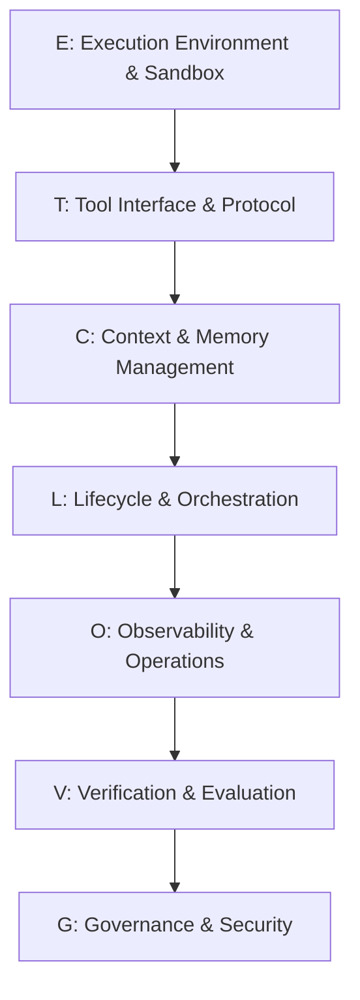

> 原文：Agent Harness Engineering: A Survey（CMU、耶鲁、弗吉尼亚理工、Amazon 等）
> 解读来源：[微信公众号 - AI修猫Prompt](https://mp.weixin.qq.com/s?__biz=Mzg4MzYxODkzMg==&mid=2247508338&idx=1&sn=bd9dd854c1752d68a6706b966058e707)

## 核心论点：binding-constraint thesis（约束瓶颈命题）

在长任务、多步骤、工具调用密集的 Agent 场景中，系统表现不再主要由模型本身决定，而是由模型外部的 **Harness（线束系统）** 决定。

> 论文证据：仅修改 Harness（工具格式、系统提示词、中间件注入），不改模型权重，coding benchmark 最高提升 **10 倍**。

这对 Agent 工程的启发：模型只是推理引擎，Harness 才是行为系统。

## 行业演进三阶段

| 阶段 | 时间 | 重点 |
|---|---|---|
| Prompt Engineering | 2022-2024 | 优化单次模型调用的文本输入 |
| Context Engineering | 2025 | 模型每一步应该看到什么信息 |
| Harness Engineering | 2026 | 管理多步骤、长时间运行任务的执行外壳 |

## ETCLOVG 七层架构

前四层 **E/T/C/L** 是结构核心，后三层 **O/V/G** 是控制平面。

### E - Execution Environment & Sandbox（执行环境与沙箱）

沙盒的三个核心目的：
- **安全（Security）**
- **可复现性（Reproducibility）**
- **活跃性（Liveness）** —— 避免长周期任务中的权限提示疲劳

代表系统：Daytona、E2B、OpenAI Code Interpreter、OpenHands、WebArena、OSWorld、SWE-ReX

### T - Tool Interface & Protocol（工具接口与协议）

- **MCP**（Model Context Protocol）已成为整合工具的显学
- **A2A** 协议专注于智能体应用之间的通信
- 生产经验："更少但更好的工具"优于庞大工具菜单

### C - Context & Memory Management（上下文与记忆）

借用操作系统内存层级：

| 层级 | 对应机制 | 代表技术 |
|---|---|---|
| 短期（活动上下文窗口） | 渐进式披露、KV缓存 | Prompt Caching |
| 中期（会话状态持久化） | 结构化笔记 | 外部文件 |
| 长期（持久化记忆） | 向量/图数据库 | MemGPT、Mem0、Honcho |

长周期任务需使用**上下文压缩**和**子智能体隔离**防止上下文漂移。

### L - Lifecycle & Orchestration（生命周期与编排）

- 单智能体内循环（ReAct、无状态重放）
- 多智能体编排（AutoGen 分层、LangGraph 图组合）
- 全生命周期流水线（Issue → PR）

### O - Observability & Operations（可观测性与运维）

- 追踪平台：Langfuse、Arize Phoenix（OpenTelemetry Span树）
- 成本优化：FrugalGPT、智能路由
- 可靠性：Anthropic Managed Agents（大脑与双手解耦）

### V - Verification & Evaluation（验证与评测）

五阶段 Task-to-Feedback Lifecycle：
1. Grounding（任务与基准）
2. Readiness（执行前验证）
3. Execution（受控执行与轨迹捕获）
4. Judgement（多级判断与故障归因）
5. Regression（持续回归反馈）

### G - Governance & Security（治理与安全）

- **权限与身份**：上下文相关的权限控制、OAuth 风格令牌
- **生命周期钩子**：输入 LLM 前、执行工具前、工具返回后、人机交互审批
- **声明式宪法**：YAML 格式安全规则，合规团队可直接修改
- **审计**：不可篡改的结构化日志

## 三个核心权衡

1. **成本-质量-速度的不可能三角**
2. **能力与控制的权衡**：工具越多、记忆越长、权限越大，潜在破坏力越大
3. **线束耦合问题**：各层高度耦合，无法孤立优化

## 五个开放问题

1. 微虚拟机隔离强度 vs 低成本大规模并发测试
2. 上下文压缩的信息丢失如何量化？如何通过外部构件自我恢复？
3. 利用可观测性日志自动归因故障来源
4. 智能体/工具/人类之间的标准化任务交接
5. 随模型进化自动识别并拆除"累赘"的 Harness 机制

## 待深入研究

- [ ] 阅读原论文《Agent Harness Engineering: A Survey》获取更详细的技术细节
- [ ] 调研 MCP 协议的具体实现和应用案例
- [ ] 对比 MemGPT、Mem0、Honcho 三种长期记忆方案的技术差异
- [ ] 研究 FrugalGPT 的成本优化策略
- [ ] 了解 Anthropic Managed Agents 的架构设计
- [ ] 探索声明式宪法（Declarative Constitutions）的实践方式
