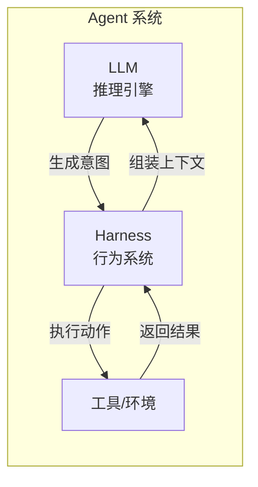
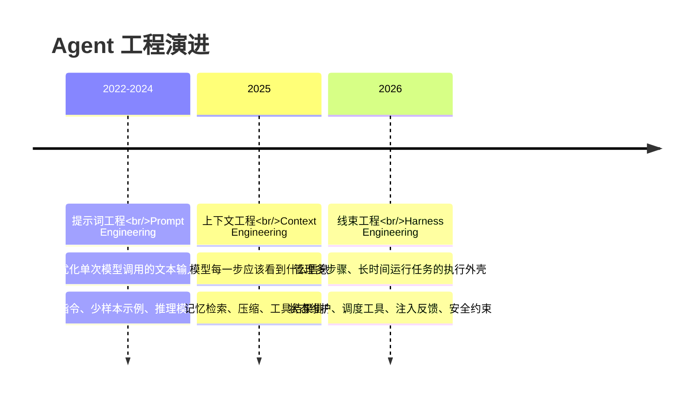
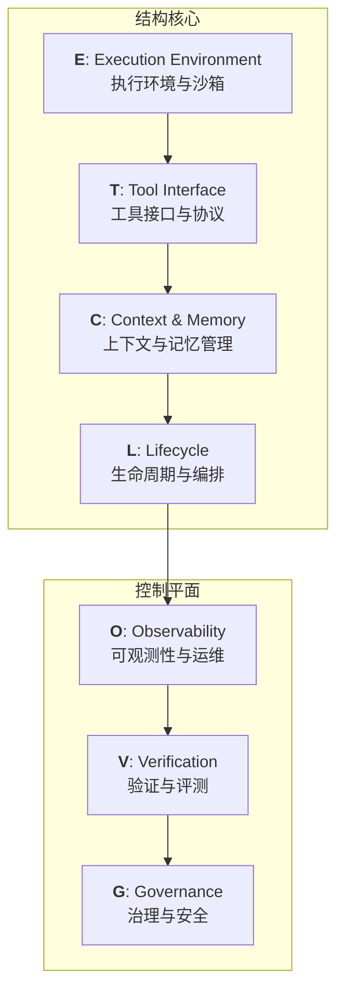
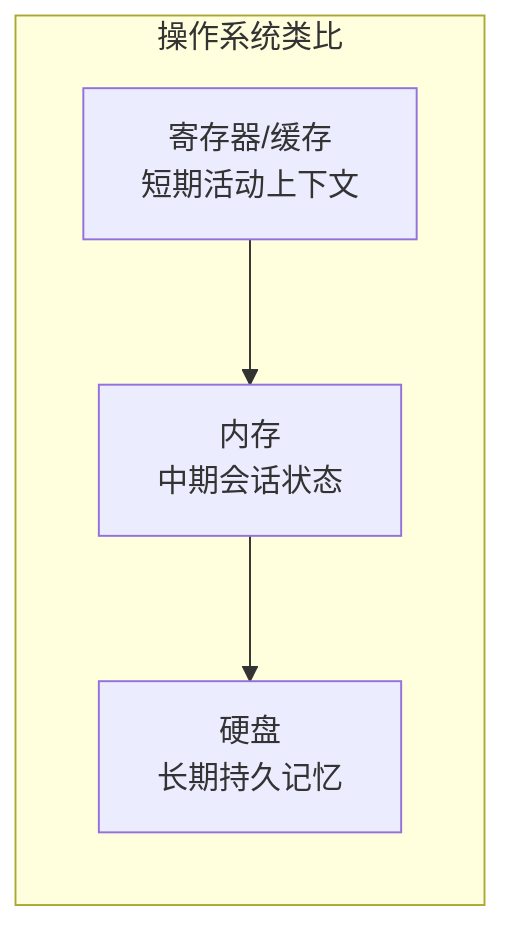
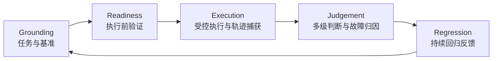

> **论文**：Agent Harness Engineering: A Survey
> **机构**：CMU、耶鲁大学、弗吉尼亚理工大学、Amazon 等
> **解读来源**：[微信公众号 - AI修猫Prompt](https://mp.weixin.qq.com/s?__biz=Mzg4MzYxODkzMg==&mid=2247508338&idx=1&sn=bd9dd854c1752d68a6706b966058e707)
> **状态**：基于中文解读整理，原文尚未找到公开链接

---

## 一、为什么需要 Harness Engineering？

### 1.1 核心命题：binding-constraint thesis（约束瓶颈命题）

在长任务、多步骤、工具调用密集的 Agent 场景中，**系统表现不再主要由模型本身决定，而是由模型外部的 Harness（线束系统）决定**。

论文用三个实验支撑这一命题：

| 实验 | 修改内容 | 结果 |
|---|---|---|
| 1 | 仅修改编辑工具格式和工具 Harness，不改模型 | coding benchmark **最高 10 倍提升** |
| 2 | 固定 GPT-5.2-Codex，重构系统提示词 + 中间件上下文注入 + 自验证 hook | Terminal-Bench 2.0 从 52.8% → **66.5%** |
| 3 | Meta-Harness 自动优化 Harness，不修改模型权重 | Terminal-Bench-2 达到 **76.4%**，超过手工工程方案 |

> **关键洞察**：换更强模型带来的收益，可能不如改 Harness 带来的收益大。这和日常体验一致——同一个 Claude 或 Qwen，放进不同框架里，稳定性完全不同。

### 1.2 模型 vs Harness 的职责划分

- **模型（LLM）**：推理引擎，负责生成意图、规划、推理
- **Harness**：行为系统，负责状态维护、工具调度、反馈注入、安全约束、上下文管理

一个 Agent 能不能完成任务，取决于：
- 工具层的设计是否合理
- 上下文窗口是否高效利用
- 执行环境是否稳定隔离
- 失败时能否正确恢复
- 成本和延迟是否可控

**这些都不是模型权重解决的问题。**

---

## 二、行业演进三阶段

论文将 Agent 工程的发展划分为三个阶段：

| 阶段 | 时间 | 工程范围 | 核心问题 |
|---|---|---|---|
| **Prompt Engineering** | 2022-2024 | 单次模型调用 | "怎么写提示词让模型输出更好？" |
| **Context Engineering** | 2025 | 单轮交互内的信息组织 | "模型这一步应该看到什么？" |
| **Harness Engineering** | 2026 | 完整执行基础设施 | "如何让 Agent 稳定、安全、可控地长期运行？" |

论文用时间线展示了从 ReAct、Toolformer、WebArena、MCP 到 Terminal-Bench 等系统的发展，说明 Agent 工程已从单一模型循环扩展到执行环境、工具协议、上下文、编排、可观测性、评测和治理的完整基础设施。

---

## 三、ETCLOVG 七层架构

研究者系统梳理了 **170+ 个开源项目**，将它们映射到七层框架中：

> **设计原则**：前四层 E/T/C/L 让 Agent **能运行**，后三层 O/V/G 让 Agent **可控、可查、可验证、可上线**。
>
> 研究者特别强调 **Observability** 和 **Governance** 应该独立成层，而不是附属于生命周期 hook——因为在生产系统中，它们已经有独立工具栈和独立团队所有权。

### 3.1 E — Execution Environment & Sandbox（执行环境与沙箱）

沙盒在 Agent 时代有三个核心目的：

| 目的 | 说明 |
|---|---|
| **安全（Security）** | 隔离 Agent 的执行，防止破坏宿主系统 |
| **可复现性（Reproducibility）** | 确保相同输入产生相同输出，便于调试和评测 |
| **活跃性（Liveness）** | 让 Agent 自由执行而无需人类频繁点击"允许"，避免长周期任务中的权限提示疲劳 |

论文将沙盒分为七类，每类有代表性系统：

| 类别 | 代表系统 | 特点 |
|---|---|---|
| 通用托管沙盒 | Daytona、E2B | 基于 MicroVM 或容器，API 接口，支持任意负载 |
| 计算机使用基础设施 | Anthropic Computer Use | 完整图形桌面环境，模拟鼠标/键盘操作 |
| 代码专用沙盒 | OpenAI Code Interpreter | 优化代码生成和数据分析的启动速度和并发性 |
| 框架集成运行时 | OpenHands | 沙盒与 Agent 框架捆绑，开箱即用 |
| 浏览器评估环境 | WebArena | 隔离的 Web 环境，用于执行和基准测试 |
| OS 级权限沙盒 | bubblewrap | 通过 OS 原语限制文件和网络访问，非常轻量 |
| 沙盒抽象层 | — | 解耦底层沙盒技术，Agent 代码可无缝切换执行环境 |

> **知识库关联**：OpenHands 的源码分析可参考 [[AI-Coding-CLI工具/index]]

### 3.2 T — Tool Interface & Protocol（工具接口与协议）

这一层定义了 Agent 如何发现能力、表示可用操作以及在不同运行时边界执行操作。

#### 协议与接口标准

- **MCP（Model Context Protocol）**：已成为整合工具的显学，通过客户端-服务器架构提供标准化的工具和资源访问
  - 知识库关联：[[MCP协议详解]]（如已有）
- **A2A（Agent-to-Agent Protocol）**：专注于不同智能体应用之间的通信与协作
- **Function Calling**：OpenAI 等厂商提供的原生工具调用接口

#### 工具发现与选择

> **生产经验**："更少但更好的工具"往往优于提供庞大的工具菜单。庞大的菜单会消耗 Token 并导致规划错误。

这意味着工具层的设计不仅是"有多少工具"，更是"如何组织工具描述、如何排序、何时展示"。

#### 规模化与会话管理

处理长周期任务时，管理工具的状态至关重要：
- 过期的句柄如何清理？
- 重试时如何保证状态一致性？
- 工具调用失败如何优雅降级？

### 3.3 C — Context & Memory Management（上下文与记忆管理）

这是决定 Agent 连贯性的核心层。LLM 的注意力机制存在两个根本限制：

1. **成本随上下文长度呈二次方增长**
2. **"上下文腐烂（Context Rot）"和"U型注意力曲线"**——模型容易忽略中间的信息

因此，上下文不能被动积累，必须**主动管理**。

论文借用操作系统内存层级，将其分为三层：

| 层级 | 对应机制 | 代表技术 | 关键策略 |
|---|---|---|---|
| **短期**（活动上下文窗口） | 当前对话窗口内的信息 | KV Cache、Prompt Caching | 渐进式披露（Just-in-time retrieval）、将静态指令放前面最大化缓存命中率 |
| **中期**（会话状态与跨运行持久化） | 跨轮次的状态保持 | 结构化笔记、外部文件 | 将规划写入外部文件，清空上下文后通过读取笔记恢复状态 |
| **长期**（持久化记忆系统） | 跨会话的知识积累 | MemGPT、Mem0、Honcho | 向量数据库 + 图数据库，"观察-反思-检索"机制提取高层知识 |

> **知识库关联**：
> - MemGPT 深度分析：[[2026-05-15-memgpt-towards-llms-as-operating-systems]]
> - Letta（MemGPT 继任者）源码分析：[[2026-05-15-letta-source-code-analysis]]
> - 上下文压缩策略：[[2026-05-15-llm-context-compression-strategies]]

#### 长周期任务的特殊处理

在 **100+ 轮对话**的长周期任务中，还需要：
- **上下文压缩（Context Compaction）**：主动压缩历史上下文，保留关键信息
- **子智能体隔离（Sub-agent context isolation）**：防止子任务的上下文漂移污染主任务

### 3.4 L — Lifecycle & Orchestration（生命周期与编排）

这一层管理 Agent 在多次调用、失败、重试中的执行流和状态。

#### 单智能体内循环（Single-Agent Inner Loop）

- **ReAct 模式**：经典的 观察 → 思考 → 行动 循环
- **无状态重放（Stateless replay）**：通过记录完整的输入输出序列实现可复现性
- **混合状态运行**：结合有状态和无状态的优势

#### 多智能体编排（Multi-Agent Orchestration）

| 模式 | 代表系统 | 特点 |
|---|---|---|
| 分层编排 | AutoGen | 上层 Agent 委派任务给下层 Agent |
| 图组合 | LangGraph | 用有向图定义 Agent 之间的流转关系 |
| 工作流编排 | — | 预定义的执行流程，确定性更强 |

> **知识库关联**：LangGraph 核心概念与实战：[[LangGraph/核心概念]]、[[LangGraph/Router-Specialist实战]]

#### 全生命周期任务流水线

将 Agent 嵌入到完整的软件工程流程中：
- 从 GitHub Issue 接收任务
- Agent 分析、规划、执行
- 生成 Pull Request
- 利用持久化构件（文件、PR）作为**状态锚点**

### 3.5 O — Observability & Operations（可观测性与运维）

论文特别将可观测性提升为独立的一层，因为在生产中，**"出了问题怎么排查"是一个巨大挑战**。

#### 追踪平台

基于 OpenTelemetry，将大模型的调用、工具使用、检索步骤转化为可视化的 **"Span 树"**：
- **Langfuse**：开源 LLM 可观测性平台
- **Arize Phoenix**：专注于 LLM 应用的观测和评估

#### 成本追踪

每个子任务可能触发几十次 LLM 调用，成本很容易失控：
- **FrugalGPT**：根据任务复杂度路由到不同成本的模型
- **智能路由**：简单任务用便宜模型，复杂任务用强模型

#### 可靠性工程

处理瞬时失败：
- **Anthropic Managed Agents**：将"大脑"（LLM）与"双手"（沙盒）解耦，沙盒崩溃可立即重新拉起而不丢失进度

### 3.6 V — Verification & Evaluation（验证与评测）

评估不再是简单地看"最终答案对不对"，而是转变为 **"任务到反馈"的五阶段生命周期**：

| 阶段 | 说明 | 关键问题 |
|---|---|---|
| **Grounding** | 明确环境和成功标准 | SWE-bench 依赖真实的 GitHub Issue 和测试用例 |
| **Readiness** | 确保沙盒、依赖、权限已正确初始化 | 防止因环境问题导致误判 |
| **Execution** | 记录完整的轨迹 | 模型输出、工具调用、成本、延迟 |
| **Judgement** | 不仅看结果 | 轨迹级评估（工具调用是否合理）、评估者级评估（裁判模型是否偏见） |
| **Regression** | 将失败转化为测试用例 | 形成持续改进 Harness 的机制 |

> **关键观点**：评测对象应该是**模型与 Harness 的组合**，而不是孤立模型。

### 3.7 G — Governance & Security（治理与安全）

当 Agent 能执行代码、发邮件时，安全就成了重中之重。治理不是单个 guardrail，而是一整套**跨层控制系统**。

#### 权限与身份管理

从静态边界（只能访问特定文件夹）发展到：
- **上下文相关的权限控制**
- 多智能体系统中引入身份验证和授权令牌（OAuth 风格）

#### 生命周期钩子（Lifecycle Hooks）

在四个关键点拦截：

| 钩子位置 | 防范风险 |
|---|---|
| 输入 LLM 前 | 提示词注入（Prompt Injection） |
| 执行工具前 | 越权操作 |
| 工具返回数据后 | 信息流污染、污点追踪 |
| 人机交互审批 | 高风险决策 |

#### 声明式宪法（Declarative Constitutions）

将安全规则从代码中剥离，用 YAML 格式描述：
- 合规团队可以直接修改 Agent 的行为边界
- 可设置预算限制、操作白名单等
- 无需修改代码即可调整安全策略

#### 审计

记录**不可篡改的结构化日志**，供事后溯源，防范"隐蔽的数据泄露"等长期攻击。

---

## 四、三个核心权衡

论文指出 ETCLOVG 的七层是**高度耦合的**，无法孤立优化。研究者总结出三个核心权衡：

### 4.1 成本-质量-速度的不可能三角

更强的沙盒、更丰富的上下文检索、更深度的安全验证 → **延迟上升、成本飙升**

工程实践就是在做妥协。例如：
- 用更贵的模型提升质量 → 成本增加
- 增加上下文长度提升召回 → 延迟增加
- 压缩上下文降低成本 → 可能丢失关键信息

### 4.2 能力与控制的权衡

赋予 Agent 的工具越多、记忆越长、沙盒权限越大 → **潜在破坏力越大**

提示词注入的"爆炸半径"随之扩大。例如：
- 给 Agent 文件系统写权限 → 可以自动修复代码，但也可能误删文件
- 让 Agent 访问互联网 → 可以获取最新信息，但也可能访问恶意网站

### 4.3 线束耦合问题

各层之间高度耦合，改变一层会影响其他层：
- 工具描述的改变会消耗不同的上下文长度
- 沙盒环境的轻微变动会影响评估得分
- Harness 是一个复杂的控制系统，不能孤立优化任何一层

---

## 五、五个开放问题

论文最后提出了五个值得研究的开放问题：

### 5.1 强化和扩展执行环境

> 如何在保证微虚拟机级别隔离强度的同时，实现低成本的大规模并发测试？

当前沙盒要么隔离强但成本高（MicroVM），要么成本低但隔离弱（容器）。找到平衡点是一个关键工程挑战。

### 5.2 维持长周期智能体的状态可靠性

> 上下文压缩必然会丢失信息，如何量化这种丢失？如何让智能体学会在状态崩溃时，通过外部构件（Artifacts）进行自我恢复？

这是一个"有损压缩"的优化问题：如何在有限的上下文窗口内保留最关键的信息。

### 5.3 从追踪日志中诊断故障

> 目前的评估多是"结果导向"，未来的重点应该放在如何利用海量的可观测性日志，自动归因是模型的错、工具接口的错、还是沙盒环境的错？

需要发展自动化的故障归因技术，类似于分布式系统中的根因分析（RCA）。

### 5.4 标准化交接（Standard Handoffs）

> 在智能体之间、智能体与工具之间、甚至智能体与人类之间交接任务时，如何传递"意图、约束、权限、历史状态"？

类似于操作系统中的进程间通信（IPC），Agent 生态需要标准化的"任务交接协议"。

### 5.5 随模型进化而自适应简化线束

> 很多复杂的线束机制（如繁琐的反思循环）只是为了弥补当前模型能力的不足。当更强的模型发布时，如何自动识别并拆除那些已经变成"累赘"的基础设施？

这是一个"技术债"问题——随着模型能力提升，部分 Harness 机制可能变得多余，需要自动化的" Harness 重构"。

---

## 六、与知识库已有内容的关联

| 论文概念 | 知识库对应内容 | 关联说明 |
|---|---|---|
| MemGPT / 长期记忆 | [[2026-05-15-memgpt-towards-llms-as-operating-systems]] | MemGPT 是 Context 层长期记忆的典型实现 |
| Letta / 状态化 Agent | [[2026-05-15-letta-source-code-analysis]] | Letta 是 MemGPT 的继任者，提供了更完整的 Agent 状态管理 |
| 上下文压缩 | [[2026-05-15-llm-context-compression-strategies]] | 长周期任务中防止上下文漂移的关键技术 |
| LangGraph / 编排 | [[LangGraph/核心概念]] | Lifecycle 层多智能体编排的代表框架 |
| MCP / 工具协议 | （可补充） | Tool 层标准化的重要协议 |
| ReAct / 内循环 | [[架构研究/Autonomous-Agents]] | 单智能体基础交互模式 |
| AI Coding CLI | [[AI-Coding-CLI工具/index]] | 实际产品中的 Harness 工程实践 |

---

## 七、个人思考与启发

### 7.1 对 Agent 工程师的启示

1. **不要只关注模型**：同样的 Claude 3.5 Sonnet，在不同 Harness 中的表现差异巨大
2. **系统化思维**：设计 Agent 时不应只写 `LLM + tools + memory`，而应拆解为完整的七层架构
3. **可观测性优先**：生产环境中，"出了问题怎么排查"和"让 Agent 能跑"同样重要

### 7.2 对技术选型的启示

| 场景 | 应优先关注的 Harness 层 |
|---|---|
| 快速原型验证 | T（工具协议）+ L（简单 ReAct 循环） |
| 生产级部署 | E（沙盒隔离）+ O（可观测性）+ G（治理安全） |
| 长周期任务 | C（上下文压缩 + 长期记忆）+ L（状态持久化） |
| 多 Agent 协作 | L（编排框架）+ T（标准化协议）+ G（权限控制） |

### 7.3 对未来的判断

论文的判断与行业趋势一致：
- **2024**：Prompt Engineering 已成熟，边际收益递减
- **2025**：Context Engineering 成为焦点（MemGPT、RAG 优化）
- **2026**：Harness Engineering 成为核心竞争力（MCP、标准化沙盒、可观测性平台）

掌握 ETCLOVG 七层架构，就是掌握下一代 AI 基础设施的入场券。

---

## 八、待深入研究

- [ ] 找到并阅读原论文《Agent Harness Engineering: A Survey》的英文全文
- [ ] 调研 MCP 协议的具体实现（客户端-服务器架构、工具发现机制）
- [ ] 对比 MemGPT、Mem0、Honcho 三种长期记忆方案的技术差异
- [ ] 研究 FrugalGPT 的成本优化策略和路由逻辑
- [ ] 了解 Anthropic Managed Agents 的"大脑-双手解耦"架构设计
- [ ] 探索声明式宪法（Declarative Constitutions）的实践方式（YAML 规则引擎）
- [ ] 研究 Daytona / E2B 的 MicroVM 沙盒实现原理
- [ ] 分析 Terminal-Bench 2.0 的评测方法论
- [ ] 调研 OpenTelemetry 在 LLM 可观测性中的应用
- [ ] 思考：如何设计一个自适应简化 Harness 的机制（对应开放问题 5）

---

## 参考

1. [中文解读原文 - AI修猫Prompt](https://mp.weixin.qq.com/s?__biz=Mzg4MzYxODkzMg==&mid=2247508338&idx=1&sn=bd9dd854c1752d68a6706b966058e707)
2. 论文：Agent Harness Engineering: A Survey（CMU、耶鲁、弗吉尼亚理工、Amazon 等）
