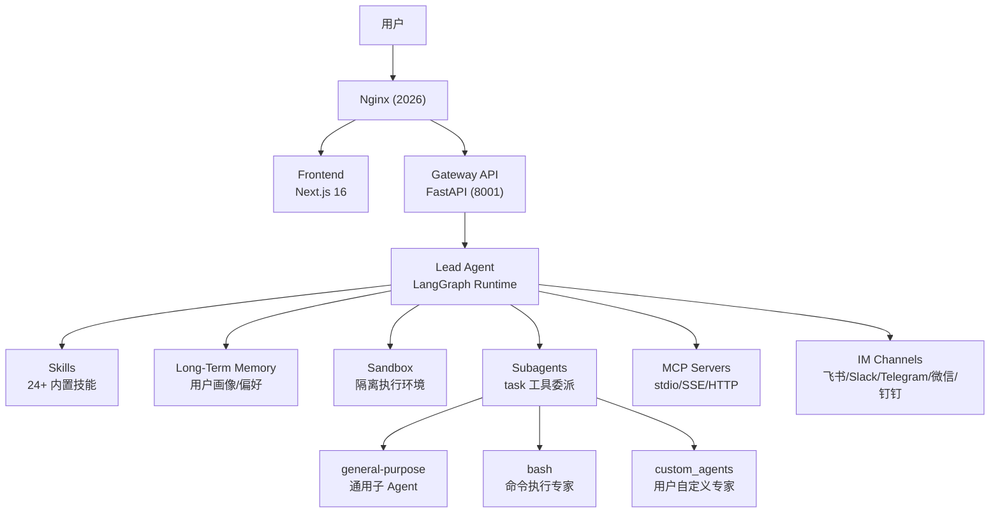
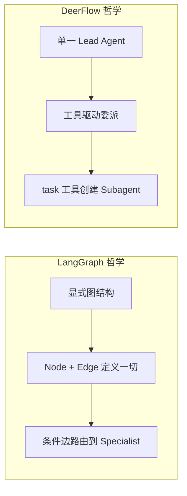

> 源码位置：`_refs/repos/deer-flow/`
> GitHub：https://github.com/bytedance/deer-flow

## 项目定位

**DeerFlow**（**D**eep **E**xploration and **E**fficient **R**esearch **Flow**）是字节跳动开源的 **Super Agent Harness**（超级 Agent 运行时框架）。

- ⭐ 66,076 stars（GitHub Trending #1，2026-02-28）
- 基于 **LangGraph** 构建的全栈 Agent 应用
- 与 v1（Deep Research 框架）完全重写，无共享代码
- 核心定位：不是让你「搭积木」，而是「开箱即用」的 Agent 基础设施

**一句话**：DeerFlow 给 AI Agent 提供了「真正能干活」的基础设施——沙箱执行、持久记忆、子 Agent 委派、技能注入、工具集成，全部内置。

---

## 核心架构

### 全景图



### 关键架构边界：Harness vs App

DeerFlow 后端严格分为两层：

| 层级 | 路径 | 职责 | 规则 |
|---|---|---|---|
| **Harness** | `backend/packages/harness/deerflow/` | 可发布的 Agent 框架核心 | **禁止**导入 `app.*` |
| **App** | `backend/app/` | 未发布的应用代码（Gateway、IM 集成） | 可以导入 `deerflow.*` |

CI 通过 `test_harness_boundary.py` 强制执行这层边界。

---

## 核心模块解析

### 1. Lead Agent（主控 Agent）

文件：`backend/packages/harness/deerflow/agents/lead_agent/`

- `agent.py` —— `make_lead_agent(config)` 工厂函数，LangGraph 运行时注册入口
- `prompt.py` —— 系统提示词组装（技能注入、记忆上下文、子 Agent 编排指令、引用规则）

**核心 mantra**：**DECOMPOSE → DELEGATE → SYNTHESIZE**

当 `subagent_enabled=True` 时，Lead Agent 收到 `<subagent_system>` 提示块，被教会：
1. 将复杂任务拆分为并行子任务
2. 同时发起最多 3 个 `task` 工具调用
3. 收集并整合子 Agent 结果

### 2. Middleware Chain（18 层中间件）

文件：`backend/packages/harness/deerflow/agents/middlewares/`

这是 DeerFlow 最核心的工程创新之一。18 个中间件按严格顺序执行：

| # | 中间件 | 作用 |
|---|---|---|
| 1 | ThreadDataMiddleware | 创建线程隔离目录 |
| 2 | UploadsMiddleware | 注入上传文件到对话 |
| 3 | SandboxMiddleware | 获取沙箱环境 |
| 4 | DanglingToolCallMiddleware | 修复中断后的缺失工具响应 |
| 5 | LLMErrorHandlingMiddleware | 规范化模型调用失败 |
| 6 | GuardrailMiddleware | 工具调用前授权检查 |
| 7 | SandboxAuditMiddleware | 沙箱操作安全日志 |
| 8 | ToolErrorHandlingMiddleware | 工具异常转错误消息 |
| 9 | SummarizationMiddleware | 接近 token 上限时上下文压缩 |
| 10 | TodoListMiddleware | 计划模式下的任务追踪 |
| 11 | TokenUsageMiddleware | Token 用量指标记录 |
| 12 | TitleMiddleware | 自动生成线程标题 |
| 13 | MemoryMiddleware | 异步记忆更新队列 |
| 14 | ViewImageMiddleware | 为视觉模型注入 base64 图片 |
| 15 | DeferredToolFilterMiddleware | 延迟加载 MCP 工具 |
| 16 | SubagentLimitMiddleware | 截断超额的 `task` 调用（并发限制）|
| 17 | LoopDetectionMiddleware | 打断重复工具调用循环 |
| 18 | ClarificationMiddleware | 拦截 `ask_clarification` 并中断用户 |

> **关键洞察**：这套中间件链本质上是对「生产级 Agent 需要的所有横切关注点」的系统化封装。每个中间件都是一个独立关注点，组合起来构成完整的 Agent 运行时保障。

### 3. Subagent System（子 Agent 委派）

文件：`backend/packages/harness/deerflow/subagents/`

**与 LangGraph 路由的核心差异**：

| 维度 | LangGraph Router + Specialist | DeerFlow Subagent |
|---|---|---|
| **路由机制** | 图结构中的 `add_conditional_edges` | Lead Agent 调用 `task` 工具 |
| **决策主体** | 预定义的路由函数 | Lead Agent 自主决策 |
| **并发模型** | super-step 内并行 | 后台线程池（`_scheduler_pool`，最多 3 个）|
| **上下文隔离** | Subgraph 状态隔离 | 每个 Subagent 有自己的 system prompt 和工具集 |
| **递归委派** | 支持 | **禁止**（Subagent 不能调用 `task`）|

**`task` 工具的执行流程**：

```
Lead Agent 调用 task(description, prompt, subagent_type)
    ↓
Registry 查找 subagent 配置（内置 → custom_agents → 覆盖）
    ↓
SubagentExecutor 创建（过滤工具、继承沙箱状态）
    ↓
后台线程池执行（15 分钟超时）
    ↓
每 5 秒轮询完成状态
    ↓
返回结果 → Lead Agent 合成
```

**内置 Specialist**：

| Subagent | 用途 | 配置 |
|---|---|---|
| `general-purpose` | 复杂多步任务、研究、文件操作、分析 | `builtins/general_purpose.py` |
| `bash` | 命令执行专家（仅当允许 shell 时） | `builtins/bash_agent.py` |

**自定义 Specialist**（通过 `config.yaml`）：

```yaml
subagents:
  custom_agents:
    analysis:
      description: "Data analysis specialist"
      system_prompt: "You are a data analysis subagent..."
      tools: [bash, read_file, write_file]
      skills: [data-analysis]
      model: inherit
      max_turns: 80
      timeout_seconds: 600
```

### 4. Skills System（技能系统）

文件：`backend/packages/harness/deerflow/skills/`

Skills 是 DeerFlow 的独特设计：

- 每个 Skill 是一个目录，包含 `SKILL.md`（YAML frontmatter + 工作流说明）
- 位置：`skills/public/`（内置，24 个）和 `skills/custom/`（用户自定义）
- 运行时通过 `get_enabled_skills_for_config()` 渐进加载
- 注入到系统提示词中的 `<skill_system>` 块

**Skills vs Subagents**：

| | Skills | Subagents |
|---|---|---|
| **本质** | 领域特定的**提示词/工作流** | 独立的**Agent 实例** |
| **执行** | 在 Lead Agent 内部执行 | 在隔离上下文中执行 |
| **状态** | 共享 Lead Agent 状态 | 有自己的状态 |
| **适用** | 方法论指导（如何做研究、如何做 PPT） | 实际任务执行（跑代码、查数据） |

**内置 Skills（24 个）**：

- `deep-research` —— 深度研究
- `ppt-generation` —— PPT 生成
- `image-generation` / `video-generation` / `podcast-generation`
- `data-analysis` / `chart-visualization`
- `github-deep-research` / `academic-paper-review`
- `frontend-design` / `skill-creator`

### 5. Sandbox System（沙箱系统）

文件：`backend/packages/harness/deerflow/sandbox/`

- **LocalSandboxProvider**：单例文件系统，默认禁用 bash
- **虚拟路径翻译**：`/mnt/user-data/{workspace,uploads,outputs}` ↔ 物理线程目录
- **工具集**：`bash`, `ls`, `read_file`, `write_file`, `str_replace`, `glob`, `grep`
- 每个线程有独立的执行环境

### 6. Memory System（记忆系统）

文件：`backend/packages/harness/deerflow/agents/memory/`

- **Updater**：基于 LLM 的事实提取 + 去重
- **Queue**：防抖后台更新（默认 30 秒）
- **Storage**：文件化按用户存储 `.deer-flow/users/{user_id}/memory.json`
- **注入**：系统提示词中的 `<memory>` 标签，包含 Top 15 事实 + 上下文

---

## 与 LangGraph 的深层对比



| 对比维度 | LangGraph | DeerFlow |
|---|---|---|
| **抽象层级** | 底层编排框架 | 上层应用运行时 |
| **图结构** | 用户显式定义 Node/Edge | 内部封装，用户无感知 |
| **路由方式** | `add_conditional_edges` | `task` 工具调用 |
| **并发控制** | Pregel super-step | 线程池 + 轮询 |
| **扩展机制** | 自定义 Node/Edge | Skills + Custom Subagents |
| **记忆** | Checkpointer（线程级）| 文件化长期记忆（用户级）|
| **沙箱** | 无内置 | 内置隔离执行环境 |
| **中间件** | 无 | 18 层生产级中间件链 |
| **适用人群** | 需要精细控制的工程师 | 想要「开箱即用」的团队 |

**关键洞察**：
- **LangGraph 是「发动机」**——给你零件，你自己组装车
- **DeerFlow 是「整车」**——发动机（LangGraph）+ 底盘（中间件）+ 内饰（Skills/Memory/Sandbox）+ 方向盘（Gateway/UI）

---

## 技术栈

| 层级 | 技术 |
|---|---|
| Agent 运行时 | LangGraph ≥ 1.0.6, LangChain ≥ 1.2.3 |
| LLM 支持 | OpenAI, Anthropic, Google Gemini, DeepSeek, Ollama, vLLM, Codex CLI |
| Gateway | FastAPI + Uvicorn + SSE-Starlette |
| 前端 | Next.js 16 + React 19 + Tailwind CSS 4 |
| 沙箱 | `agent-sandbox`（支持本地 fs 和 Docker）|
| 搜索 | Tavily, Firecrawl, DuckDuckGo |
| 文档转换 | `markitdown` |
| IM 集成 | 飞书、Slack、Telegram、微信、企业微信、钉钉 |
| 数据库 | SQLite（默认）/ PostgreSQL |

---

## 与已有知识的关联

- **[[LangGraph-Router-Specialist实战]]** —— DeerFlow 的 Subagent 系统是 Router + Specialist 的另一种实现范式（工具委派 vs 条件边路由）
- **[[LangGraph核心概念]]** —— DeerFlow 的 Lead Agent 底层就是 LangGraph 的 StateGraph + Pregel 引擎
- **[[MCP协议详解]]** —— DeerFlow 内置 MCP 支持（stdio/SSE/HTTP），Skills 和 MCP Tools 是互补的扩展机制
- **[[LLM-Powered-Autonomous-Agents]]** —— DeerFlow 是 Planning + Memory + Tool Use 三者的工程化落地，尤其是 MRKL 的「路由器+专家模块」思想的现代实现
- **[[2026-05-08-durable-execution]]** —— DeerFlow 的 ThreadData + Checkpointer + Sandbox 是 durable execution 在应用层的完整实践

---

## 待深入研究

- [ ] 18 层中间件链的具体实现细节（尤其是 SummarizationMiddleware 的上下文压缩策略）
- [ ] `task` 工具的轮询机制与 SSE 事件流实现
- [ ] Skills 系统的渐进加载和注入策略（如何不超出 token 限制）
- [ ] Memory Updater 的 LLM-based 事实提取与去重算法
- [ ] Sandbox 的安全模型（`agent-sandbox` 的实现原理）
- [ ] 与 LangGraph Swarm 模式的对比（工具委派 vs Agent 自主 handoff）
- [ ] 自定义 Agent 的 SOUL.md + config.yaml 配置体系
- [ ] Frontend 中的 `@xyflow/react` 可视化（Agent 执行流程图）
- [ ] 生产部署的 Docker Compose 配置和安全建议
