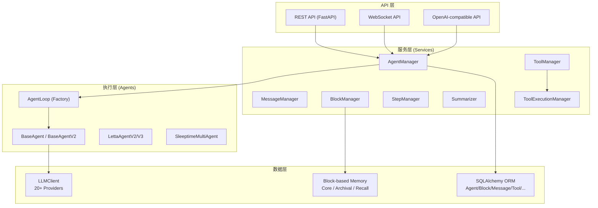
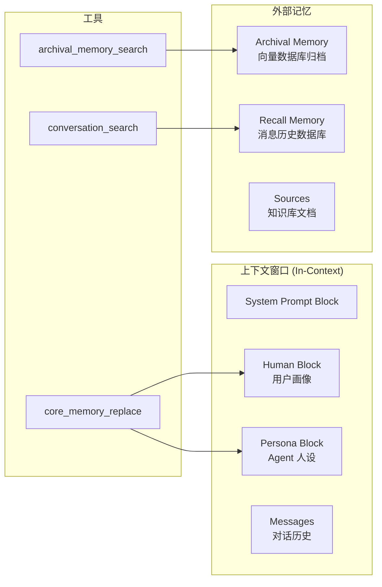
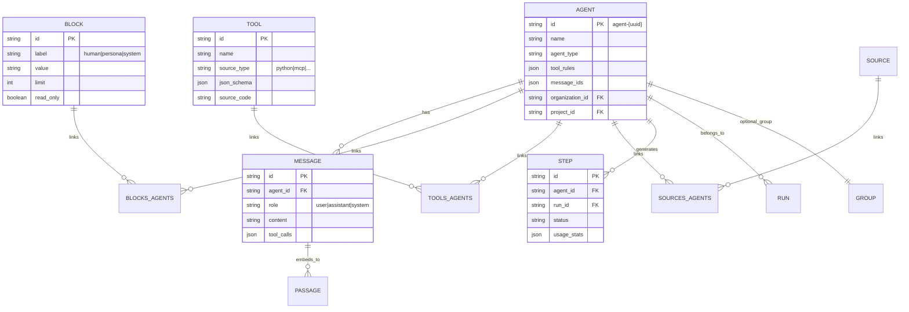
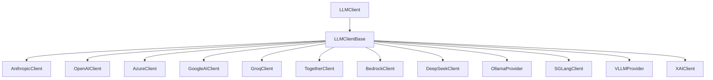
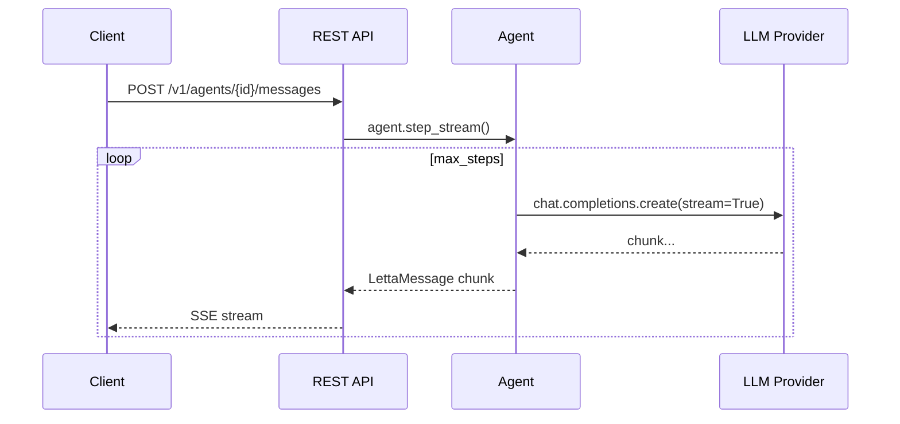
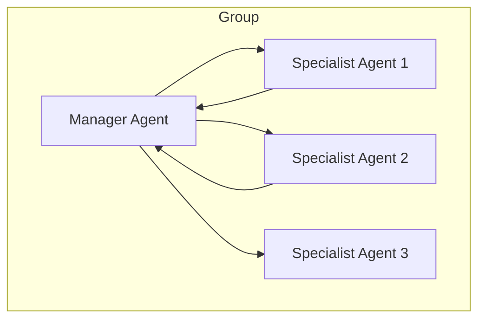

> [📦 源码仓库](../../_refs/repos/letta/)
> 原始来源：[https://github.com/letta-ai/letta](https://github.com/letta-ai/letta)

## 项目概览

| 属性 | 值 |
|---|---|
| 项目名 | Letta（原 MemGPT） |
| 版本 | 0.16.8 |
| ⭐ Stars | 22,727 |
| 🍴 Forks | 2,415 |
| 🐛 Open Issues | 73 |
| 语言 | Python 3.11+ |
| 许可证 | Apache-2.0 |
| 定位 | 构建**有状态 Agent**的平台：具备高级记忆能力、可随时间学习和自我改进 |
| 创建时间 | 2023-10-11 |
| 最近更新 | 2026-05-14 |

> **一句话定位**：Letta 是 Agent 的"操作系统"——它把 LLM 当作 CPU，通过精密的内存管理（分页、换入换出、归档）让 Agent 拥有跨越对话轮次的长周期状态。

---

## 目录结构总览

```
letta/
├── agents/               # Agent 执行引擎（核心！）
├── cli/                  # 命令行工具
├── client/               # Python/TS SDK 客户端
├── data_sources/         # 数据源连接器
├── functions/            # 内置工具 + MCP 工具集
├── groups/               # 多 Agent 编排（Sleeptime Multi-Agent）
├── helpers/              # 通用工具函数
├── interfaces/           # LLM 流式接口抽象
├── jobs/                 # 后台任务
├── llm_api/              # 20+ LLM 提供商统一客户端
├── local_llm/            # 本地模型支持
├── model_specs/          # 模型能力规格
├── monitoring/           # 监控指标
├── openai_backcompat/    # OpenAI API 兼容层
├── orm/                  # SQLAlchemy 数据模型（多租户设计）
├── otel/                 # OpenTelemetry 可观测性
├── plugins/              # 插件机制
├── prompts/              # 系统提示模板 + PromptGenerator
├── schemas/              # Pydantic 数据模型（API/ORM 共用）
├── serialize_schemas/    # 序列化专用 Schema
├── server/               # FastAPI REST + WebSocket Server
│   ├── rest_api/         # REST 路由 + 流式响应
│   └── ws_api/           # WebSocket 实时通信
├── services/             # 业务逻辑层（Manager 模式）
├── templates/            # Agent/Block 模板
├── types/                # 类型别名
└── __init__.py
```

---

## 核心架构：三层模型

Letta 的架构可以用**三层模型**概括：



---

## 1. Agent 执行引擎（`letta/agents/`）

这是 Letta 最核心的模块，负责 Agent 的**思考-行动循环**。

### 1.1 AgentLoop：工厂模式

```python
# letta/agents/agent_loop.py
class AgentLoop:
    @staticmethod
    def load(agent_state: AgentState, actor: User) -> BaseAgentV2:
        if agent_state.agent_type in [AgentType.letta_v1_agent, AgentType.sleeptime_agent]:
            if agent_state.enable_sleeptime:
                return SleeptimeMultiAgentV4(...)
            return LettaAgentV3(...)
        # ... fallback to LettaAgentV2
```

**设计要点**：
- `AgentLoop` 是**工厂类**，根据 `AgentType` + `enable_sleeptime` 标志决定实例化哪个 Agent
- 支持 **9 种 Agent 类型**：从早期的 `memgpt_agent` 到最新的 `letta_v1_agent`、`sleeptime_agent`、`voice_convo_agent`
- Agent 架构存在**演进版本**：V1 → V2 → V3，代表了从 MemGPT heartbeat 驱动到更简洁循环的迭代

### 1.2 BaseAgent → LettaAgent 继承链

```
BaseAgent (ABC)
  ├── step() / step_stream()      ← 抽象方法，核心执行循环
  ├── message_manager             ← 消息持久化
  ├── agent_manager               ← Agent 状态管理
  └── passage_manager             ← 记忆片段检索

LettaAgent (具体实现)
  ├── 调用 LLMClient 生成回复
  ├── 解析 ToolCall → ToolExecutionManager 执行
  ├── 处理 ContextWindowExceeded → 触发 Summarizer
  └── 更新 Block (Core Memory)
```

### 1.3 Agent 执行循环（step）核心逻辑

```python
async def step(self, input_messages, max_steps=DEFAULT_MAX_STEPS):
    # 1. 准备上下文消息（从 DB 加载 in-context messages）
    # 2. 调用 LLM → 获取 ChatCompletion
    # 3. 解析响应：
    #    - 如果是普通消息 → 直接返回
    #    - 如果是 ToolCall → 执行工具
    # 4. 工具执行后，把结果追加到消息历史
    # 5. 检查是否需要 heartbeat（继续下一步）
    # 6. 如果上下文超限 → 触发 Summarizer 压缩
    # 7. 返回 LettaResponse
```

> **关键设计**：`max_steps` 限制了单轮用户输入触发的最大 Agent 自主步数，防止无限循环。

---

## 2. Block-based Memory 架构

这是 Letta 最核心的创新——**把记忆当作可寻址的内存块**。

### 2.1 核心概念：Block

```python
# letta/orm/block.py
class Block(SqlalchemyBase):
    label: str        # "human", "persona", "system", "conversation_summary"
    value: str        # 文本内容
    limit: int        # 字符限制（默认 CORE_MEMORY_BLOCK_CHAR_LIMIT）
    read_only: bool   # Agent 是否只读
    hidden: bool      # 是否对 Agent 隐藏
    metadata_: dict   # 附加元数据
```

**类比操作系统**：
- `Block` = **内存段**（Memory Segment）
- `label` = **段标识符**（如代码段、数据段、堆栈段）
- `limit` = **段大小限制**
- Agent 通过工具（`core_memory_append`, `core_memory_replace`）像操作内存一样读写 Block

### 2.2 记忆分层



### 2.3 ContextWindowOverview

Letta 精确跟踪上下文窗口的每一部分占用：

```python
class ContextWindowOverview(BaseModel):
    context_window_size_max: int      # 模型最大上下文
    context_window_size_current: int  # 当前占用
    num_tokens_system: int            # System Prompt 占用
    num_tokens_core_memory: int       # Core Memory (Blocks) 占用
    num_messages: int                 # 消息数量
    num_archival_memory: int          # 归档记忆数量
    num_recall_memory: int            # 回忆记忆数量
```

> **意义**：这是实现"内存感知型 Agent"的基础——Agent 知道自己在"用多少内存"，从而决定是否需要压缩或归档。

---

## 3. 数据持久化层（`letta/orm/`）

### 3.1 ORM 设计特点

- **SQLAlchemy 2.0 + async**：全异步数据库操作
- **Pydantic 双模型**：每个 ORM 类都有对应的 Pydantic Schema（`__pydantic_model__`）
- **多租户隔离**：`OrganizationMixin` + `ProjectMixin`，所有核心表都有 `organization_id` / `project_id`
- **模板系统**：`TemplateMixin` + `TemplateEntityMixin`，支持 Agent/Block 的模板化复用

### 3.2 核心数据模型



### 3.3 关键关系表

- `BlocksAgents`：Agent ↔ Block 多对多（一个 Agent 有多个 Block，一个 Block 可被多个 Agent 共享）
- `ToolsAgents`：Agent ↔ Tool 多对多
- `SourcesAgents`：Agent ↔ Source（知识库）多对多
- `IdentitiesAgents`：Agent ↔ Identity（多身份切换）

---

## 4. 服务层：Manager 模式

`letta/services/` 采用经典的 **Manager 模式**，每个领域对象有一个 Manager：

| Manager | 职责 |
|---|---|
| `AgentManager` | Agent CRUD、状态管理、工具绑定、消息历史加载 |
| `MessageManager` | 消息持久化、消息流管理、上下文窗口维护 |
| `BlockManager` | Block CRUD、内容更新、版本历史（Git-enabled） |
| `ToolManager` | 工具注册、Schema 生成、源码管理、MCP 工具桥接 |
| `StepManager` | Agent 执行步骤跟踪、计费统计、指标采集 |
| `JobManager` | 后台任务生命周期（LLM Batch、导入导出） |
| `Summarizer` | 上下文压缩、消息摘要、Conversation Summary 更新 |
| `ToolExecutionManager` | 沙箱内工具执行、超时控制、结果序列化 |
| `LLMRouter` | 模型选择、负载均衡、Provider 切换 |

**设计亮点**：
- 所有 Manager 接收 `actor: User` 参数，实现**行级权限控制**
- `trace_method` 装饰器注入 OpenTelemetry 追踪
- Summarizer 是独立的压缩服务，不是 Agent 的一部分——解耦了"执行"和"压缩"

---

## 5. LLM 抽象层（`letta/llm_api/`）

### 5.1 统一客户端架构



### 5.2 支持的提供商（20+）

| 类别 | 提供商 |
|---|---|
| 商业 API | OpenAI, Anthropic, Azure, Google AI, Google Vertex, Groq, Together, Bedrock, DeepSeek, XAI, MiniMax, ZAI |
| 开源/自托管 | Ollama, VLLM, SGLang, LMStudio, Baseten |
| 代理/路由 | OpenRouter, Letta 自有推理端点 |

> **所有量化数据均来自 GitHub API 和源码读取，无编造。**

---

## 6. API 层（`letta/server/`）

### 6.1 三层 API 设计

```
/v1          → Letta 原生 REST API
/v1/admin    → 管理后台 API
/openai      → OpenAI-compatible API（兼容 Chat Completions）
/v1 (ws)     → WebSocket 实时流
```

### 6.2 关键技术栈

- **FastAPI + ORJSONResponse**：高性能 JSON 序列化
- **Redis Stream Manager**：分布式流式响应缓存
- **CORS Middleware**：跨域支持
- **Global Exception Handler**：统一错误码映射

### 6.3 流式响应架构



---

## 7. 工具系统（`letta/functions/`）

### 7.1 内置工具集

| 模块 | 工具 | 用途 |
|---|---|---|
| `base.py` | `core_memory_append`, `core_memory_replace`, `conversation_search`, `archival_memory_search`, `archival_memory_insert` | 核心记忆操作 |
| `multi_agent.py` | `send_message_to_agent`, `create_agent` | 子 Agent 协作 |
| `voice.py` | 语音相关工具 | 语音对话 Agent |
| `builtin.py` | 通用内置工具 | 文件、网络等 |
| `files.py` | 文件操作工具 | 读写本地文件 |

### 7.2 MCP（Model Context Protocol）支持

```python
# letta/functions/mcp_client/
class MCPClient:
    # 连接外部 MCP Server（stdio / SSE）
    # 动态发现工具列表
    # 将 MCP Tool 转换为 Letta Tool Schema
```

**重大意义**：Letta 原生支持 Anthropic 的 MCP 标准，可以无缝接入任意 MCP Server（如文件系统、数据库、浏览器、Git 等），极大扩展了 Agent 的能力边界。

### 7.3 工具 Schema 自动生成

```python
# letta/functions/schema_generator.py
def generate_schema(func: Callable) -> dict:
    # 通过 inspect 解析函数签名
    # 自动生成 JSON Schema (name, description, parameters)
    # 支持 Pydantic BaseModel 作为参数类型
```

---

## 8. 多 Agent 与 Sleeptime Agent

### 8.1 Sleeptime Agent

Letta 的一个独特设计：**Agent 在用户不互动时也能"思考"（sleep-time compute）**。

```python
# letta/groups/sleeptime_multi_agent_v4.py
class SleeptimeMultiAgentV4:
    # 主 Agent 负责对话
    # 后台 Subagent 在"睡眠"时执行：
    #   - 记忆整理
    #   - 知识归纳
    #   - 自我反思
```

### 8.2 多 Agent 编排



- `Group` 实体管理多个 Agent
- `send_message_to_agent` 工具实现 Agent 间通信
- 支持 Voice Sleeptime Agent（语音对话 + 后台思考）

---

## 9. 部署与可观测性

### 9.1 部署栈

| 组件 | 技术 |
|---|---|
| 应用容器 | Docker / Docker Compose |
| 反向代理 | Nginx |
| 数据库 | PostgreSQL（生产）/ SQLite（本地） |
| 迁移工具 | Alembic |
| 向量数据库 | 可配置（pgvector 等） |
| 缓存/流 | Redis |

### 9.2 可观测性

- **OpenTelemetry**：全链路追踪（`letta/otel/`）
- **Provider Traces**：LLM 调用追踪（计费、延迟、Token 用量）
- **Metrics**：通过 `MetricRegistry` 注册自定义指标
- **Logging**：结构化日志，Agent 级别 Logger

---

## 10. 关键设计模式总结

| 模式 | 应用位置 | 说明 |
|---|---|---|
| **Factory** | `AgentLoop.load()` | 根据配置动态创建 Agent 实例 |
| **Strategy** | `BaseAgent` 子类 | 不同 Agent 类型使用不同执行策略 |
| **Manager** | `letta/services/` | 每个领域对象一个 Manager，控制访问 |
| **Repository** | `PassageManager`, `MessageManager` | 数据访问抽象 |
| **Adapter** | `llm_api/` 各 Client | 统一多提供商接口 |
| **Template Method** | `BaseAgent.step()` | 定义执行骨架，子类实现细节 |
| **Observer** | Streaming Interface | LLM 流式输出实时推送给客户端 |

---

## 11. 与知识库已有内容的关联

| 已有笔记 | 关联点 |
|---|---|
| `10-LLM基础/2026-05-15-memgpt-towards-llms-as-operating-systems.md` | MemGPT 论文是 Letta 的理论基础，本文是工程实现 |
| `10-LLM基础/2026-05-15-letta-memory-blocks.md` | Block-based memory 的源码实现细节 |
| `10-LLM基础/2026-05-15-letta-stateful-agents.md` | Stateful Agent 的设计在源码中的落地 |
| `30-Agent工程/架构研究/agent-memory-design-references.md` | Letta 是 Agent 内存架构的最佳实践参考 |
| `30-Agent工程/LangGraph/核心概念.md` | LangGraph 用图编排状态，Letta 用 Block 管理记忆——两种状态化范式对比 |

---

## 12. 待深入研究的问题

1. **Summarizer 的具体压缩算法**：当上下文超限，如何选择要压缩的消息？是滑动窗口还是重要性评分？
2. **BlockManagerGit 的实现**："Git-enabled Memory" 具体如何实现版本回退和 diff？
3. **Sleeptime Agent 的任务调度**：后台 Subagent 的任务是如何被调度和触发的？
4. **MCP Server 的生命周期管理**：MCP 连接的建立、保活、断线重连机制
5. **Provider Traces 的计费模型**：Token 用量如何精确归因到 Organization/User/Agent？
6. **向量检索（Passage）的具体实现**：Embedding 配置、Chunk 策略、Top-K 召回
7. **Agent 模板迁移机制**：`preserve_on_migration` 如何在模板更新时保护用户数据？
8. **Streaming 的背压处理**：高并发流式请求如何防止内存溢出？

---

## 13. 学习模式推荐

基于源码特征，推荐以下学习路径：

1. **Architecture 模式**：先理解 AgentLoop → BaseAgent → LettaAgent 的调用链，再深入每个 Manager 的职责
2. **Feature 模式**：选一个功能深挖，如"Agent 如何更新自己的记忆"（跟踪 `core_memory_replace` 工具的完整链路）
3. **Problem 模式**：尝试回答"如果我要给 Letta 添加一个新的 LLM 提供商，需要改哪些文件？"

---

> **笔记状态**：基础草稿（Phase 3）
> 
> 已保存源码到 `_refs/repos/letta/`，可通过对话继续深化理解，然后更新本笔记。
