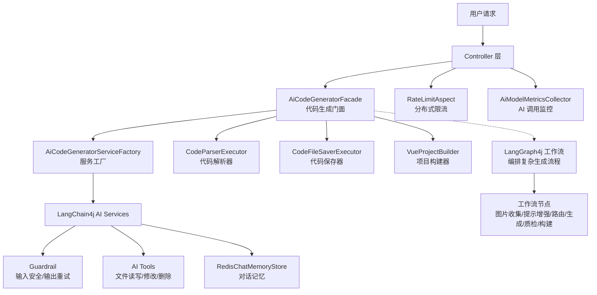
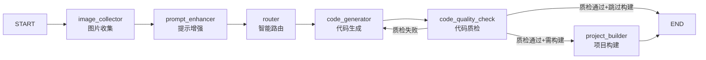
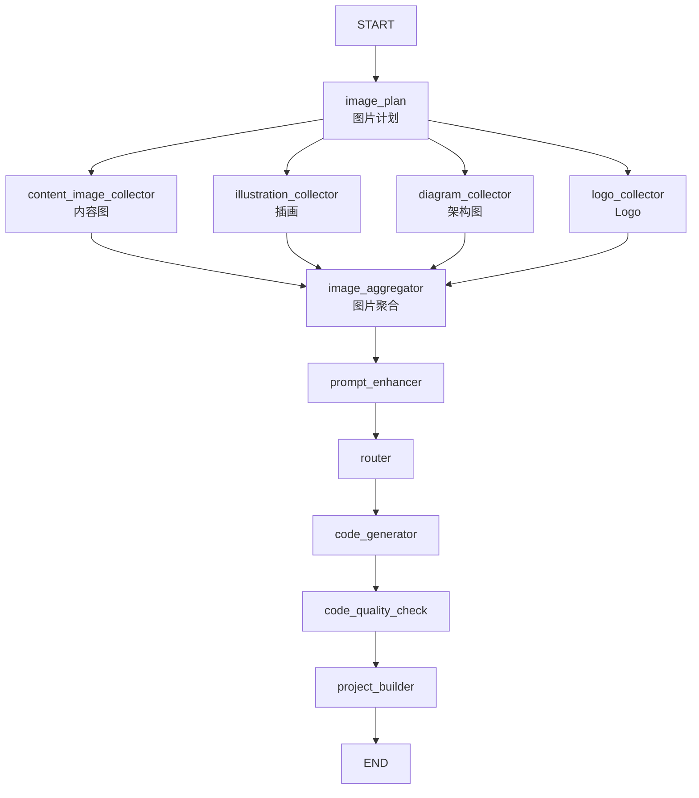

# 鱼皮 AI 代码生成平台（yu-ai-code-mother）架构解析

> 源码位置：`_refs/repos/yu-ai-code-mother/`
> GitHub：https://github.com/liyupi/yu-ai-code-mother
> 作者：程序员鱼皮
>
> 本项目为教学项目，基于 Spring Boot 3 + LangChain4j + LangGraph4j + Vue 3 开发的企业级 AI 代码生成平台。

---

## 一、项目定位

**一句话**：基于 Java 技术栈的 **AI 零代码应用生成平台**，用户输入需求描述，AI 自动分析、选择生成策略、调用工具生成代码文件，支持流式输出实时预览、可视化编辑、一键部署分享。

**四大核心能力：**
1. **智能代码生成** —— AI 分析需求，自动选择生成策略（HTML / 多文件 / Vue 项目），通过工具调用生成代码
2. **可视化编辑** —— 生成应用实时展示，进入编辑模式与 AI 对话快速修改页面
3. **一键部署分享** —— 云端部署 + 自动截封面图 + 源码下载
4. **企业级管理** —— 用户/应用管理、AI 调用监控、系统性能监控

---

## 二、技术栈全景

| 层级 | 技术选型 | 版本 |
|------|----------|------|
| **基础框架** | Spring Boot | 3.5.4 |
| **JDK** | Java Virtual Threads | 21 |
| **AI 框架** | LangChain4j | 1.1.0 |
| **AI 工作流** | LangGraph4j | 1.6.0-rc2 |
| **AI 模型** | OpenAI API / 阿里云 DashScope | 2.21.1 |
| **数据访问** | MyBatis-Flex + HikariCP + MySQL | 1.11.1 |
| **缓存** | Redis + Caffeine（多级缓存） | — |
| **限流** | Redisson 分布式限流 | 3.50.0 |
| **对象存储** | 腾讯云 COS | — |
| **监控** | Spring Boot Actuator + Micrometer + Prometheus + Grafana | — |
| **前端** | Vue 3 | — |
| **微服务** | Spring Cloud Alibaba + Dubbo（微服务版） | — |

---

## 三、单体架构核心模块解析



### 3.1 AI 核心层（`ai/`）

#### AI Service 接口定义（声明式 AI 服务）

```java
public interface AiCodeGeneratorService {
    @SystemMessage(fromResource = "prompt/codegen-html-system-prompt.txt")
    HtmlCodeResult generateHtmlCode(String userMessage);
    
    @SystemMessage(fromResource = "prompt/codegen-vue-project-system-prompt.txt")
    TokenStream generateVueProjectCodeStream(@MemoryId long appId, @UserMessage String userMessage);
}
```

**关键设计：**
- 使用 LangChain4j 的 `@SystemMessage(fromResource = ...)` 从外部文件加载系统提示词，便于维护
- `@MemoryId` 实现按 appId 隔离的对话记忆
- 同时提供同步返回（`HtmlCodeResult`）和流式返回（`TokenStream` / `Flux<String>`）两种接口

#### 工具调用体系（`ai/tools/`）

| 工具 | 职责 |
|------|------|
| **FileReadTool** | 读取文件内容 |
| **FileWriteTool** | 写入文件 |
| **FileModifyTool** | 修改文件 |
| **FileDeleteTool** | 删除文件 |
| **FileDirReadTool** | 读取目录结构 |
| **ExitTool** | 结束工具调用会话 |

**工具管理器（`ToolManager`）：**
- Spring 自动注入所有 `BaseTool` 实现
- `@PostConstruct` 构建 `toolName -> Tool` 映射表
- 支持运行时通过名称获取工具实例

```java
@Component
public class ToolManager {
    @Resource
    private BaseTool[] tools;  // Spring 自动注入所有工具
    
    @PostConstruct
    public void initTools() {
        for (BaseTool tool : tools) {
            toolMap.put(tool.getToolName(), tool);
        }
    }
}
```

#### Guardrail 机制（`ai/guardrail/`）

**输入护轨（`PromptSafetyInputGuardrail`）：**
- 输入长度限制（1000 字）
- 敏感词检测（"忽略之前的指令"、"越狱"等）
- 正则注入攻击检测（`ignore previous instructions`、`system: you are` 等模式）

**输出护轨（`RetryOutputGuardrail`）：**
- 响应为空/过短检测
- 敏感信息泄露检测（密码、token、私钥、证书等）
- 发现问题时通过 `reprompt()` 让模型重新生成

> **与已有知识的联系**：Guardrail 是生产级 AI 应用的安全边界。参见 [[Autonomous-Agents]] 中提到的 "LLM 自我评估在专业领域不可靠"——Guardrail 提供了外部验证机制。

### 3.2 AI 工作流层（`langgraph4j/`）

本项目使用了 **LangGraph4j**（LangGraph 的 Java 实现）来编排复杂的代码生成流程，提供了**三种工作流模式**：

#### 模式一：顺序工作流（`CodeGenWorkflow`）



**关键设计：**
- 使用 `MessagesStateGraph` 作为状态图基座
- `WorkflowContext` 作为全局状态载体，存储在所有节点间传递的上下文
- 质检失败时通过条件边 `addConditionalEdges` 回流到 `code_generator` 重新生成
- 根据代码生成类型（HTML / MULTI_FILE / VUE_PROJECT）决定是否执行项目构建

#### 模式二：并发工作流（`CodeGenConcurrentWorkflow`）



**并发执行机制：**
- 配置 `ExecutorService` 线程池（core=10, max=20）
- 通过 `RunnableConfig.builder().addParallelNodeExecutor("image_plan", pool)` 指定并发节点
- LangGraph4j 在 super-step 内自动并行执行无依赖的节点

#### 模式三：子图工作流（`CodeGenSubgraphWorkflow`）

与并发模式类似，但将每个图片收集器封装为**独立的子图（Subgraph）**：

```java
private StateGraph<MessagesState<String>> createContentImageSubgraph() {
    return new MessagesStateGraph<String>()
        .addNode("content_collect", ContentImageCollectorNode.create())
        .addEdge(START, "content_collect")
        .addEdge("content_collect", END);
}

// 父图中将子图作为节点
.addNode("content_image_subgraph", contentImageSubgraph)
```

**子图的价值：**
- 与父图**完全共享状态**（`MessagesState`）
- 复杂流程模块化，便于独立测试和维护
- 子图内部可以有自己的 start/end 边界

#### 工作流状态设计（`WorkflowContext`）

```java
@Data
@Builder
public class WorkflowContext implements Serializable {
    private String currentStep;           // 当前执行步骤
    private String originalPrompt;        // 用户原始输入
    private String enhancedPrompt;        // 增强后的提示词
    private CodeGenTypeEnum generationType;  // 代码生成类型
    private String generatedCodeDir;      // 生成的代码目录
    private QualityResult qualityResult;  // 质检结果
    private ImageCollectionPlan imageCollectionPlan;  // 图片收集计划
    // 并发图片收集中间结果
    private List<ImageResource> contentImages;
    private List<ImageResource> illustrations;
    private List<ImageResource> diagrams;
    private List<ImageResource> logos;
}
```

**状态操作方法：**
- `WorkflowContext.getContext(state)` —— 从 `MessagesState` 中反序列化上下文
- `WorkflowContext.saveContext(context)` —— 将上下文保存回 `MessagesState`

#### 路由节点（`RouterNode`）

```java
public class RouterNode {
    public static AsyncNodeAction<MessagesState<String>> create() {
        return node_async(state -> {
            AiCodeGenTypeRoutingService routingService = 
                SpringContextUtil.getBean(AiCodeGenTypeRoutingService.class);
            CodeGenTypeEnum generationType = 
                routingService.routeCodeGenType(context.getOriginalPrompt());
            context.setGenerationType(generationType);
            return WorkflowContext.saveContext(context);
        });
    }
}
```

**设计要点：**
- 通过 `SpringContextUtil.getBean()` 在 Node 中获取 Spring Bean（LangGraph4j Node 默认不是 Spring 管理的）
- AI 根据用户输入智能判断生成类型（HTML / 多文件 / Vue 项目）
- 失败降级：路由异常时默认使用 HTML 类型

### 3.3 核心业务层（`core/`）

#### 门面模式（`AiCodeGeneratorFacade`）

作为代码生成的统一入口，封装了类型分发、流式处理、工具调用传递、项目构建等复杂逻辑：

```java
@Service
public class AiCodeGeneratorFacade {
    
    // 同步生成
    public File generateAndSaveCode(String userMessage, CodeGenTypeEnum type, Long appId)
    
    // 流式生成（统一返回 Flux<String>）
    public Flux<String> generateAndSaveCodeStream(String userMessage, CodeGenTypeEnum type, Long appId)
}
```

**流式处理核心（`processTokenStream`）：**
- `onPartialResponse` —— AI 文本片段实时推送给前端
- `onPartialToolExecutionRequest` —— 工具调用请求实时展示
- `onToolExecuted` —— 工具执行结果实时展示
- `onCompleteResponse` —— 流结束后触发 Vue 项目构建

**消息类型设计：**

```java
// 统一的消息类型枚举，前端根据 type 解析不同消息
public enum StreamMessageTypeEnum {
    AI_RESPONSE,      // AI 文本响应
    TOOL_REQUEST,     // AI 请求调用工具
    TOOL_EXECUTED,    // 工具执行完成
    WORKFLOW_START,   // 工作流开始
    STEP_COMPLETED,   // 工作流步骤完成
    WORKFLOW_COMPLETED, // 工作流完成
    WORKFLOW_ERROR    // 工作流错误
}
```

#### 代码解析与保存（策略模式 + 执行器模式）

| 组件 | 职责 | 设计模式 |
|------|------|----------|
| `CodeParser` | 解析不同格式的 AI 输出 | 策略模式 |
| `HtmlCodeParser` | 提取 HTML 代码 | 具体策略 |
| `MultiFileCodeParser` | 提取多文件代码块 | 具体策略 |
| `CodeParserExecutor` | 根据类型选择 Parser 执行 | 执行器/工厂 |
| `CodeFileSaverTemplate` | 保存代码的抽象模板 | 模板方法模式 |
| `CodeFileSaverExecutor` | 根据类型选择 Saver 执行 | 执行器/工厂 |

#### Vue 项目构建器（`VueProjectBuilder`）

```java
@Component
public class VueProjectBuilder {
    public boolean buildProject(String projectPath) {
        // 1. 检查 package.json
        // 2. 执行 npm install（5分钟超时）
        // 3. 执行 npm run build（3分钟超时）
        // 4. 验证 dist 目录生成
    }
    
    public void buildProjectAsync(String projectPath) {
        Thread.ofVirtual().name("vue-builder-" + ...).start(() -> buildProject(projectPath));
    }
}
```

**关键点：**
- 使用 **Java 21 Virtual Threads** 异步执行构建，不阻塞主线程
- 跨平台命令处理（Windows `.cmd` vs Linux/Mac）
- 超时控制（npm install 5min, npm build 3min）

### 3.4 监控与限流

#### AI 模型监控（`AiModelMetricsCollector`）

基于 Micrometer + Prometheus 的四维指标采集：

| 指标 | 类型 | 标签维度 |
|------|------|----------|
| `ai_model_requests_total` | Counter | user_id, app_id, model_name, status |
| `ai_model_errors_total` | Counter | user_id, app_id, model_name, error_message |
| `ai_model_tokens_total` | Counter | user_id, app_id, model_name, token_type |
| `ai_model_response_duration_seconds` | Timer | user_id, app_id, model_name |

**缓存优化：** 使用 `ConcurrentHashMap` 缓存已创建的指标对象，避免每次请求重复注册。

#### 分布式限流（`RateLimitAspect`）

基于 Redisson `RRateLimiter` 的注解式限流：

```java
@RateLimit(rate = 10, rateInterval = 60, limitType = RateLimitType.USER)
public Flux<String> generateCode(...) { ... }
```

**限流维度：**
- **API 级别** —— 按方法名限流
- **用户级别** —— 按登录用户 ID 限流
- **IP 级别** —— 按客户端 IP 限流（未登录用户降级）

---

## 四、微服务架构

单体版演进为微服务版，按业务模块拆分：

```
yu-ai-code-mother-microservice/
├── yu-ai-code-common/      # 公共模块（异常、常量、工具、AOP）
├── yu-ai-code-model/       # 数据模型（Entity、DTO、VO、Enum）
├── yu-ai-code-client/      # 内部 RPC 接口定义
├── yu-ai-code-ai/          # AI 服务（LangChain4j、工作流、工具、Guardrail）
├── yu-ai-code-app/         # 应用服务（Controller、核心业务、项目构建）
├── yu-ai-code-user/        # 用户服务（认证、用户管理）
└── yu-ai-code-screenshot/  # 截图服务（Selenium 网页截图）
```

**拆分策略：**
- **AI 服务独立** —— AI 调用是资源密集型操作，独立部署便于横向扩容和模型切换
- **截图服务独立** —— Selenium 依赖重，独立部署避免影响主服务稳定性
- **用户服务独立** —— 认证逻辑独立，可被其他服务复用

---

## 五、关键设计亮点

### 1. 流式输出的统一抽象

项目同时处理两种流式数据源：
- **Flux<String>**（HTML / MULTI_FILE）— Reactor 响应式流
- **TokenStream**（VUE_PROJECT）— LangChain4j 原生流

通过 `StreamHandlerExecutor` 根据类型分发到不同的处理器，上层调用方无感知。

### 2. 工作流自检与重试

代码质检节点失败后，不直接报错，而是：
1. 将质检错误信息注入到下一次代码生成的提示词中
2. 工作流通过条件边自动回流到生成节点
3. 模型基于"错误反馈"修复后重新生成

```java
private static String buildErrorFixPrompt(QualityResult qualityResult) {
    errorInfo.append("\n\n## 上次生成的代码存在以下问题，请修复：\n");
    qualityResult.getErrors().forEach(error -> errorInfo.append("- ").append(error).append("\n"));
    errorInfo.append("\n请根据上述问题和建议重新生成代码，确保修复所有提到的问题。");
}
```

### 3. 多级缓存策略

- **L1**：Caffeine 本地缓存（JVM 内，极高速）
- **L2**：Redis 分布式缓存（跨实例共享）
- **L3**：MySQL 持久化存储

AI 对话记忆通过 `RedisChatMemoryStore` 实现跨会话持久化，支持 TTL 过期。

### 4. 虚拟线程的应用

多处使用 Java 21 Virtual Threads：
- Vue 项目异步构建
- SSE 流式输出后端推送
- 工作流执行

```java
Thread.startVirtualThread(() -> {
    // 长时间运行的工作流执行
});
```

---

## 六、与已有笔记的关联

- **[[LangChain4j]]** —— 本文是该笔记的工程实践补充，展示了声明式 AI Service、Tool Calling、Guardrail、Memory 的完整落地
- **[[核心概念]]** —— LangGraph4j 的工作流设计与 Python 版 LangGraph 的 StateGraph、Node、Edge、Conditional Edge 概念完全对应
- **[[DeerFlow]]** / **[[Deep-Agents]]** —— 同为 AI 应用运行时框架，可对比 Java 与 Python 生态的差异（LangChain4j vs LangChain，LangGraph4j vs LangGraph）
- **[[Autonomous-Agents]]** —— Tool Use + Planning + Memory 三大组件在此项目中的具体工程实现
- **[[rag-evolution]]** —— 本项目未使用 RAG，但 Guardrail 的输入校验机制与 RAG 的防幻觉思路互补
- **[[Spring-AI]]** / **[[Spring-AI-Alibaba]]** —— 同为 Spring 生态的 Java AI 框架，可与 LangChain4j 的实现方式做对比

---

## 七、待深入研究

- [ ] LangGraph4j 与 Python LangGraph 的功能差异（如 checkpoint、thread_id 持久化是否支持）
- [ ] `AiCodeGeneratorServiceFactory` 的动态服务实例创建机制（多租户模型隔离）
- [ ] 代码解析器（`HtmlCodeParser`、`MultiFileCodeParser`）的具体实现，如何处理 AI 输出的格式不确定性
- [ ] 流式消息的统一协议设计（`AiResponseMessage`、`ToolRequestMessage` 的 JSON Schema）
- [ ] MyBatis-Flex 在 AI 应用中的 CRUD 实践
- [ ] 微服务版中 Dubbo 与 LangChain4j 的集成方式（AI 服务作为 RPC 提供方）
- [ ] 提示词工程：codegen-html-system-prompt.txt / codegen-vue-project-system-prompt.txt 的具体内容
- [ ] 与 Spring AI 的对比：相同功能在 Spring AI 中的实现方式差异
