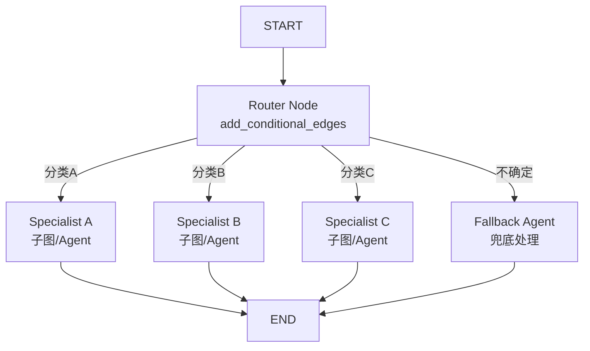
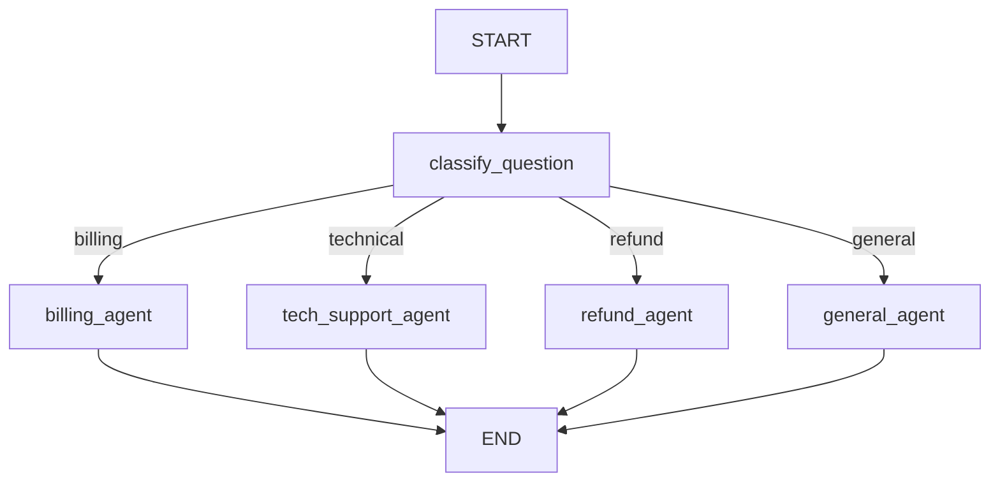
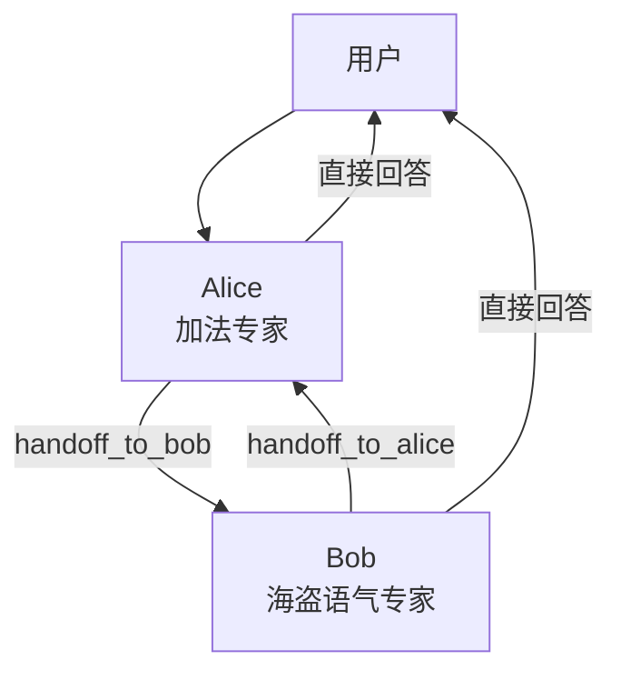
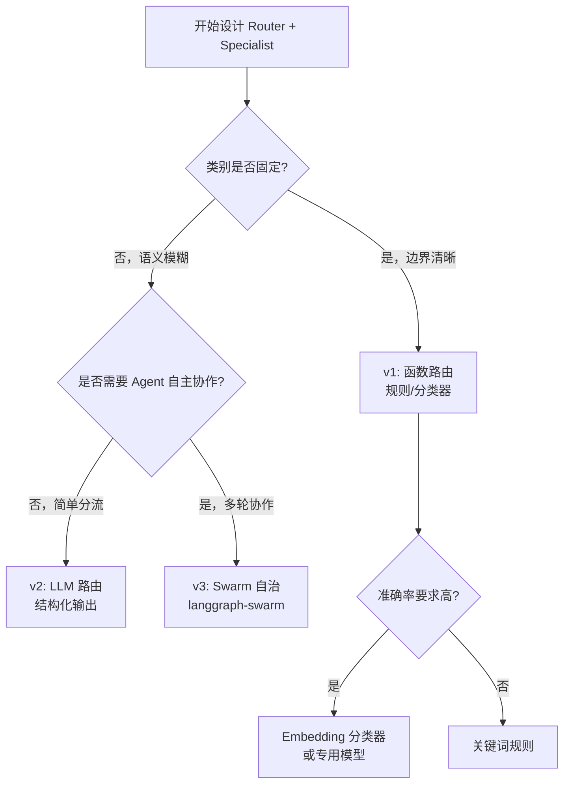

> [📖 中英段落对照：Graph API](../99-工具与参考/ref-articles/langgraph-graph-api-bilingual.md)
> [📖 中英段落对照：Workflows & Agents](../99-工具与参考/ref-articles/langgraph-workflows-agents-bilingual.md)

## 什么是 Router + Specialist

Router + Specialist 是 Agent 系统中最常用的一种**分层架构**：

| 组件 | 职责 | 类比 |
|---|---|---|
| **Router（路由器/调度器）** | 理解用户意图，判断该交给谁处理 | 医院分诊台护士 |
| **Specialist（专家/专员）** | 在特定领域内深度处理任务 | 各科主治医生 |
| **Fallback（兜底）** | 处理 Router 无法分类的情况 | 全科医生 |

LangGraph 中的对应实现：



---

## 三种实现模式

在 LangGraph 生态中，Router + Specialist 有三种主流实现模式，复杂度递增：

| 模式 | 核心机制 | 适用场景 | 代表项目 |
|---|---|---|---|
| **v1: 函数路由** | `routing_fn` 用规则/分类器判断 | 类别固定、边界清晰 | 大部分生产系统 |
| **v2: LLM 路由** | 让 LLM 判断分类并选择 Specialist | 类别模糊、需要语义理解 | OpenAI Swarm |
| **v3: Swarm 自治** | Agent 自主决定 handoff 给谁 | 复杂协作、动态交接 | `langgraph-swarm` |

---

## v1：函数路由（硬编码 Router）

最简单、最可控的实现。Router 是一个 Python 函数，用规则或轻量分类器决定走向。

### 场景：客服系统



### 完整代码

```python
from typing import TypedDict, Literal
from langgraph.graph import StateGraph, START, END

# ========== State ==========
class State(TypedDict):
    question: str
    category: str
    answer: str

# ========== Router ==========
def classify_question(state: State) -> dict:
    """基于关键词的简单分类器（生产环境可替换为 LLM 或 Embedding 分类器）"""
    q = state["question"].lower()
    if any(k in q for k in ["price", "cost", "bill", "charge", "payment"]):
        return {"category": "billing"}
    if any(k in q for k in ["bug", "error", "crash", "not working", "broken"]):
        return {"category": "technical"}
    if any(k in q for k in ["refund", "return", "money back"]):
        return {"category": "refund"}
    return {"category": "general"}

# ========== Specialists ==========
def billing_agent(state: State) -> dict:
    return {"answer": f"[Billing] 已为您查询 '{state['question']}' 的账单信息。"}

def tech_support_agent(state: State) -> dict:
    return {"answer": f"[Tech] 正在为您排查 '{state['question']}' 的技术问题。"}

def refund_agent(state: State) -> dict:
    return {"answer": f"[Refund] 已为您提交 '{state['question']}' 的退款申请。"}

def general_agent(state: State) -> dict:
    return {"answer": f"[General] 关于 '{state['question']}'，这是通用回答。"}

# ========== 路由函数 ==========
def route_by_category(state: State) -> Literal["billing", "technical", "refund", "general"]:
    return state["category"]

# ========== 组装图 ==========
graph = StateGraph(State)
graph.add_node("classify", classify_question)
graph.add_node("billing", billing_agent)
graph.add_node("technical", tech_support_agent)
graph.add_node("refund", refund_agent)
graph.add_node("general", general_agent)

graph.add_edge(START, "classify")
graph.add_conditional_edges(
    "classify",
    route_by_category,
    {
        "billing": "billing",
        "technical": "technical",
        "refund": "refund",
        "general": "general",
    }
)
for node in ["billing", "technical", "refund", "general"]:
    graph.add_edge(node, END)

app = graph.compile()

# ========== 运行 ==========
for q in ["How much do I owe?", "App keeps crashing", "I want a refund", "Hello there"]:
    result = app.invoke({"question": q})
    print(f"Q: {q}\nA: {result['answer']}\n")
```

**输出：**
```
Q: How much do I owe?
A: [Billing] 已为您查询 ...

Q: App keeps crashing
A: [Tech] 正在为您排查 ...

Q: I want a refund
A: [Refund] 已为您提交 ...

Q: Hello there
A: [General] 关于 ...
```

### v1 的优缺点

| ✅ 优点 | ❌ 缺点 |
|---|---|
| 确定性 100%，不会分类错误 | 类别边界模糊时效果差 |
| 延迟极低（无需 LLM 调用） | 新增类别需要改代码 |
| 成本低（规则判断几乎免费） | 无法处理语义变体 |

---

## v2：LLM 路由（智能 Router）

让 LLM 充当 Router，通过结构化输出决定分类。适合类别边界模糊的场景。

### 核心变化：Router 改用 LLM

```python
from typing import Literal
from langchain.chat_models import init_chat_model
from langchain.messages import SystemMessage, HumanMessage

model = init_chat_model("gpt-4o-mini", temperature=0)

CATEGORIES = ["billing", "technical", "refund", "general"]

class RouterOutput(TypedDict):
    category: Literal["billing", "technical", "refund", "general"]
    reasoning: str

router_model = model.with_structured_output(RouterOutput)

def llm_router(state: State) -> dict:
    """使用 LLM 进行语义分类"""
    prompt = f"""You are a customer support triage agent.
Classify the user question into one of these categories:
- billing: questions about pricing, invoices, payments, charges
- technical: bugs, errors, crashes, features not working
- refund: return requests, money back, refund policy
- general: anything else

User question: {state['question']}
"""
    response = router_model.invoke([
        SystemMessage(content="You classify customer support questions."),
        HumanMessage(content=prompt)
    ])
    return {"category": response["category"]}
```

**其余代码与 v1 完全相同**，只需把 `classify_question` 替换为 `llm_router`。

### v2 的优化：两步路由（路由 + 兜底）

```python
def two_step_router(state: State) -> dict:
    """先尝试规则匹配，失败再用 LLM"""
    q = state["question"].lower()
    # 第一步：规则快速匹配
    if any(k in q for k in ["price", "cost", "bill"]):
        return {"category": "billing"}
    # 第二步：LLM 兜底
    response = router_model.invoke([...])
    return {"category": response["category"]}
```

### v2 的优缺点

| ✅ 优点 | ❌ 缺点 |
|---|---|
| 能处理语义变体和模糊边界 | 每次请求多一次 LLM 调用（成本+延迟） |
| 新增类别只需改 prompt/schema | 分类准确性依赖模型能力 |
| 可输出 reasoning，便于 debug | 有概率分类错误 |

---

## v3：Swarm 自治（Agent 自主 Handoff）

这是 LangGraph 官方推荐的多 Agent 协作模式（`langgraph-swarm`）。每个 Specialist 是一个完整的 Agent，**自主决定**何时把控制权交给其他 Agent。

### 核心思想

- 没有中央 Router
- 每个 Agent 自带 `handoff_to_XXX` 工具
- Agent 自己判断：「这事我该交给别人做」
- 系统记录 `active_agent`，确保对话上下文连续



### 完整代码（基于 `langgraph-swarm`）

```python
from langchain_openai import ChatOpenAI
from langgraph_swarm import create_handoff_tool, create_swarm
from langchain.agents import create_agent

model = ChatOpenAI(model="gpt-4o")

# ===== Specialist 1: Alice（数学专家）=====
alice = create_agent(
    model,
    tools=[
        add,
        create_handoff_tool(
            agent_name="Bob",
            description="Transfer to Bob, a pirate-themed assistant",
        ),
    ],
    system_prompt="You are Alice, a math expert. Solve arithmetic problems.",
    name="Alice",
)

# ===== Specialist 2: Bob（海盗语气专家）=====
bob = create_agent(
    model,
    tools=[
        create_handoff_tool(
            agent_name="Alice",
            description="Transfer to Alice for math problems",
        ),
    ],
    system_prompt="You are Bob, you speak like a pirate.",
    name="Bob",
)

# ===== 创建 Swarm =====
from langgraph.checkpoint.memory import InMemorySaver

checkpointer = InMemorySaver()
workflow = create_swarm(
    [alice, bob],
    default_active_agent="Alice"
)
app = workflow.compile(checkpointer=checkpointer)

# ===== 运行 =====
config = {"configurable": {"thread_id": "1"}}

# Turn 1: 用户想跟 Bob 说话
result = app.invoke(
    {"messages": [{"role": "user", "content": "I'd like to speak to Bob"}]},
    config,
)
# Turn 2: 问数学题（Bob 会自动 handoff 给 Alice）
result = app.invoke(
    {"messages": [{"role": "user", "content": "What's 5 + 7?"}]},
    config,
)
```

### Swarm 的关键机制

| 机制 | 说明 |
|---|---|
| `create_handoff_tool(agent_name=...)` | 给 Agent 一个「转交控制权」的工具 |
| `active_agent` | 记录当前活跃的 Agent，下次对话自动恢复 |
| `Command(goto=agent_name)` | Handoff 时底层使用的跳转原语 |
| `checkpointer` | **必须**提供，否则 Swarm 会忘记当前活跃 Agent |

### v3 的优缺点

| ✅ 优点 | ❌ 缺点 |
|---|---|
| 最灵活，Agent 自主决策 | 调试难度高（不确定性大） |
| 适合复杂多轮协作场景 | 可能出现循环 handoff |
| 自然支持上下文传递 | 需要更强的模型（推荐 GPT-4o） |
| 官方支持，生态完善 | 延迟和成本最高 |

---

## 如何选择模式？



| 场景 | 推荐模式 |
|---|---|
| 企业内部工单系统（固定类别） | v1 函数路由 |
| 开放域客服（用户问题多样化） | v2 LLM 路由 |
| 研究助手、复杂任务协作 | v3 Swarm |
| 成本敏感、低延迟要求 | v1 或 v1+v2 混合 |

---

## 生产级最佳实践

### 1. Router 的健壮性

```python
def robust_router(state: State):
    """三层路由：规则 → Embedding → LLM"""
    # Layer 1: 规则匹配（零成本）
    category = rule_based_classify(state["question"])
    if category:
        return {"category": category}
    
    # Layer 2: Embedding 相似度（低成本）
    category = embedding_classify(state["question"])
    if category and confidence > 0.9:
        return {"category": category}
    
    # Layer 3: LLM 兜底（高成本但准确）
    return llm_classify(state["question"])
```

### 2. Specialist 的隔离

每个 Specialist 应该：
- 有自己独立的 `system_prompt`
- 只挂载相关工具（避免工具选择干扰）
- 使用 Subgraph 封装，保持内部状态隔离

```python
from langgraph.graph import StateGraph

def create_specialist(name: str, system_prompt: str, tools: list):
    """工厂函数：创建隔离的 Specialist Subgraph"""
    sg = StateGraph(MessagesState)
    sg.add_node("model", lambda s: model_with_tools.invoke([...]))
    sg.add_node("tools", ToolNode(tools))
    sg.add_conditional_edges("model", should_continue, {"tools": "tools", END: END})
    sg.add_edge("tools", "model")
    sg.add_edge(START, "model")
    return sg.compile(name=name)
```

### 3. Fallback 策略

```python
def route_with_fallback(state: State):
    category = state["category"]
    if category not in ["billing", "technical", "refund"]:
        return "general"  # 兜底
    if state.get("retry_count", 0) > 3:
        return "human_escalation"  # 转人工
    return category
```

### 4. 监控与评估

| 指标 | 说明 |
|---|---|
| Router 准确率 | LLM/分类器是否选对了 Specialist |
| Specialist 解决率 | 该 Specialist 是否成功解决了问题 |
| Handoff 次数（v3） | Swarm 模式下交接次数是否合理 |
| 平均延迟 | Router + Specialist 的总耗时 |

---

## 开源项目参考

| 项目 | Stars | 说明 | 学习价值 |
|---|---|---|---|
| [langchain-ai/langgraph-swarm-py](https://github.com/langchain-ai/langgraph-swarm-py) | 1485 | **官方 Swarm 库**，Agent 自主 handoff | ⭐⭐⭐ 必读 |
| [bytedance/deer-flow](https://github.com/bytedance/deer-flow) | 66076 | 字节跳动长时任务 SuperAgent，含路由调度 | ⭐⭐⭐ 架构参考 |
| [guy-hartstein/company-research-agent](https://github.com/guy-hartstein/company-research-agent) | 1885 | 基于 LangGraph 的研究 Agent | ⭐⭐ 模式参考 |
| [ANI-IN/Multi-Agent-Customer-Support](https://github.com/ANI-IN/Multi-Agent-Customer-Support) | 11 | 多 Agent 客服系统（含 Gradio UI） | ⭐⭐ 完整场景 |
| [kanerika-ai/langgraph-supervisor-agent](https://github.com/kanerika-ai/langgraph-supervisor-agent) | 0 | Supervisor 路由到 Research/Data/Writing | ⭐⭐ Router + Specialist 示例 |
| [muneeb-rashid-cyan/LangGraph-Customer-Support-Agent](https://github.com/muneeb-rashid-cyan/LangGraph-Customer-Support-Agent) | 2 | 生产级多 Agent 客服 | ⭐⭐ 生产参考 |

---

## 与已有笔记的关联

- **[[LangGraph核心概念]]** —— `add_conditional_edges`、`Command(goto=...)` 是 Router 的底层机制
- **[[LangGraph快速上手]]** —— `should_continue` 是最简单的条件路由实例
- **[[LLM-Powered-Autonomous-Agents]]** —— MRKL 的「LLM 路由到专家模块」是本模式的理论源头
- **[[2026-05-08-durable-execution]]** —— 多 Agent 系统的持久化对维护对话状态至关重要

---

## 待深入研究

- [ ] Embedding-based Router 的实现（比 LLM 快、比规则准）
- [ ] Swarm 模式下的循环 handoff 检测与打断
- [ ] Subgraph 状态隔离 vs 全局状态共享的权衡
- [ ] Router + Specialist 的 A/B 测试与性能评估方法
- [ ] 与 LangChain `create_agent` 高阶抽象的集成方式
