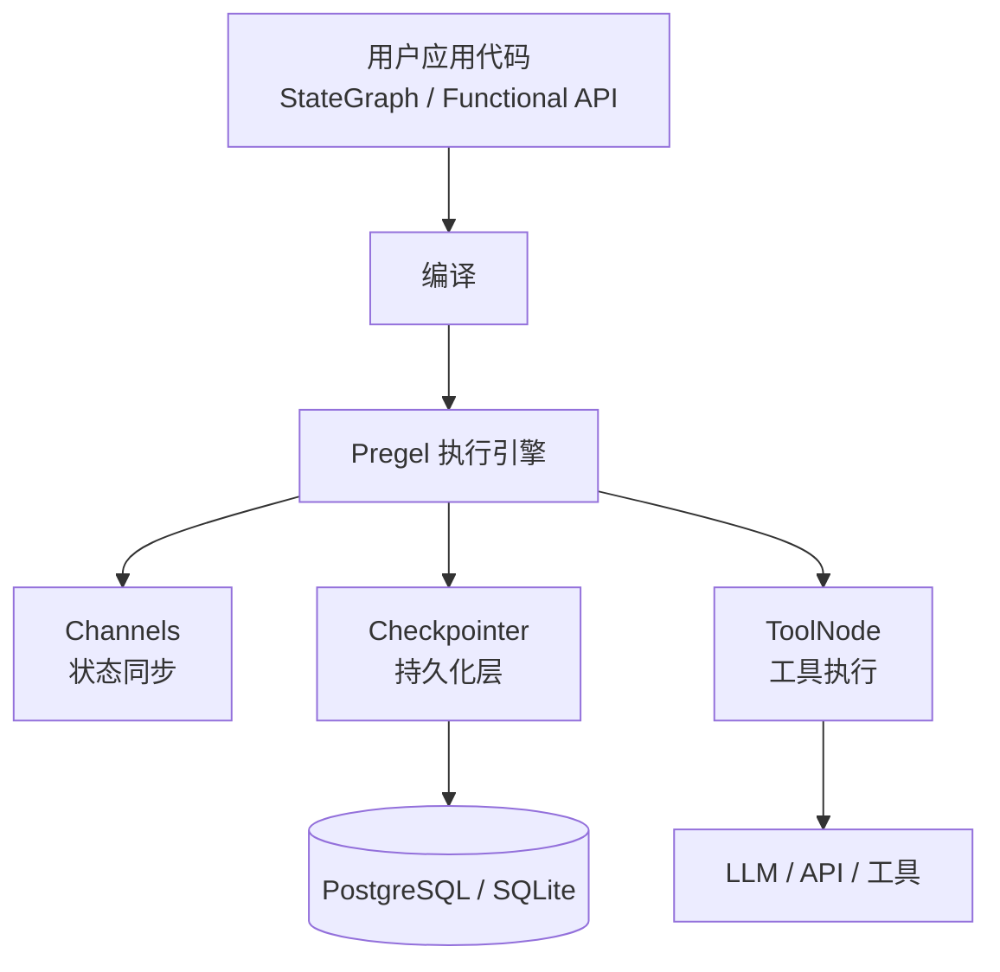
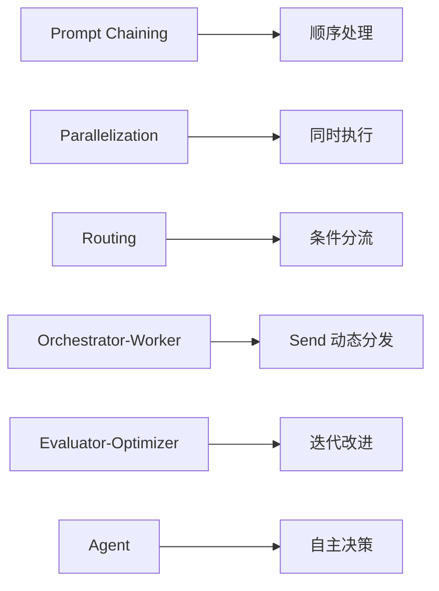

> [📖 中英段落对照：Overview](../99-工具与参考/ref-articles/langgraph-overview-bilingual.md)
> [📖 中英段落对照：Graph API](../99-工具与参考/ref-articles/langgraph-graph-api-bilingual.md)
> [📖 中英段落对照：Persistence](../99-工具与参考/ref-articles/langgraph-persistence-bilingual.md)
> [📖 中英段落对照：Workflows & Agents](../99-工具与参考/ref-articles/langgraph-workflows-agents-bilingual.md)
> [📖 中英段落对照：Durable Execution](../99-工具与参考/ref-articles/durable-execution-bilingual.md)

## LangGraph 是什么

LangGraph 是一个**底层编排框架和运行时**，用于构建、管理和部署**长时运行、有状态**的 Agent 和工作流。

**关键定位：**
- **非常底层** —— 不抽象提示词或架构，专注于编排本身
- **有状态（Stateful）** —— 每个执行步骤的状态都被保存，支持暂停和恢复
- **图驱动** —— 用图（Graph）模型表达 Agent 工作流
- **可独立使用** —— 不需要依赖 LangChain，但与之无缝集成

**灵感来源：** Google Pregel、Apache Beam；接口设计借鉴 NetworkX。

## 核心架构



**两条 API 路线，同一个引擎：**

| API 风格 | 代表类/装饰器 | 适用场景 |
|---|---|---|
| **声明式（Graph API）** | `StateGraph` + `add_node` / `add_edge` | 复杂流程、需要可视化 |
| **函数式（Functional API）** | `@entrypoint` / `@task` | 简单流程、偏好装饰器风格 |

> 两者最终都编译到同一个 **Pregel** 执行引擎。

## 三要素：State、Node、Edge

这是 LangGraph 的**基石概念**。

### State（状态）

State 是一个**共享数据结构**，代表应用的当前快照。

- 通常用 `TypedDict` 或 `Pydantic BaseModel` 定义 schema
- 所有 Node 和 Edge 的输入 schema
- Node 返回的是**增量更新**，不是完整的 State

**Reducer（归约器）—— 状态更新的核心机制：**

每个 State key 可以有自己的 reducer，决定增量更新如何合并到现有状态：

| Reducer 类型 | 行为 | 示例 |
|---|---|---|
| **默认（无 reducer）** | 新值覆盖旧值 | `{"foo": 1}` → `{"foo": 2}` |
| **operator.add** | 追加/累加 | `{"bar": ["hi"]}` + `{"bar": ["bye"]}` → `{"bar": ["hi", "bye"]}` |
| **add_messages** | 按 message ID 合并消息列表 | 新消息追加，同 ID 消息覆盖 |

**MessagesState：**
LangGraph 内置的常用 State，预定义了 `messages: list[AnyMessage]` 并使用 `add_messages` reducer。

```python
from langgraph.graph import MessagesState

# 通常直接继承扩展
class MyState(MessagesState):
    count: int
```

**多 Schema 支持：**
- 可以定义 `InputState` / `OutputState` 约束图的输入输出
- Node 可以写入未在输入 schema 中的 channel（只要 graph state 的并集中存在）
- `PrivateState` 允许 Node 声明额外的私有状态 channel

### Node（节点）

Node 是**执行单元**，本质上就是 Python 函数。

**函数签名：**
```python
def my_node(state, config, runtime):
    # state: 当前图状态
    # config: RunnableConfig（含 thread_id、tracing 信息等）
    # runtime: Runtime（含 store、stream_writer、control 等）
    return {"foo": "updated"}  # 返回增量更新
```

**特殊 Node：**
- `START` —— 虚拟起始节点，代表用户输入进入图的位置
- `END` —— 虚拟终止节点，代表图的结束

**Node Caching：**
编译时可指定 cache，Node 支持按输入缓存结果（TTL 可控）。

### Edge（边）

Edge 决定**控制流**——下一步执行哪个 Node。

| 边类型 | 说明 | API |
|---|---|---|
| **普通边** | A → B 固定流转 | `add_edge("A", "B")` |
| **条件边** | 根据 State 路由到不同 Node | `add_conditional_edges("A", routing_fn)` |
| **入口点** | 指定从 START 进入的第一个 Node | `add_edge(START, "A")` |
| **条件入口点** | 根据逻辑选择不同的起始 Node | `add_conditional_edges(START, routing_fn)` |

**Send —— 动态边（Map-Reduce 模式）：**
```python
from langgraph.types import Send

# 在 conditional edge 中返回 Send，动态创建 worker
return [Send("worker", {"section": s}) for s in sections]
```

## Command 原语

`Command` 是控制图执行的**多功能原语**，有四个参数：

| 参数 | 作用 |
|---|---|
| `update` | 应用状态更新（等价于 Node 返回更新） |
| `goto` | 导航到指定 Node（等价于条件边路由） |
| `graph` | 从 subgraph 导航到父图（`Command.PARENT`） |
| `resume` | 恢复被 `interrupt()` 暂停的执行 |

**使用场景：**
1. **从 Node 返回** —— 同时更新状态和路由
2. **输入到 invoke/stream** —— 人机协同恢复
3. **从 Tool 返回** —— 工具内控制图状态和执行路径

```python
from langgraph.types import Command

def my_node(state):
    # 更新状态并跳转到另一个节点
    return Command(update={"foo": "bar"}, goto="other_node")
```

## Super-step 执行模型

LangGraph 的执行受 **Pregel** 引擎驱动，采用 **Bulk Synchronous Parallel（BSP）** 模型：

```
Super-step 1: 用户输入 → Node A（可能并行）
       ↓
Super-step 2: Node B, Node C（并行）
       ↓
Super-step 3: Node D
       ↓
终止（所有 Node inactive，无消息在途）
```

**关键规则：**
- 一个 super-step = 图节点的一次迭代
- 并行执行的 Node 属于**同一个** super-step
- 顺序执行的 Node 属于**不同的** super-step
- 每个 super-step 结束时：没有新消息的 Node 投票变为 inactive
- 所有 Node inactive 且没有消息在传输时，图执行终止

## 持久化层（Persistence）

持久化是 LangGraph 的**核心差异化能力**。

### Thread（线程）

- `thread_id` 是 checkpoint 的主键
- 一个 thread 包含一系列运行的累积状态
- 调用图时必须指定 `thread_id`（在 `config["configurable"]` 中）

### Checkpoint（检查点）

- 每个 super-step 边界保存一个 StateSnapshot
- 也保存 node 级别的 task writes（用于故障恢复）

**StateSnapshot 结构：**

| 字段 | 说明 |
|---|---|
| `values` | 状态 channel 值 |
| `next` | 下一个要执行的 Node 名称 |
| `config` | thread_id + checkpoint_ns + checkpoint_id |
| `metadata` | 执行元数据（source、writes、step） |
| `tasks` | 当前 step 待执行的任务 |

**Checkpoint Namespace：**
- `""` —— 根图
- `"node_name:uuid"` —— subgraph
- 嵌套 subgraph 用 `\|` 连接

### Memory Store（跨线程记忆）

Checkpointer 只能在**同一个 thread 内**保持状态。如果要跨线程共享信息（如用户画像），需要使用 `Store`：

```python
from langgraph.store.memory import InMemoryStore

store = InMemoryStore()
# 编译时同时传入 checkpointer 和 store
graph.compile(checkpointer=checkpointer, store=store)
```

Store 支持：
- 按 namespace + key 存取任意数据
- **语义搜索**（配置 embedding model 后）

### Checkpointer 实现

| 实现 | 适用场景 |
|---|---|
| `InMemorySaver` | 实验、测试（内置） |
| `SqliteSaver` | 本地工作流 |
| `PostgresSaver` | 生产环境 |
| `CosmosDBSaver` | Azure 生产环境 |

## 工作流与 Agent 模式

LangGraph 文档归纳了 6 种常见模式：



| 模式 | 核心特征 | LangGraph 支持 |
|---|---|---|
| **Prompt Chaining** | 顺序调用，前输出为后输入 | 普通 Edge 串联 |
| **Parallelization** | 多个子任务同时执行 | 条件边返回多个目标 Node |
| **Routing** | 输入分类后分流处理 | `add_conditional_edges` |
| **Orchestrator-Worker** | 分解→委派→合成 | `Send` API 动态创建 worker |
| **Evaluator-Optimizer** | 生成→评估→反馈循环 | `interrupt` + `Command(resume=...)` |
| **Agent** | LLM 自主决定工具和流程 | `create_react_agent` 或自定义 |

## 与已有笔记的关联

- **[[2026-05-08-durable-execution]]** —— 持久化执行是 LangGraph 的四大核心优势之一；checkpoint、thread、super-step 等概念是理解 durable execution 的基础
- **[[LLM-Powered-Autonomous-Agents]]** —— LangGraph 是该文 Planning + Memory 组件的工程化封装
- **LangChain** —— LangGraph 可独立使用，但常与 LangChain 的模型/工具集成搭配

## 待深入研究

- [ ] `interrupt` 和 `Command(resume=...)` 的完整人机协同流程
- [ ] Functional API（`@entrypoint` / `@task`）的具体用法和编译机制
- [ ] Channel 类型详解（`LastValue`、`Topic`、`BinaryOperatorAggregate`）
- [ ] Subgraph 调用机制、状态隔离和 namespace 传播
- [ ] `DeltaChannel` 的存储优化策略
- [ ] `RemainingSteps` 的优雅降级实践
- [ ] LangGraph CLI 和 `langgraph.json` 配置
- [ ] 与 Temporal / Cadence 工作流引擎的架构对比
