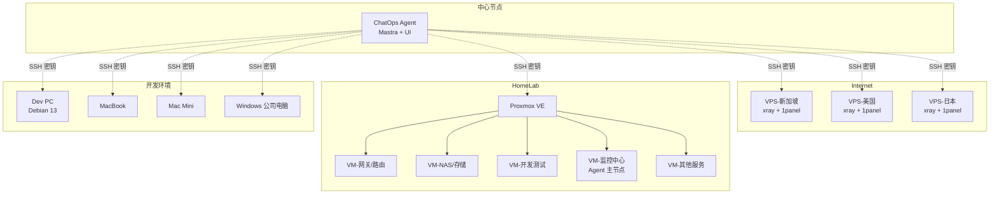
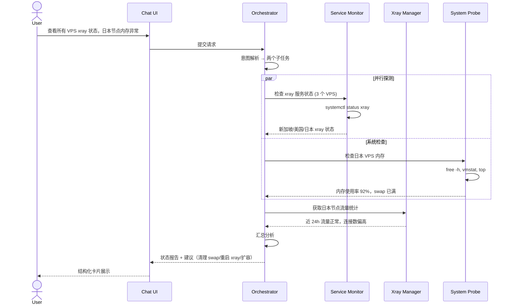
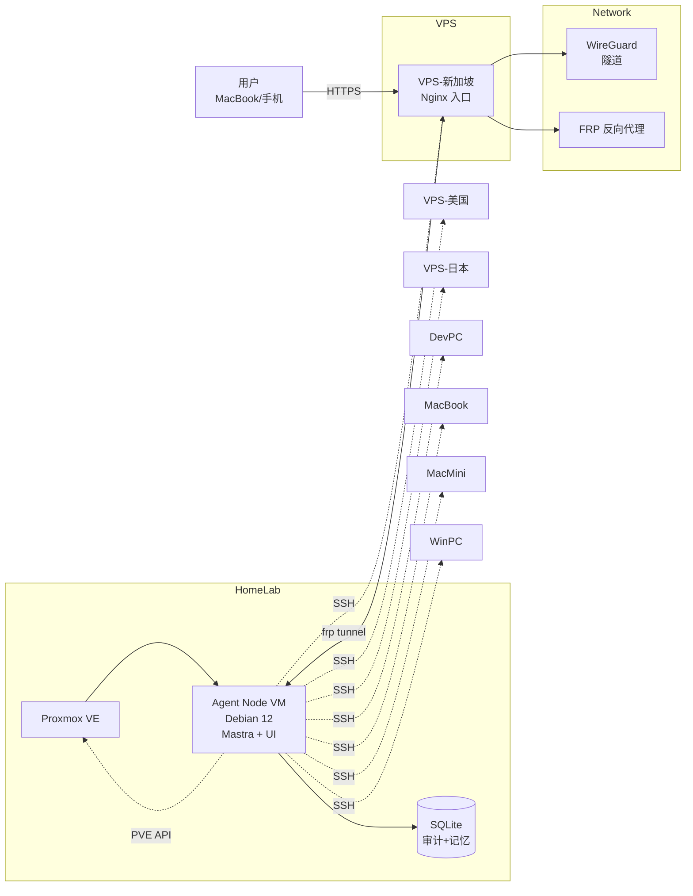

# ChatOps SRE Agent 架构设计

> 目标：通过自然语言对话，管理 3-5 个海外 VPS、HomeLab PVE、多台开发机的配置、监控、运维和观测。

---

## 一、基础设施拓扑



**中心节点选址建议**：HomeLab PVE 中的一台 **常驻 Linux VM**（推荐 Debian 12/Ubuntu 22.04 LTS），原因：
- 24x7 在线，不依赖开发机开机
- 内网可直达所有 HomeLab VM
- 通过 VPS 的 WireGuard/FRP 隧道可反向代理到公网
- 物理隔离，即使 Agent 出问题不影响主力开发机

---

## 二、核心 Agent 架构（多 Agent 协作）

不做一个大一统 Agent，而是按职责拆分，由 **Orchestrator Agent** 调度：

| Agent | 职责 | 工具链 |
|-------|------|--------|
| **Orchestrator** | 意图识别、任务分派、结果汇总 | 路由决策 |
| **System Probe** | 系统状态探测、硬件资源、进程 | SSH + 系统命令 |
| **Service Monitor** | 服务健康检查、日志轮询、告警 | HTTP/ICMP + 日志读取 |
| **Config Assistant** | 配置查看、差异对比、修改建议 | SSH + 文件读写 |
| **Task Scheduler** | cron/systemd 定时任务管理 | SSH + crontab/systemctl |
| **Xray Manager** | 代理节点管理、流量统计、配置切换 | SSH + xray API |
| **1Panel Manager** | 应用生命周期、容器、数据库 | 1Panel OpenAPI |
| **PVE Manager** | VM 启停、资源调整、快照 | Proxmox VE API |
| **Script Runner** | 执行自定义监控/运维脚本 | SSH + 脚本引擎 |

### 工作流示例

**用户说**："帮我看看所有 VPS 的 xray 状态，日本节点的内存好像不太对"



---

## 三、工具链 / MCP Server 设计

每个 Agent 背后是一组 MCP Tools，按目标机器分组注册：

### 3.1 SSH Command Executor（核心）

```typescript
// Mastra Tool 定义
const sshExec = createTool({
  id: 'ssh-exec',
  description: '在目标机器上执行 SSH 命令',
  inputSchema: z.object({
    host: z.enum(['vps-sg', 'vps-us', 'vps-jp', 'dev-pc', 'macbook', 'macmini', 'winpc', ...]),
    command: z.string(),
    sudo: z.boolean().default(false),
    timeout: z.number().default(30000),
  }),
  execute: async ({ host, command, sudo, timeout }) => {
    // 通过 SSH2 库执行，返回 stdout/stderr/exitCode
  },
});
```

**机器注册表**（`~/.mastra/machines.yaml`）：

```yaml
machines:
  vps-sg:
    host: "1.2.3.4"
    port: 22
    user: "root"
    keyPath: "~/.ssh/id_ed25519_vps"
    tags: ["vps", "xray", "1panel", "production"]
    os: "linux"

  vps-us:
    host: "5.6.7.8"
    port: 22
    user: "root"
    keyPath: "~/.ssh/id_ed25519_vps"
    tags: ["vps", "xray", "1panel", "production"]

  vps-jp:
    host: "9.10.11.12"
    port: 22
    user: "root"
    keyPath: "~/.ssh/id_ed25519_vps"
    tags: ["vps", "xray", "1panel", "production"]

  dev-pc:
    host: "192.168.1.50"
    port: 22
    user: "tsukino"
    keyPath: "~/.ssh/id_ed25519_homelab"
    tags: ["workstation", "development", "debian"]
    os: "linux"

  macbook:
    host: "192.168.1.51"
    port: 22
    user: "tsukino"
    keyPath: "~/.ssh/id_ed25519_homelab"
    tags: ["workstation", "development", "macos"]
    os: "macos"

  macmini:
    host: "192.168.1.52"
    port: 22
    user: "tsukino"
    keyPath: "~/.ssh/id_ed25519_homelab"
    tags: ["workstation", "server", "macos"]
    os: "macos"

  winpc:
    host: "192.168.1.53"
    port: 22
    user: "tsukino"
    keyPath: "~/.ssh/id_ed25519_homelab"
    tags: ["workstation", "development", "windows"]
    os: "windows"

  pve:
    host: "192.168.1.10"
    port: 22
    user: "root"
    keyPath: "~/.ssh/id_ed25519_homelab"
    tags: ["hypervisor", "proxmox", "infrastructure"]
```

### 3.2 1Panel API Client

1Panel 有 OpenAPI，可以直接 HTTP 调用：

```typescript
const onePanelApi = createTool({
  id: '1panel-api',
  description: '调用 1Panel OpenAPI 管理应用',
  inputSchema: z.object({
    vps: z.enum(['vps-sg', 'vps-us', 'vps-jp']),
    endpoint: z.string(), // /api/v1/apps, /api/v1/containers, etc.
    method: z.enum(['GET', 'POST', 'DELETE']),
    body: z.record(z.any()).optional(),
  }),
  execute: async ({ vps, endpoint, method, body }) => {
    // 从密钥管理器读取 1Panel API Key
    // 发起 HTTP 请求
  },
});
```

### 3.3 Proxmox VE API Client

```typescript
const pveApi = createTool({
  id: 'pve-api',
  description: '管理 Proxmox VE 虚拟机',
  inputSchema: z.object({
    action: z.enum(['list', 'start', 'stop', 'reboot', 'status', 'snapshot', 'resize']),
    node: z.string().default('pve'),
    vmid: z.number().optional(),
    params: z.record(z.any()).optional(),
  }),
  execute: async ({ action, node, vmid, params }) => {
    // PVE API: POST /api2/json/nodes/{node}/qemu/{vmid}/status/start
  },
});
```

### 3.4 Xray API Client

xray-core 有 stats API：

```typescript
const xrayApi = createTool({
  id: 'xray-api',
  description: '查询 xray 节点状态和流量',
  inputSchema: z.object({
    vps: z.enum(['vps-sg', 'vps-us', 'vps-jp']),
    action: z.enum(['stats', 'users', 'restart', 'config-test']),
  }),
  execute: async ({ vps, action }) => {
    // 通过 xray API (grpc/http) 查询
    // 或读取 /usr/local/etc/xray/config.json
  },
});
```

---

## 四、安全模型（关键！）

ChatOps 执行系统命令是高风险操作，必须多层防护：

### 4.1 命令分级与 Human-in-the-loop

| 风险等级 | 操作示例 | 处理方式 |
|----------|----------|----------|
| 🟢 只读 | `df -h`, `systemctl status`, `free -m` | 直接执行 |
| 🟡 低风险写 | 修改配置文件（有备份）, `apt update` | 执行后汇报 |
| 🟠 中风险写 | `systemctl restart`, `apt upgrade`, 清理日志 | **暂停等待用户确认** |
| 🔴 高风险写 | `rm -rf`, `fdisk`, `reboot`, `iptables -F` | **必须人工确认 + 二次验证** |
| ⚫ 破坏级 | 删除 VM、格式化磁盘、修改网络导致失联 | **完全禁止通过 Chat 执行** |

### 4.2 Mastra Workflow 实现 Human-in-the-loop

```typescript
// workflows/dangerous-operation.ts
export const dangerousOpWorkflow = new Workflow({
  name: 'dangerous-operation-approval',
})
  .step('detectRisk', async ({ context }) => {
    const risk = analyzeRisk(context.command);
    if (risk.level === 'high') {
      return { suspend: true, reason: '高风险操作需要确认' };
    }
    return { proceed: true };
  })
  .step('userConfirm', async ({ context }) => {
    // Workflow 暂停，等待用户在前端点击"确认"
    // Mastra 的 suspend/resume 机制会持久化状态
  })
  .step('execute', async ({ context }) => {
    // 用户确认后才执行
    return sshExec(context.command);
  });
```

### 4.3 只读模式默认开启

新会话默认进入 **Observer Mode**：
- 可以查看所有状态、日志、配置
- 不能执行任何写操作
- 需要显式 `/mode admin` 切换（需本地认证）

### 4.4 审计日志

所有操作记录到本地 SQLite：

```sql
CREATE TABLE audit_log (
  id INTEGER PRIMARY KEY,
  timestamp DATETIME DEFAULT CURRENT_TIMESTAMP,
  user TEXT,
  agent TEXT,
  target_host TEXT,
  command TEXT,
  risk_level TEXT,
  status TEXT, -- pending / approved / rejected / executed / failed
  output TEXT,
  ip_address TEXT
);
```

---

## 五、健康监控与告警（自动运行）

### 5.1 定时巡检 Workflow

```typescript
// 每 5 分钟自动运行
export const healthCheckWorkflow = new Workflow({
  name: 'health-check',
  trigger: { cron: '*/5 * * * *' }, // 每 5 分钟
})
  .step('probeAll', async () => {
    const results = await Promise.all([
      probeVPS('vps-sg'),
      probeVPS('vps-us'),
      probeVPS('vps-jp'),
      probeVMs(),
      probeWorkstations(),
    ]);
    return results;
  })
  .step('analyze', async ({ context }) => {
    const anomalies = detectAnomalies(context.results);
    if (anomalies.length > 0) {
      await notifyUser(anomalies); // 推送到 Chat UI
    }
    return { anomalies };
  });
```

### 5.2 监控指标

| 指标 | 阈值 | 告警方式 |
|------|------|----------|
| CPU > 80% 持续 5min | 警告 | Chat 消息 |
| CPU > 95% 持续 2min | 严重 | Chat + 可选 Bark/钉钉 |
| 内存 > 85% | 警告 | Chat |
| 磁盘 > 85% | 警告 | Chat |
| 磁盘 > 95% | 严重 | Chat + 紧急通知 |
| xray 进程消失 | 严重 | Chat + 自动尝试重启 |
| 1panel 应用异常 | 警告 | Chat |
| VM 离线 | 严重 | Chat |
| VPS 网络不可达 | 严重 | Chat |

---

## 六、配置管理策略（非集中式）

你特别提到 **cc-switch 等配置不能集中管理**，这里的设计原则是：

> **Agent 是"配置助手"，不是"配置独裁者"**

### 6.1 配置查看（随时可用）

```
用户: "我 MacBook 上的 Claude Code 现在用的哪个 provider？"
Agent: 读取 ~/.claude/config.json → "当前使用的是 Claude 3.7 Sonnet，通过 OpenRouter 路由"
```

### 6.2 配置建议（需人工确认后应用）

```
用户: "帮我在 dev-pc 上切换 Claude Code 到 Gemini 2.5 Pro"
Agent: 
  1. 检查当前配置
  2. 生成差异对比（diff）
  3. 展示给用户确认
  4. 用户说"确认"后才写入
  5. 验证切换成功
```

### 6.3 配置同步（可选，非强制）

对于**可以统一**的配置（如 `.gitconfig`, `.ssh/config` 基础模板），Agent 可以：
- 维护一份"基准配置模板"
- 对比各机器差异
- 提示用户哪些机器可以同步更新

但对于 **cc-switch** 等需要在本地独立管理的工具，Agent 只做**查询和辅助修改**，不做集中推送。

---

## 七、推荐技术栈

| 层级 | 技术 | 理由 |
|------|------|------|
| **Agent 框架** | **Mastra** | TypeScript 原生，Workflow + Memory + Tool 完整，支持 Human-in-the-loop |
| **前端** | **React + Vite + Ant Design X** | 中后台交互精致，ThoughtChain 适合展示工具调用 |
| **前端数据层** | **@ant-design/x-sdk** | 自建 MastraChatProvider 对接 |
| **后端部署** | **Node.js 22 + pm2** | 中心节点常驻运行 |
| **数据库** | **SQLite**（本地）| 轻量，审计日志 + 会话记忆足够 |
| **向量存储** | 暂不需要 | ChatOps 场景 RAG 需求低 |
| **SSH 库** | **node-ssh2** | 成熟稳定，支持密钥 + 代理 |
| **HTTP 客户端** | **undici / fetch** | 调用 1Panel/PVE API |
| **部署** | **Docker Compose** | 中心节点一键启动 |
| **反向代理** | **Nginx / Caddy** | Chat UI 的 HTTPS 访问 |
| **隧道** | **WireGuard / FRP** | 从 VPS 反向代理回 HomeLab |

---

## 八、部署架构



**访问路径**：
1. 内网：直接访问 `http://192.168.1.xx:3000`
2. 公网：`https://ops.yourdomain.com` → VPS Nginx → FRP → Agent VM

---

## 九、MVP 开发路线图

| 阶段 | 功能 | 工期 |
|------|------|------|
| **Phase 1** | SSH 连接所有机器 + 基础命令执行 + 只读状态查询 | 3-5 天 |
| **Phase 2** | 健康监控 Workflow（定时巡检 + 告警推送） | 3-5 天 |
| **Phase 3** | xray/1panel/PVE 专用工具 + 结构化展示 | 5-7 天 |
| **Phase 4** | 危险操作 Human-in-the-loop + 审计日志 | 3-5 天 |
| **Phase 5** | 配置助手（查看 + 辅助修改 + diff） | 5-7 天 |
| **Phase 6** | 前端 Chat UI（Ant Design X）+ 移动端适配 | 7-10 天 |

---

## 十、与知识库的关联

- [Mastra 核心概念](./2026-05-28-mastra.md) — Agent 框架基础
- [Mastra 源码索引](../99-工具与参考/repos/mastra/index.md) — 深入定制 Workflow/Memory
- [Ant Design X 笔记](../60-前端/2026-05-28-ant-design-x.md) — 前端 UI 层
- [MCP 协议](../MCP.md) — 工具调用标准

---

## 参考

- [Mastra 官方文档](https://mastra.ai/docs)
- [1Panel OpenAPI 文档](https://1panel.cn/docs/)
- [Proxmox VE API](https://pve.proxmox.com/wiki/Proxmox_VE_API)
- [Xray API 文档](https://xtls.github.io/Xray-docs-next/)
