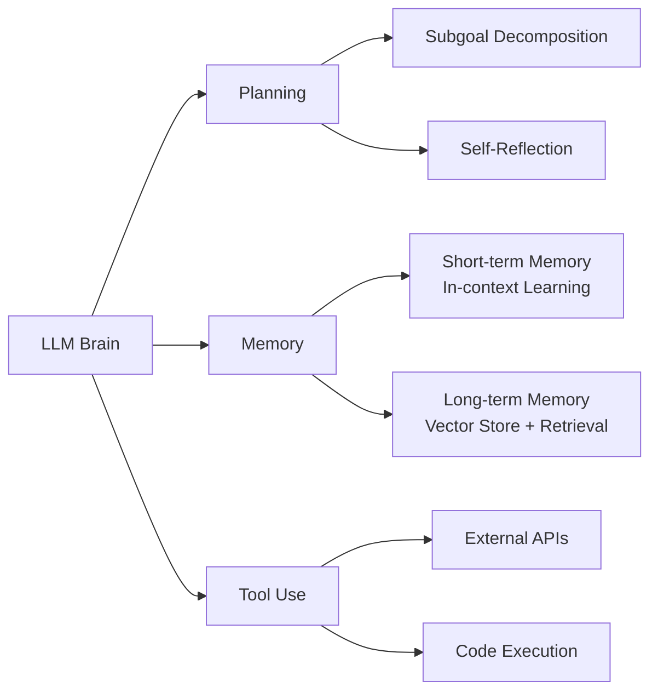

# LLM Powered Autonomous Agents —— 经典综述

> 原文：[LLM Powered Autonomous Agents](https://lilianweng.github.io/posts/2023-06-23-agent/)
> 作者：Lilian Weng（OpenAI Safety 团队负责人）
> 日期：2023-06-23

## 一句话总结

LLM 作为"大脑"的自主 Agent 系统，通过 **Planning（规划）+ Memory（记忆）+ Tool Use（工具使用）** 三大组件，将大语言模型从文本生成器扩展为通用问题解决器。

## 核心概念

### 1. Agent 系统架构

将 LLM 视为 Agent 的"大脑"，辅以三个关键组件：

### 2. Planning —— 任务规划

#### 任务分解（Task Decomposition）

| 方法 | 核心思想 | 特点 |
|------|---------|------|
| **Chain of Thought (CoT)** | "Think step by step" | 将复杂任务分解为简单步骤，标准提示技术 |
| **Tree of Thoughts (ToT)** | 每步探索多种推理可能 | BFS/DFS 搜索 + 状态评估，形成树状结构 |
| **LLM+P** | 外包给经典规划器 | 使用 PDDL 作为中间语言，适合机器人领域 |

#### 自我反思（Self-Reflection）

- **ReAct**：推理 + 行动结合，`Thought → Action → Observation` 循环
- **Reflexion**：动态记忆 + 自我反思，通过启发式函数检测低效轨迹和幻觉
- **Chain of Hindsight (CoH)**：将带反馈的历史输出序列呈现给模型，引导其自我改进
- **Algorithm Distillation (AD)**：将 RL 的学习历史蒸馏为策略，实现上下文内强化学习

### 3. Memory —— 记忆机制

#### 人类记忆 → AI 系统的映射

| 人类记忆类型 | AI 对应物 | 特点 |
|-------------|----------|------|
| 感觉记忆 | Embedding 表示 | 原始输入的向量表示 |
| 短期/工作记忆 | In-context Learning | 受限于 Transformer 的上下文窗口 |
| 长期记忆 | 外部向量存储 + 快速检索 | 理论上无限容量 |

#### 向量检索算法（MIPS）

- **LSH**：局部敏感哈希，相似项高概率映射到同一桶
- **ANNOY**：随机投影树，可扩展的近似最近邻
- **HNSW**：分层可导航小世界图，类似"六度分隔"理论
- **FAISS**：向量量化 + 聚类，粗量化和细量化结合
- **ScaNN**：各向异性向量量化，优化内积保真度

### 4. Tool Use —— 工具使用

- **MRKL**：神经-符号架构，LLM 作为路由器，将查询路由到专家模块（计算器、天气 API 等）
- **TALM / Toolformer**：微调 LM 学习调用外部工具 API
- **ChatGPT Plugins / Function Calling**：实际落地的工具使用范例
- **HuggingGPT**：用 ChatGPT 做任务规划器，调度 HuggingFace 模型执行
- **API-Bank**：工具增强 LLM 的评估基准，分三级（调用 → 检索 → 规划）

## 关键洞察

1. **ReAct 是 Agent 的底层协议**：`Thought → Action → Observation` 的循环不只是提示技巧，而是 LLM 与外部环境交互的基础模式。后续 LangChain、AutoGPT 等框架都沿用了这一范式。

2. **Tool Use 的瓶颈不在工具本身，而在"知道何时用"**：MRKL 实验表明，LLM 在可靠提取工具参数上存在困难——这解释了为什么现代 Agent 框架（如 Claude Code、Kimi CLI）会投入大量工程在工具调用格式化和重试机制上。

3. **LLM 自我评估在专业领域不可靠**：ChemCrow 实验显示，GPT-4 自我评估与专家评估差距巨大。Agent 系统在化学、医学等垂直领域需要外部验证机制，不能仅依赖 LLM 的自检。

## 与我已有知识的联系

- [[Agent设计模式]] —— 本文是 ReAct、Plan-and-Execute 等模式的原始理论基础之一
- [[Tool-Calling模式]] —— MRKL、Toolformer、API-Bank 为现代工具调用提供了早期范式
- [[核心概念]] —— LangGraph 的状态图本质上是对本文 Planning + Memory 组件的工程化封装
- [[MCP协议详解]] —— MCP 可视为 MRKL "专家模块" 思想的标准化协议层

## 待深入研究

- [ ] Reflexion 的具体实现细节：启发式函数 $h_t$ 如何设计？
- [ ] Algorithm Distillation 与当前 In-context Learning 前沿的关系
- [ ] HNSW vs FAISS 在实际 RAG 系统中的性能对比
- [ ] ChemCrow 的 13 个化学工具的具体设计和 LangChain 集成方式
- [ ] Generative Agents 的记忆流（Memory Stream）检索算法（相关性+时效性+重要性的加权实现）

## 个人思考

这篇 2023 年中的文章几乎预见了后来一年 Agent 领域的所有主要方向：

1. **从论文到产品**：ReAct → LangChain/LangGraph；Tool Use → Function Calling / MCP；Memory → RAG 向量数据库。理论框架在 2023 年中就已清晰，后续主要是工程化和产品化。

2. **三个挑战至今未完全解决**：
   - 上下文长度限制 → 虽有 1M+ token 模型，但长上下文注意力衰减和成本问题仍在
   - 长期规划鲁棒性 → 当前 Agent（包括 Claude Code）在复杂多步任务中仍容易"走偏"
   - 自然语言接口可靠性 → 这也是当前从 "Agent 演示" 到 "生产级 Agent" 的最大鸿沟

3. **AutoGPT 的启示**：文中提到 AutoGPT "大量代码用于格式解析"——这精准地指出了早期 Agent 的核心痛点。2024-2025 年的解决方案是：**结构化输出（JSON Schema / XML）** 和 **原生工具调用能力**，本质上都是在解决"自然语言不可靠"的问题。

4. **对全栈 Agent 工程师的启示**：
   - 不要只盯着 LLM 本身，Planning、Memory、Tool Use 三者的系统工程能力才是护城河
   - 垂直领域 Agent（如 ChemCrow）的价值在于"专家工具 + 领域验证"，而非通用 LLM
   - 评估体系（如 API-Bank 的三级评估）是 Agent 产品化的前置条件

---

> 参考存档：`_refs/articles/2023-06-23-llm-powered-autonomous-agents.md`
