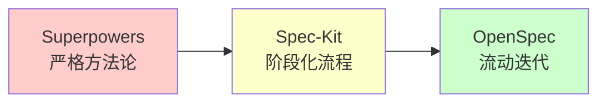
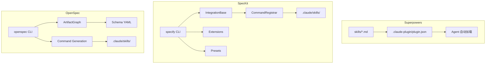
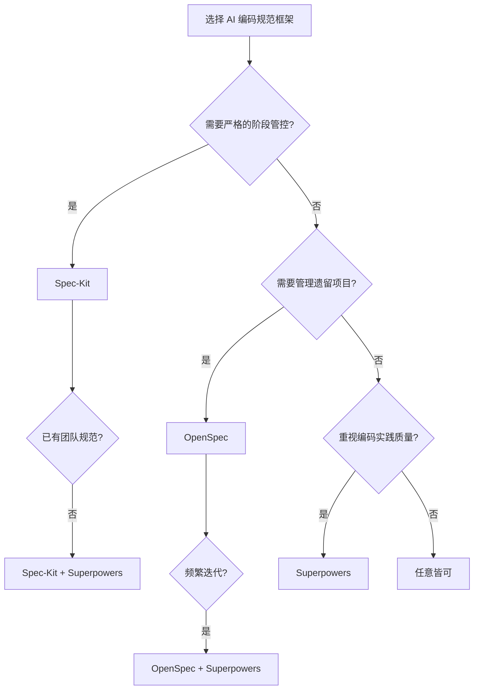

# AI 编码规范框架深度对比：Superpowers vs Spec-Kit vs OpenSpec

> 本文对比分析三个当前最流行的 AI-Native 软件开发规范框架：
> - **Superpowers** ([`obra/superpowers`](https://github.com/obra/superpowers)) — 方法论 Skills 框架
> - **Spec-Kit** ([`github/spec-kit`](https://github.com/github/spec-kit)) — GitHub 官方的 Spec-Driven CLI 工具包
> - **OpenSpec** ([`Fission-AI/OpenSpec`](https://github.com/Fission-AI/OpenSpec)) — AI-Native 的 Spec-Driven 框架

## 一、基本信息速览

| 维度 | Superpowers | Spec-Kit | OpenSpec |
|------|------------|----------|----------|
| **作者** | Jesse Vincent (obra) | GitHub 官方 | Fission AI (0xTab) |
| **协议** | MIT | MIT | MIT |
| **技术栈** | Markdown + JSON | Python + uv | TypeScript/Node.js |
| **形态** | Skills 库 + 方法论 | CLI 工具 + 框架 | npm CLI + 框架 |
| **版本** | v5.1.0 | 持续迭代 | v1.3.1 |
| **支持平台** | 8+ | 30+ | 30+ |
| **Stars** | 191,361 | 99,575 | 48,101 |
| **核心哲学** | 软件工程最佳实践自动化 | 规格说明可执行化 | 流动、迭代、简单 |

## 二、定位与哲学对比

### 2.1 Superpowers：方法论即代码

Superpowers 不是传统意义上的"工具"，而是**一套嵌入 AI Agent 思维中的软件开发方法论**。它的核心假设是：

> "AI Agent 默认不会遵循软件工程最佳实践，需要我们通过 Skills 来约束和引导。"

**关键词：** TDD、YAGNI、DRY、子 Agent 协作、代码审查

### 2.2 Spec-Kit：规格说明可执行化

Spec-Kit 的核心理念是**翻转传统开发流程**：

> "For decades, code has been king — specifications were just scaffolding. Spec-Driven Development changes this: specifications become executable."

**关键词：** 规格驱动、Human-in-the-Loop、阶段关卡、模板约束

### 2.3 OpenSpec：流动的规格图

OpenSpec 强调**灵活性和迭代性**：

> "fluid not rigid, iterative not waterfall, easy not complex, built for brownfield"

**关键词：** Artifact Graph、Schema-Driven、归档合并、遗留项目友好

### 2.4 哲学光谱



| 哲学维度 | Superpowers | Spec-Kit | OpenSpec |
|---------|------------|----------|----------|
| **严格程度** | ⭐⭐⭐⭐⭐ 铁律 | ⭐⭐⭐⭐ 阶段关卡 | ⭐⭐⭐ 灵活流动 |
| **人工参与** | 低（自动触发） | 高（每阶段确认） | 中（关键节点确认） |
| **迭代友好** | ⭐⭐⭐ 计划先行 | ⭐⭐ 阶段较重 | ⭐⭐⭐⭐⭐ 随时迭代 |
| **遗留项目** | ⭐⭐⭐ 通用 | ⭐⭐⭐ 通用 | ⭐⭐⭐⭐⭐ brownfield-first |

## 三、架构设计对比

### 3.1 架构概览



### 3.2 核心抽象对比

| 框架 | 核心抽象 | 实现方式 | 设计意图 |
|------|---------|---------|---------|
| **Superpowers** | **Skill** | Markdown 文件（SKILL.md） | 用自然语言定义行为约束 |
| **Spec-Kit** | **Integration** | Python 类 + 模板 | 多平台命令适配与注册 |
| **OpenSpec** | **Artifact Graph** | DAG + Schema YAML | 将文档结构化为可执行图 |

### 3.3 多平台集成机制对比

**Superpowers：极简元数据**

```
.claude-plugin/plugin.json    # 20 行 JSON
.cursor-plugin/               # 类似
.codex-plugin/                # 类似
skills/                       # 共享的 Markdown
```

- **优点：** 极简，无平台适配代码
- **缺点：** 依赖平台原生解析能力，灵活性有限

**Spec-Kit：注册器模式**

```python
class CommandRegistrar:
    AGENT_CONFIGS: dict[str, dict]
    
    def register_command(agent, name, content):
        # 根据平台格式写入对应目录
```

- **优点：** 精确控制每个平台的输出格式，支持 30+ 平台
- **缺点：** 需要为每个平台维护适配代码

**OpenSpec：命令生成器 + 适配器注册表**

```typescript
class CommandAdapterRegistry {
    generateCommands(tool, workflows) {
        // 根据工具类型生成对应格式
    }
}
```

- **优点：** 自动检测工具，一键生成所有配置
- **缺点：** 新增平台需要更新注册表

### 3.4 平台支持数量

| 框架 | 支持平台数 | 代表平台 |
|------|----------|---------|
| Superpowers | ~8 | Claude, Codex, Cursor, OpenCode, Gemini, Copilot, Factory Droid |
| Spec-Kit | 30+ | 上述 + Kimi CLI, Cline, Continue, Windsurf, RooCode, Trae 等 |
| OpenSpec | 30+ | 上述 + Amazon Q, Augment, Crush, iFlow, Qoder, Lingma 等 |

**关键发现：** Spec-Kit 和 OpenSpec 都支持 **Kimi CLI**！

## 四、工作流对比

### 4.1 标准流程对比

| 阶段 | Superpowers | Spec-Kit | OpenSpec |
|------|------------|----------|----------|
| **启动** | Agent 自动识别意图 | `specify init` | `openspec init` |
| **原则确立** | 隐含在方法论中 | `/speckit.constitution` | 可选配置 |
| **需求规格** | 对话提炼 Spec | `/speckit.specify` | `/opsx:propose` |
| **技术方案** | `writing-plans` | `/speckit.plan` | `design.md` (自动生成) |
| **任务分解** | 计划中包含 | `/speckit.tasks` | `tasks.md` (自动生成) |
| **实施** | `subagent-driven-development` | `/speckit.implement` | `/opsx:apply` |
| **审查** | 两阶段子 Agent 审查 | 可选 | 可选 `/opsx:verify` |
| **归档** | `finishing-a-development-branch` | Git 提交 | `/opsx:archive` |

### 4.2 TDD 支持对比

| 框架 | TDD 严格程度 | 实现方式 |
|------|------------|---------|
| **Superpowers** | ⭐⭐⭐⭐⭐ **铁律** | SKILL.md 强制执行 Red-Green-Refactor |
| **Spec-Kit** | ⭐⭐⭐ 推荐 | 在 constitution 中可配置 |
| **OpenSpec** | ⭐⭐ 可选 | Schema 模板中可包含测试要求 |

Superpowers 的 TDD 是最严格的："Write code before the test? Delete it. Start over."

### 4.3 子 Agent 协作

| 框架 | 子 Agent 支持 | 模式 |
|------|-------------|------|
| **Superpowers** | ⭐⭐⭐⭐⭐ 原生支持 | 每任务一个新子 Agent + 两阶段审查 |
| **Spec-Kit** | ⭐⭐ 依赖平台 | 由 Agent 平台决定 |
| **OpenSpec** | ⭐⭐ 依赖平台 | 由 Agent 平台决定 |

Superpowers 是唯一将**子 Agent 协作**作为核心方法论内置的框架。

## 五、规格管理对比

### 5.1 规格存储方式

| 框架 | 存储位置 | 格式 | 版本控制 |
|------|---------|------|---------|
| **Superpowers** | `docs/superpowers/plans/` | Markdown | Git 手动管理 |
| **Spec-Kit** | 项目根目录 + `.specify/` | Markdown + YAML | Git 手动管理 |
| **OpenSpec** | `openspec/changes/` + `openspec/specs/` | Markdown + YAML | **自动归档 + 合并** |

### 5.2 规格演进机制

**Superpowers：** 计划文档按日期命名，历史保留在 Git 中。

**Spec-Kit：** 规格文档由用户维护，无自动合并机制。

**OpenSpec：** ⭐ **独特的 Delta-to-Spec 合并**
```
openspec/changes/add-dark-mode/specs/user-auth/spec.md  (delta)
→ 归档时自动合并 →
openspec/specs/user-auth/spec.md  (baseline)
```

OpenSpec 是唯一实现了**规格自动合并**的框架。

## 六、扩展性对比

| 维度 | Superpowers | Spec-Kit | OpenSpec |
|------|------------|----------|----------|
| **自定义 Skill** | 写 Markdown | 写 Extension | 写 Schema YAML |
| **扩展门槛** | 低 | 中（需 Python） | 中（需理解 DAG） |
| **预设/模板** | 无 | Presets 系统 | Schema 系统 |
| **社区扩展** | Marketplace | Community Extensions | 较少 |

## 七、适用场景矩阵

| 场景 | Superpowers | Spec-Kit | OpenSpec | 推荐 |
|------|------------|----------|----------|------|
| **新功能开发** | ⭐⭐⭐⭐⭐ | ⭐⭐⭐⭐⭐ | ⭐⭐⭐⭐⭐ | 三者皆可 |
| **Bug 修复** | ⭐⭐⭐⭐⭐ | ⭐⭐⭐⭐ | ⭐⭐⭐⭐ | Superpowers |
| **遗留项目改进** | ⭐⭐⭐ | ⭐⭐⭐ | ⭐⭐⭐⭐⭐ | **OpenSpec** |
| **快速原型** | ⭐⭐⭐ | ⭐⭐ | ⭐⭐⭐⭐ | **OpenSpec** |
| **企业级项目** | ⭐⭐⭐⭐ | ⭐⭐⭐⭐⭐ | ⭐⭐⭐⭐ | **Spec-Kit** |
| **严格合规/审计** | ⭐⭐⭐⭐ | ⭐⭐⭐⭐⭐ | ⭐⭐⭐ | **Spec-Kit** |
| **个人项目** | ⭐⭐⭐⭐⭐ | ⭐⭐⭐ | ⭐⭐⭐⭐⭐ | Superpowers/OpenSpec |
| **团队协作** | ⭐⭐⭐⭐ | ⭐⭐⭐⭐⭐ | ⭐⭐⭐⭐ | **Spec-Kit** |
| **探索性研究** | ⭐⭐ | ⭐⭐ | ⭐⭐⭐⭐ | **OpenSpec** |
| **严格 TDD** | ⭐⭐⭐⭐⭐ | ⭐⭐⭐ | ⭐⭐ | **Superpowers** |

## 八、组合使用建议

这三个框架**不是互斥的**，可以组合使用：

### 方案 A：Superpowers + OpenSpec（推荐个人开发者）

- 用 **OpenSpec** 管理规格和变更流程（`opsx:propose/apply/archive`）
- 用 **Superpowers** 的 Skills 约束编码行为（TDD、代码审查、子 Agent 开发）

```
/opsx:propose add-feature     ← OpenSpec
/superpowers:writing-plans    ← Superpowers
/opsx:apply                   ← OpenSpec
/superpowers:tdd              ← Superpowers（实施中自动触发）
/opsx:archive                 ← OpenSpec
```

### 方案 B：Spec-Kit + Superpowers（推荐团队）

- 用 **Spec-Kit** 建立严格的规格流程和团队规范
- 用 **Superpowers** 提升个体编码质量

### 方案 C：三合一（理想状态）

- **Spec-Kit** 负责规格定义和团队流程
- **OpenSpec** 负责变更管理和规格归档
- **Superpowers** 负责编码实践和质量保证

> 注：目前三个项目之间没有官方集成，组合使用需要手动协调。

## 九、源码层面的关键差异

| 维度 | Superpowers | Spec-Kit | OpenSpec |
|------|------------|----------|----------|
| **代码复杂度** | 极低（纯 Markdown） | 高（Python CLI + 集成系统） | 中高（TS + 图引擎） |
| **测试覆盖** | 有集成测试 | 有单元测试 + 集成测试 | 有 E2E + 单元测试 |
| **构建系统** | 简单脚本 | uv + Python 包 | Node.js + TypeScript |
| **可阅读性** | ⭐⭐⭐⭐⭐ | ⭐⭐⭐ | ⭐⭐⭐⭐ |
| **学习曲线** | 平缓 | 较陡 | 中等 |

## 十、选择决策树



## 十一、结论

| 框架 | 一句话总结 | 最适合谁 |
|------|----------|---------|
| **Superpowers** | "让 AI 自动遵循软件工程最佳实践的方法论" | 重视代码质量、喜欢 TDD、使用 Claude Code 的开发者 |
| **Spec-Kit** | "GitHub 官方的规格驱动开发工具包" | 需要严格流程、团队协作、企业级项目的开发者 |
| **OpenSpec** | "流动迭代的 AI-Native 规格管理框架" | 需要管理遗留项目、频繁迭代、重视规格演进的开发者 |

这三个框架代表了 AI-Native 软件开发的三种不同哲学：**纪律型**（Superpowers）、**流程型**（Spec-Kit）、**流动型**（OpenSpec）。选择哪一个取决于你的项目性质、团队规模和个人偏好。

对于我的知识库方向（全栈 Agent 工程师），建议：**Superpowers 作为日常编码约束 + OpenSpec 作为规格管理基础设施**，形成完整的 AI 辅助开发工作流。

---

> 相关笔记：
> - [[superpowers-源码解析]]
> - [[spec-kit-源码解析]]
> - [[openspec-源码解析]]
