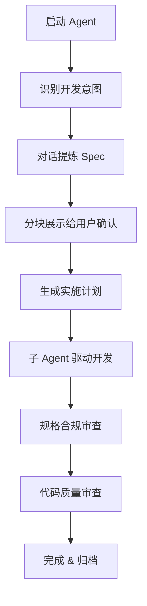
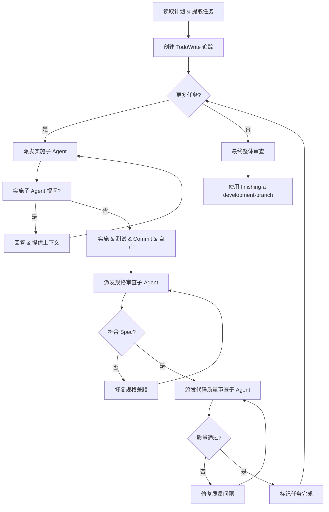
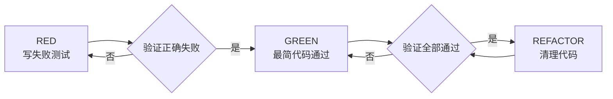

# Superpowers 源码解析：AI 编码 Agent 的软件开发方法论

> **源码仓库：** https://github.com/obra/superpowers
> **版本：** v5.1.0
> **协议：** MIT
> **Stars：** 191,361 | **Forks：** 17,019

## 一、项目定位

Superpowers 是一套**完整的软件开发方法论**，专为 AI 编码 Agent（Claude Code、Cursor、Codex CLI、OpenCode 等）设计。它的核心思想不是让 Agent "凭感觉写代码"，而是通过一套**可组合的技能（Skills）**和**初始引导指令**，让 Agent 自动遵循软件工程最佳实践。

作者 Jesse Vincent（ obra ）将其定位为：

> "A complete software development methodology for your coding agents, built on top of a set of composable skills and some initial instructions that make sure your agent uses them."

## 二、核心工作流

Superpowers 的工作流从启动 Agent 的那一刻就开始了：



关键设计：**Skills 自动触发**，无需用户手动调用。Agent 在对话中识别到对应场景时，会自动加载并应用相应的 Skill。

## 三、架构拆解

### 3.1 项目结构

```
superpowers/
├── skills/                          # 核心技能库（12 个 Skill）
│   ├── brainstorming/
│   ├── dispatching-parallel-agents/
│   ├── executing-plans/
│   ├── finishing-a-development-branch/
│   ├── receiving-code-review/
│   ├── requesting-code-review/
│   ├── subagent-driven-development/
│   ├── systematic-debugging/
│   ├── test-driven-development/
│   ├── using-git-worktrees/
│   ├── using-superpowers/
│   ├── verification-before-completion/
│   └── writing-plans/
│   └── writing-skills/
├── .claude-plugin/                  # Claude Code 插件元数据
│   ├── plugin.json
│   └── marketplace.json
├── .cursor-plugin/                  # Cursor 插件
├── .codex-plugin/                   # Codex CLI 插件
├── .opencode/                       # OpenCode 插件
├── docs/                            # 文档
├── hooks/                           # Git hooks
├── scripts/                         # 构建脚本
├── AGENTS.md                        # 指向 CLAUDE.md
├── CLAUDE.md                        # Claude Code 上下文文件
└── package.json
```

### 3.2 Skill 定义格式

每个 Skill 都是一个独立的 Markdown 文件 `SKILL.md`，遵循统一格式：

```markdown
---
name: skill-name
description: Use when ...
---

# Skill Title

## Overview
...

## When to Use
...

## The Process
...
```

**Frontmatter 设计：**
- `name`: Skill 的唯一标识
- `description`: 触发条件描述，Agent 据此判断是否激活该 Skill

这种设计极其简洁——**没有复杂的配置系统，没有代码依赖，纯 Markdown 驱动**。这是 Superpowers 最大的架构特点。

### 3.3 多平台插件系统

Superpowers 支持 **8 个 AI 编码平台**：

| 平台 | 插件目录 | 安装方式 |
|------|---------|---------|
| Claude Code | `.claude-plugin/` | Marketplace: `/plugin install superpowers@claude-plugins-official` |
| Codex CLI | `.codex-plugin/` | `/plugins` → 搜索 superpowers |
| Cursor | `.cursor-plugin/` | 插件市场 |
| OpenCode | `.opencode/` | 插件系统 |
| Gemini CLI | `.gemini-extension.json` | 扩展系统 |
| Factory Droid | - | `droid plugin install` |
| GitHub Copilot CLI | - | CLI 插件 |

每个插件目录只包含极简的 JSON 元数据文件（如 `.claude-plugin/plugin.json`），真正的内容都在 `skills/` 目录中共享。

```json
{
  "name": "superpowers",
  "description": "Core skills library for Claude Code: TDD, debugging, collaboration patterns, and proven techniques",
  "version": "5.1.0",
  "author": { "name": "Jesse Vincent", "email": "jesse@fsck.com" },
  "keywords": ["skills", "tdd", "debugging", "best-practices", "workflows"]
}
```

**关键洞察：** Superpowers 没有为每个平台写不同的适配代码，而是**利用各平台原生的 Skill/Markdown 读取能力**，通过统一的 Markdown 格式实现跨平台兼容。

## 四、核心技能深度解析

### 4.1 writing-plans（制定计划）

**触发时机：** 有了 Spec 或需求后，开始编码前

**核心原则：**
- 假设实施工程师**零上下文**、**品味差**、**不做判断**
- 每个步骤控制在 **2-5 分钟**能完成的粒度
- 严格的 DRY、YAGNI、TDD

**计划文档模板：**

```markdown
# [Feature Name] Implementation Plan

> **For agentic workers:** REQUIRED SUB-SKILL: Use superpowers:subagent-driven-development

**Goal:** ...
**Architecture:** ...
**Tech Stack:** ...

---

### Task N: [Component Name]

**Files:**
- Create: `exact/path/to/file.py`
- Modify: `exact/path/to/existing.py:123-145`
- Test: `tests/exact/path/to/test.py`

- [ ] **Step 1: Write the failing test**
- [ ] **Step 2: Run it to make sure it fails**
- [ ] **Step 3: Implement minimal code**
- [ ] **Step 4: Run tests, ensure pass**
- [ ] **Step 5: Commit**
```

**文件存储位置：** `docs/superpowers/plans/YYYY-MM-DD-<feature-name>.md`

### 4.2 subagent-driven-development（子 Agent 驱动开发）

**核心设计：** 每个任务分配一个**全新的子 Agent**，执行后进行**两阶段审查**



**为什么用子 Agent：**
- 隔离上下文，避免上下文污染
- 为每个任务精确构建所需上下文
- 保留主 Agent 的上下文用于协调

**vs. executing-plans 的区别：**
- `subagent-driven-development`：同一会话内，每个任务新子 Agent
- `executing-plans`：并行会话执行

### 4.3 test-driven-development（严格 TDD）

Superpowers 的 TDD 是我见过的**最严格的 TDD 规范**：

**铁律：**
```
NO PRODUCTION CODE WITHOUT A FAILING TEST FIRST
```

**违反规则的后果：** 删除已写的代码，从头开始。

**Red-Green-Refactor 循环：**



**关键细节：**
- 必须**亲眼看到测试失败**，否则不知道测试是否正确
- 每次只写一个最小测试
- 重构后必须保持全部通过

### 4.4 systematic-debugging（系统化调试）

不是"凭感觉改代码看对不对"，而是：
1. 明确问题现象
2. 形成假设
3. 设计验证实验
4. 收集证据
5. 确认或排除假设
6. 修复 & 验证

### 4.5 代码审查双技能

- **requesting-code-review：** 在提交前主动请求审查
- **receiving-code-review：** 接收审查反馈后的处理流程

### 4.6 using-git-worktrees（Git 工作树隔离）

为每个功能开发创建独立的 Git worktree，避免：
- 分支切换时的工作区污染
- 多个并行实验的冲突
- 构建产物的交叉影响

### 4.7 verification-before-completion（完成前验证）

在标记任务完成前，必须验证：
- 所有测试通过
- Spec 要求已满足
- 没有引入回归
- 代码质量达标

## 五、设计理念与亮点

### 5.1 方法论优先于工具

Superpowers 不是"一个工具"，而是**一套方法论**。它不依赖特定的 AI 模型或平台，而是定义了"AI 应该如何做软件开发"的标准流程。

### 5.2 自动触发 vs 手动调用

与需要用户记住命令并手动调用的系统不同，Superpowers 的 Skills 是 **model-invoked**——Agent 根据当前任务自动判断该激活哪个 Skill。这降低了认知负担。

### 5.3 极端的实用主义

- 计划要详细到"热情的初级工程师"也能看懂
- 每个步骤 2-5 分钟，确保可执行
- 严格的 TDD，不给自己留"就这一次例外"的借口

### 5.4 跨平台一致性

通过 Markdown + JSON 元数据的极简设计，实现了在 8 个不同平台上的**同一套工作流**。没有平台锁定。

## 六、适用场景

| 场景 | 适用性 |
|------|--------|
| 新功能开发 | ⭐⭐⭐⭐⭐ 完整方法论覆盖 |
| Bug 修复 | ⭐⭐⭐⭐⭐ TDD + 调试技能 |
| 代码重构 | ⭐⭐⭐⭐⭐ 计划 + TDD + 审查 |
| 快速原型 | ⭐⭐⭐ 过于严格，可能拖慢速度 |
| 配置/脚本 | ⭐⭐⭐ 可豁免 TDD |
| 探索性研究 | ⭐⭐ 需要先形成 Spec |

## 七、与知识库的关联

- 与 [[test-driven-development]] 笔记关联：Superpowers 的 TDD 实践
- 与 [[subagent-driven-development]] 关联：子 Agent 协作模式
- 与 [[writing-plans]] 关联：实施计划制定

## 八、待深入研究

- [ ] Superpowers Marketplace 的插件分发机制
- [ ] Skills 的自动触发具体是如何实现的（各平台如何解析 description 并匹配）
- [ ] 与 Claude Code 原生 `/plugin` 系统的深度集成方式
- [ ] 在实际项目中的落地效果和经验总结
