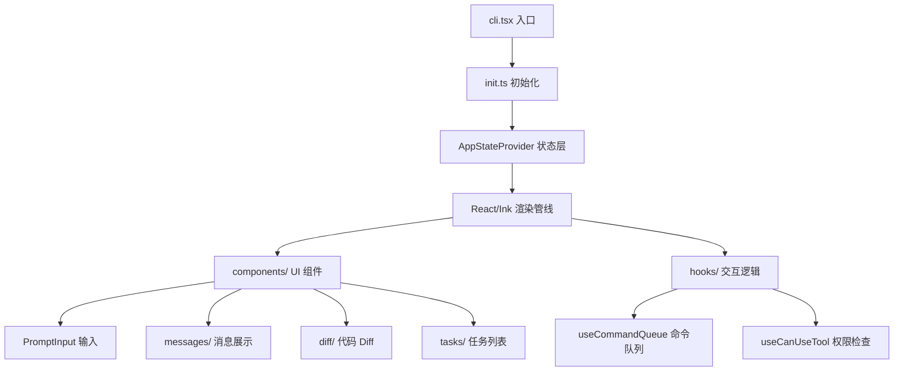

> ⚠️ 来源声明：本文档基于 2025 年 4 月初泄露的 Claude Code 源码（内部代号 tengu），仅供个人技术学习研究。
> 
> 原始来源：https://github.com/anthropics/claude-code（官方仓库，非泄露版）

---

## 1. 项目定位（一句话）

Claude Code 是 Anthropic 官方推出的 **终端原生 AI 编程助手**，以 TUI（终端用户界面）形式提供沉浸式代码交互体验，核心定位是替代/增强开发者在终端中的日常编程工作流。

---

## 2. 技术栈与核心依赖

| 层级 | 技术/库 | 用途 |
|------|---------|------|
| **运行时** | [Bun](https://bun.sh) | 替代 Node.js，提供更快的启动速度和包管理 |
| **语言** | TypeScript | 全量 TS，ES Module |
| **终端 UI** | React + [Ink](https://github.com/vadimdemedes/ink) | 在终端中渲染 React 组件，实现类 GUI 的 TUI |
| **CLI 框架** | Commander.js | 命令行参数解析 |
| **AI API** | @anthropic-ai/sdk | Anthropic API 客户端 |
| **协议** | @modelcontextprotocol/sdk | MCP（Model Context Protocol）协议支持 |
| **沙箱** | @anthropic-ai/sandbox-runtime | 代码沙箱执行 |
| **状态** | 自定义 Store（类 Redux）| React Context + useSyncExternalStore |
| **遥测** | OpenTelemetry | 全链路指标、日志、追踪 |
| **实验管理** | GrowthBook | 功能开关（Feature Flags） |
| **校验** | Zod | Schema 校验和类型安全 |

---

## 3. 目录结构概览

```text
_refs/repos/claude-code-aini/
├── bin/                    # 启动脚本（bash + Windows CMD）
├── src/
│   ├── entrypoints/        # 入口文件
│   │   ├── cli.tsx         # 主 CLI 入口，动态导入优化启动速度
│   │   ├── init.ts         # 初始化逻辑（配置、遥测、环境）
│   │   ├── mcp.ts          # MCP 服务器模式入口
│   │   └── sandboxTypes.ts # 沙箱类型定义
│   ├── components/         # React/Ink UI 组件（113 个文件）
│   │   ├── agents/         # Agent 相关 UI
│   │   ├── messages/       # 消息渲染组件
│   │   ├── PromptInput/    # 输入框
│   │   ├── shell/          # 终端 Shell 交互
│   │   ├── diff/           # 代码 Diff 展示
│   │   ├── tasks/          # 任务管理 UI
│   │   └── ...
│   ├── hooks/              # React Hooks（83 个）
│   │   ├── useCommandQueue.ts
│   │   ├── useCanUseTool.tsx
│   │   ├── useBackgroundTaskNavigation.ts
│   │   └── ...
│   ├── services/           # 业务服务层（16 个文件）
│   │   ├── mcp/            # MCP 服务
│   │   ├── oauth/          # OAuth 认证
│   │   ├── analytics/      # 遥测与分析
│   │   ├── policyLimits/   # 策略限制
│   │   └── voice/          # 语音输入
│   ├── commands/           # 斜杠命令（15 个）
│   │   ├── init.ts         # 项目初始化
│   │   ├── review.ts       # 代码 Review
│   │   ├── commit.ts       # Git 提交辅助
│   │   ├── brief.ts        # 生成摘要
│   │   └── ...
│   ├── tools/              # Agent 工具系统（42+ 个工具）
│   │   ├── BashTool/       # Bash 命令执行
│   │   ├── FileReadTool/   # 文件读取
│   │   ├── FileWriteTool/  # 文件写入
│   │   ├── FileEditTool/   # 文件编辑（Search & Replace）
│   │   ├── GlobTool/       # 文件 Glob 匹配
│   │   ├── GrepTool/       # 代码搜索
│   │   ├── AgentTool/      # 子 Agent 委派
│   │   ├── SkillTool/      # 技能调用
│   │   ├── WebSearchTool/  # 网络搜索
│   │   ├── WebFetchTool/   # 网页抓取
│   │   ├── LSPTool/        # LSP 语言服务器
│   │   ├── MCP 相关工具/   # MCP 工具封装
│   │   └── ...
│   ├── bridge/             # 远程桥接（31 个文件）
│   │   ├── bridgeMain.ts   # 核心桥接逻辑（~3000 行）
│   │   ├── bridgeApi.ts    # API 客户端
│   │   ├── sessionRunner.ts# 会话运行器
│   │   └── ...
│   ├── state/              # 全局状态管理
│   │   ├── AppStateStore.ts# 状态存储
│   │   ├── AppState.tsx    # React Provider
│   │   └── store.ts        # Store 实现
│   ├── bootstrap/          # 启动时全局状态
│   │   └── state.ts        # 全局计数器、Session ID 等
│   ├── constants/          # 常量与提示词（21 个文件）
│   │   ├── prompts.ts      # 系统提示词生成（~914 行）
│   │   ├── systemPromptSections.ts
│   │   └── tools.ts        # 工具定义常量
│   ├── context/            # React Context
│   ├── types/              # TypeScript 类型定义
│   └── utils/              # 工具函数（298 个文件，最大模块）
│       ├── permissions/    # 权限系统
│       ├── settings/       # 设置管理
│       ├── model/          # 模型管理
│       ├── telemetry/      # 遥测实现
│       └── ...
├── vendor/bun/             # 内置 Bun 运行时（Windows 免安装）
├── docs/                   # 项目文档
└── stubs/                  # 构建 Stub（替代原生模块）
```

---

## 4. 关键入口与公共 API

### 4.1 主入口 `src/entrypoints/cli.tsx`

采用**动态导入（dynamic import）**策略，按场景按需加载模块：

- `--version` / `-v`：零依赖快速路径，直接输出版本
- `--dump-system-prompt`：输出系统提示词（用于 prompt sensitivity eval）
- `--claude-in-chrome-mcp`：Chrome 扩展 MCP 模式
- `--chrome-native-host`：Chrome Native Host 模式
- `--computer-use-mcp`：Computer Use MCP 模式
- `--daemon-worker`：守护进程工作节点（Ant 内部）
- 默认路径：加载完整 TUI

关键代码特征：
```typescript
// 使用 bun:bundle feature() 做 Dead Code Elimination
if (feature('ABLATION_BASELINE') && process.env.CLAUDE_CODE_ABLATION_BASELINE) {
  // 实验基线模式，禁用多种高级功能
}
```

### 4.2 MCP 服务器入口 `src/entrypoints/mcp.ts`

可将 Claude Code 作为 **MCP Server** 运行，暴露内置工具给外部客户端：

```typescript
const server = new Server(
  { name: 'claude/tengu', version: MACRO.VERSION },
  { capabilities: { tools: {} } }
);
```

支持的工具通过 `getTools()` 动态获取，权限通过 `hasPermissionsToUseTool()` 校验。

---

## 5. 核心架构设计

### 5.1 TUI 架构：React + Ink

在终端中实现完整的 React 渲染管线：



### 5.2 工具系统（Tool System）

Claude Code 的核心竞争力之一是其**丰富的内置工具集**，在 `src/tools/` 下定义了 42+ 个工具：

| 工具类别 | 代表工具 | 功能 |
|----------|----------|------|
| **文件操作** | FileReadTool, FileWriteTool, FileEditTool, GlobTool, GrepTool | 代码库读写与搜索 |
| **Shell** | BashTool, PowerShellTool | 执行终端命令 |
| **Agent** | AgentTool | 委派子 Agent 处理子任务 |
| **技能** | SkillTool | 调用预定义技能 |
| **Web** | WebSearchTool, WebFetchTool | 联网搜索与抓取 |
| **开发** | LSPTool, NotebookEditTool | LSP 语言服务、Notebook |
| **任务** | TaskCreateTool, TaskListTool, TaskOutputTool, TodoWriteTool | 任务管理 |
| **MCP** | ListMcpResourcesTool, ReadMcpResourceTool, MCPTool | MCP 协议交互 |
| **工作流** | EnterPlanModeTool, ExitPlanModeV2Tool | 计划模式 |
| **其他** | BriefTool, AskUserQuestionTool, WebFetchTool | 摘要、提问、抓取 |

**工具注册机制**（`src/tools.ts`）：
- 核心工具直接 import
- Ant-only 工具（REPLTool, SuggestBackgroundPRTool 等）用条件 `require()` 懒加载
- Feature-gated 工具（SleepTool, Cron 工具等）通过 `feature()` 控制

### 5.3 系统提示词生成（System Prompt）

`src/constants/prompts.ts`（~914 行）是整个产品的**大脑配置**：

- 动态生成系统提示词，根据环境、模型、配置调整
- 包含工具使用说明、权限提示、输出格式要求
- 支持 `systemPromptSection` 模块化组合
- 通过 `--dump-system-prompt` 可导出完整提示词用于评估

### 5.4 权限系统

`src/utils/permissions/` 实现了细粒度的工具权限控制：

- `hasPermissionsToUseTool()`：工具使用前的权限校验
- `PermissionMode`：多种权限模式（严格/宽松/绕过等）
- `DenialTrackingState`：权限拒绝追踪
- `Scratchpad`：临时工作区隔离

### 5.5 Bridge（远程桥接）

`src/bridge/`（31 个文件，~3000 行核心逻辑）支持**远程会话模式**：

- `bridgeMain.ts`：核心桥接，管理会话生命周期
- `bridgeApi.ts`：API 通信层
- `sessionRunner.ts`：会话运行器
- `jwtUtils.ts`：JWT Token 刷新
- `capacityWake.ts`：容量唤醒机制
- 支持 CCR（Claude Code Remote）容器化部署

### 5.6 状态管理

自定义轻量级 Store（非 Redux）：

```typescript
// src/state/store.ts
export function createStore(initialState: AppState, onChange?) {
  // useSyncExternalStore 兼容的 Store
}
```

- `AppStateStore.ts`：定义完整状态结构
- `AppState.tsx`：React Provider + Context
- `bootstrap/state.ts`：启动时全局状态（Session ID、成本统计等）

---

## 6. 亮点设计

### 6.1 启动性能优化

- **动态导入**：`cli.tsx` 中几乎所有模块都是 `await import()`，按需加载
- **启动分析器**：`startupProfiler.js` 记录各阶段耗时
- **零依赖快速路径**：`--version` 不加载任何模块
- **懒加载遥测**：OpenTelemetry 模块延迟初始化

### 6.2 Feature Flag 系统

使用 `bun:bundle` 的 `feature()` 函数实现编译期特性开关：

```typescript
if (feature('PROACTIVE') || feature('KAIROS')) {
  // 仅在启用了对应特性时包含代码
}
```

这使得同一份源码可以构建出：
- Ant 内部版（全功能）
- 外部发布版（功能裁剪）
- 实验版本（A/B 测试）

### 6.3 多模式支持

同一套源码支持多种运行模式：

| 模式 | 入口 | 说明 |
|------|------|------|
| **TUI 交互** | 默认 | 完整终端界面 |
| **无头模式** | `-p "prompt"` | CI/CD 脚本化 |
| **MCP Server** | `--mcp` | 对外暴露工具 |
| **Chrome MCP** | `--claude-in-chrome-mcp` | 浏览器扩展 |
| **Native Host** | `--chrome-native-host` | Chrome Native Messaging |
| **Computer Use** | `--computer-use-mcp` | Computer Use 协议 |
| **远程模式** | `CLAUDE_CODE_REMOTE` | CCR 远程会话 |

### 6.4 内置 Bun 运行时

`vendor/bun/` 目录内置了 Bun 可执行文件，Windows 用户无需单独安装，双击 `start.cmd` 即可运行。

---

## 7. 与知识库已有内容的关联

- [[ai编码规范框架对比-superpowers-vs-spec-kit-vs-openspec]] — Claude Code 的 Tool 系统与这些编码规范框架有相似之处，都强调**工具化编程**
- [[openspec-源码解析]] / [[spec-kit-源码解析]] / [[superpowers-源码解析]] — 对比学习 AI 编码工具的架构差异
- [[Autonomous-Agents]] — Claude Code 的 AgentTool 实现了子 Agent 委派，是 Multi-Agent 架构的实践

---

## 8. 待深入研究的问题

1. **Ink 渲染管线细节**：React 组件如何在终端中实现滚动、输入、ANSI 色彩？
2. **AgentTool 子代理机制**：如何实现子 Agent 的上下文隔离和结果汇总？
3. **FileEditTool 的 Search & Replace 算法**：如何精确匹配并编辑代码？
4. **Bridge 远程会话协议**：完整的通信协议和加密机制？
5. **GrowthBook Feature Flag 集成**：动态特性开关如何影响用户体验？
6. **权限系统的完整设计**：从请求到授权到审计的完整链路？
7. **LSP 集成**：如何通过 LSPTool 调用语言服务器获取语义信息？
8. **MCP 工具的双向通信**：Claude Code 既作为 MCP Client 又作为 MCP Server 的架构？
9. **语音输入实现**：`voiceStreamSTT.ts` 的流式语音识别？
10. **沙箱安全模型**：`@anthropic-ai/sandbox-runtime` 的隔离机制？

---

## 9. 数据说明

> 本笔记基于泄露源码直接分析，不涉及 GitHub API 查询。
> 
> 由于源码为内部构建版本，部分量化数据（如 Stars、Forks）不适用，版本号以 `package.json` 中的 `1.0.0` 为准。
> 
> 工具数量、文件数量等数据均通过本地脚本统计，可复现验证。
