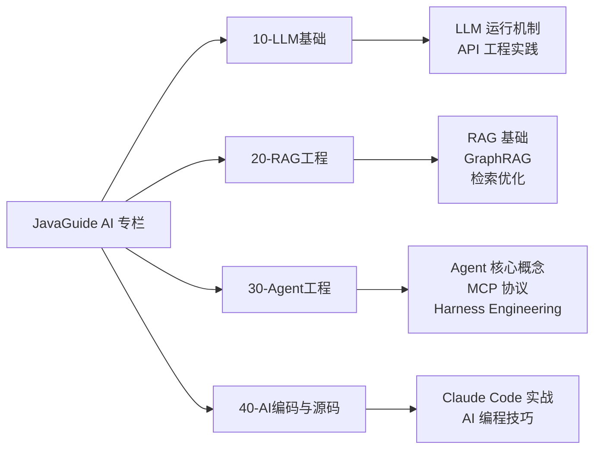

> 📌 本文档是 [JavaGuide](https://github.com/Snailclimb/JavaGuide) 仓库 AI 相关内容的**本地索引**，原始文件保存在 `_refs/repos/javaguide/docs/ai/` 和 `_refs/repos/javaguide/docs/ai-coding/` 下。

---

## 仓库概览

[JavaGuide](https://github.com/Snailclimb/JavaGuide) 是 Snailclimb 维护的 Java 技术面试指南，近期新增了 **AI 应用开发面试专栏**，内容质量很高，以面试考点为切入点，系统覆盖了从 LLM 底层原理到生产级工程实践的核心知识。

**内容定位**：面向 Java / 后端背景的开发者，侧重 AI 应用层开发（而非模型训练）。

**核心价值**：
- 把 Token、Temperature、上下文窗口等概念还原为**工程参数**
- 从 Demo 到生产级应用的**完整链路拆解**
- 大量配图和 Java 后端示例

---

## 内容目录映射

### 一、大模型基础（对应知识库 `10-LLM基础/`）

| 文章 | 本地路径 | 核心内容 |
|------|---------|---------|
| **万字拆解 LLM 运行机制** | `docs/ai/llm-basis/llm-operation-mechanism.md` | Token 计算、上下文窗口、Temperature、采样策略等底层原理 |
| **大模型 API 调用工程实践** | `docs/ai/llm-basis/llm-api-engineering.md` | 流式输出、重试、限流、结构化返回、Java 后端落地 |
| **大模型结构化输出详解** | `docs/ai/llm-basis/structured-output-function-calling.md` | JSON Schema、Function Calling、Tool Calling、MCP 底层链路 |

> 💡 **学习建议**：如果你正在学习 `10-LLM基础/`，这几篇文章是非常好的工程视角补充。特别是 API 工程化和结构化输出部分，弥补了纯理论学习的缺口。

---

### 二、AI Agent（对应知识库 `30-Agent工程/`）

| 文章 | 本地路径 | 核心内容 |
|------|---------|---------|
| **一文搞懂 AI Agent 核心概念** | `docs/ai/agent/agent-basis.md` | Agent 六代进化史、Agent Loop、ReAct、Plan-and-Execute、Reflection、Multi-Agent、A2A |
| **AI Agent 记忆系统** | `docs/ai/agent/agent-memory.md` | 短期/长期记忆设计、存储形式、生命周期、工程优化 |
| **大模型提示词工程实践指南** | `docs/ai/agent/prompt-engineering.md` | Prompt 四要素框架、六大核心技巧、Prompt 注入防护 |
| **上下文工程实战指南** | `docs/ai/agent/context-engineering.md` | Context vs Prompt Engineering、静态编排、动态挂载、Token 预算降级 |
| **万字详解 Agent Skills** | `docs/ai/agent/skills.md` | Skills 设计理念、与 MCP/Function Calling 区别、Skill 设计最佳实践 |
| **万字拆解 MCP 协议** | `docs/ai/agent/mcp.md` | MCP 四层架构、JSON-RPC 2.0、生产级 Server 开发 |
| **一文搞懂 Harness Engineering** | `docs/ai/agent/harness-engineering.md` | Agent = Model + Harness、六层架构、上下文 40% 阈值、一线团队实战 |
| **Workflow 中的循环与图** | `docs/ai/agent/workflow-graph-loop.md` | （补充）工作流中的循环和图结构 |

> 💡 **与已有笔记关联**：
> - `agent-basis.md` 中的 **ReAct / Plan-and-Execute / Reflection** 可与 `30-Agent工程/理论框架/` 下的内容交叉验证
> - `mcp.md` 可与 `30-Agent工程/Java-AI-生态/` 下的 Spring AI / LangChain4j 笔记配合阅读
> - `harness-engineering.md` 提出的 **Agent = Model + Harness** 等式非常有启发性，建议精读

---

### 三、RAG 检索增强生成（对应知识库 `20-RAG工程/`）

| 文章 | 本地路径 | 核心内容 |
|------|---------|---------|
| **万字详解 RAG 基础概念** | `docs/ai/rag/rag-basis.md` | RAG 原理、优势、局限性 |
| **万字详解 RAG 向量索引算法和向量数据库** | `docs/ai/rag/rag-vector-store.md` | HNSW、IVFFLAT 索引算法、向量数据库选型 |
| **万字详解 GraphRAG** | `docs/ai/rag/graphrag.md` | 知识图谱驱动 RAG、实体/关系/社区发现、全局检索 vs 局部检索 |
| **万字详解 RAG 检索优化** | `docs/ai/rag/rag-optimization.md` | Chunk 策略、Hybrid Search、Query Rewrite、Rerank、上下文压缩 |
| **RAG 文档处理** | `docs/ai/rag/rag-document-processing.md` | 文档预处理、分块策略 |
| **RAG 知识更新** | `docs/ai/rag/rag-knowledge-update.md` | 知识库增量更新策略 |

> 💡 **学习建议**：`rag-optimization.md` 和 `graphrag.md` 是工程实战价值最高的两篇。如果你在做 RAG 项目优化，可以直接参考其中的 Chunk 策略和 Rerank 方案。

---

### 四、AI 系统架构设计

| 文章 | 本地路径 | 核心内容 |
|------|---------|---------|
| **AI 应用架构设计** | `docs/ai/system-design/ai-application-architecture.md` | AI 应用的整体架构模式 |
| **AI 语音系统** | `docs/ai/system-design/ai-voice.md` | 语音相关 AI 系统设计 |

---

### 五、AI 编程实战与技巧（对应知识库 `40-AI编码与源码/`）

#### 实战案例

| 文章 | 本地路径 | 核心内容 |
|------|---------|---------|
| **IDEA + Qoder 插件实战** | `docs/ai-coding/idea-qoder-plugin.md` | JetBrains IDE 中 AI 辅助接口优化、代码重构 |
| **Trae + MiniMax 多场景实战** | `docs/ai-coding/trae-m2.7.md` | Redis 故障排查、跨语言重构 |
| **Claude Code 接入第三方模型实战** | `docs/ai-coding/cc-glm5.1.md` | JVM 智能诊断助手、百万级慢查询治理 |
| **DeepSeek V4 + Claude Code 实战** | `docs/ai-coding/deepseek-v4-claude-code.md` | 代码审计、Flyway 集成、多模型协同 |

#### 技巧与选型

| 文章 | 本地路径 | 核心内容 |
|------|---------|---------|
| **AI 编程必备 Skills 推荐** | `docs/ai-coding/programmer-essential-skills.md` | 6 个实用 Skills：TDD、代码审查、UI 设计、网页自动化 |
| **Claude Code 核心命令详解** | `docs/ai-coding/claudecode-commands.md` | `/simplify`、`/review`、`/loop`、`/batch` 等 |
| **Claude Code 使用指南** | `docs/ai-coding/claudecode-tips.md` | 配置、工作流、进阶技巧 |
| **OpenAI Codex 最佳实践** | `docs/ai-coding/codex-best-practices.md` | Codex 云端智能体和 CLI 的提示工程、安全策略 |
| **AI 编程选 CLI 还是 IDE？** | `docs/ai-coding/cli-vs-ide.md` | Claude Code、Cursor、Kiro、Trae 深度对比 |
| **AI 编程开放性面试题** | `docs/ai-coding/ai-ide.md` | 10 道高频面试问题 |

> 💡 **与已有笔记关联**：`cli-vs-ide.md` 可与 `40-AI编码与源码/` 下的 Claude Code / Cursor 使用笔记对照阅读，形成自己的工具选型判断。

---

## 与知识库已有内容的关联

---

## 学习路径建议

### 路径 A：面试冲刺（1-2 周）
1. `agent-basis.md` → 建立 Agent 全景认知
2. `mcp.md` → 掌握最热协议
3. `rag-basis.md` + `rag-optimization.md` → RAG 核心考点
4. `llm-operation-mechanism.md` → 底层原理防追问
5. `ai-ide.md` → AI 编程面试题兜底

### 路径 B：工程实战（按项目需求）
- 做 **Agent 项目** → `harness-engineering.md` + `context-engineering.md` + `skills.md`
- 做 **RAG 项目** → `rag-vector-store.md` + `graphrag.md` + `rag-optimization.md`
- 做 **AI 编程提效** → `claudecode-tips.md` + `programmer-essential-skills.md`

---

## 备注

- 所有配图使用了 `oss.javaguide.cn` 的 CDN 链接，本地无法直接查看，可在线访问原文或下载仓库后查看
- 部分内容使用了 `<!-- @include -->` 语法，这是 JavaGuide 站点的模板语法，在本地 Markdown 阅读器中不会渲染
- 仓库原始地址：`https://github.com/Snailclimb/JavaGuide`
