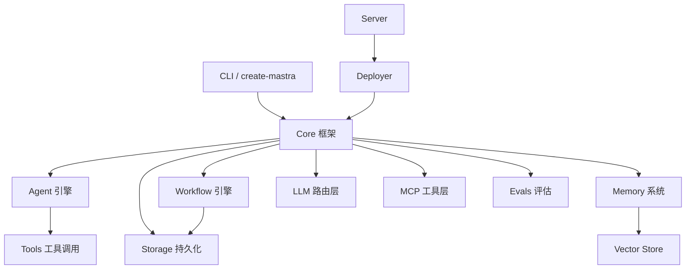

# Mastra 源码导航

> [📎 GitHub 仓库](https://github.com/mastra-ai/mastra) | ⭐ 24,453 | 🍴 2,144 | 📅 创建于 2024-08-06

Mastra 是 Gatsby 原团队打造的 TypeScript AI Agent 框架，支持从原型到生产级应用的全流程开发。

## 核心文档

| 文档 | 说明 |
|------|------|
| [README](./README.md) | 项目总览与快速开始 |
| [DEVELOPMENT](./DEVELOPMENT.md) | 开发环境搭建与构建指南 |
| [CONTRIBUTING](./CONTRIBUTING.md) | 贡献指南 |
| [LICENSE](./LICENSE.md) | 双许可证说明（Apache 2.0 + Enterprise） |

## 核心包（packages/）

| 包名 | 说明 |
|------|------|
| [core](./packages/core/) | **核心框架** — Agent、Workflow、Memory、Storage、LLM 路由等 |
| [agent-builder](./packages/agent-builder/) | Agent 构建器 |
| [evals](./packages/evals/) | 评估框架 |
| [memory](./packages/memory/) | 记忆系统（对话历史、语义记忆） |
| [rag](./packages/rag/) | RAG 检索增强生成 |
| [mcp](./packages/mcp/) | MCP 协议支持 |
| [server](./packages/server/) | 服务端运行时 |
| [deployer](./packages/deployer/) | 部署适配器 |
| [cli](./packages/cli/) | CLI 工具 |
| [create-mastra](./packages/create-mastra/) | 项目脚手架 |

## 其他重要目录

| 目录 | 说明 |
|------|------|
| [docs](./docs/) | 官方文档源码 |
| [examples](./examples/) | 示例项目（agent、voice、evals 等） |
| [deployers](./deployers/) | 各平台部署器（Vercel、Netlify、Cloudflare 等） |
| [stores](./stores/) | 向量存储与数据存储适配器 |
| [server-adapters](./server-adapters/) | 服务端框架适配器 |
| [integrations](./integrations/) | 第三方集成 |
| [client-sdks](./client-sdks/) | 客户端 SDK |
| [voice](./voice/) | 语音相关模块 |
| [workflows](./workflows/) | 工作流引擎 |
| [ee](./ee/) | **企业版代码**（Mastra Enterprise License） |

## 架构概览

