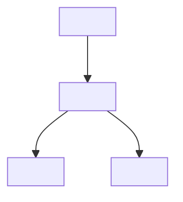
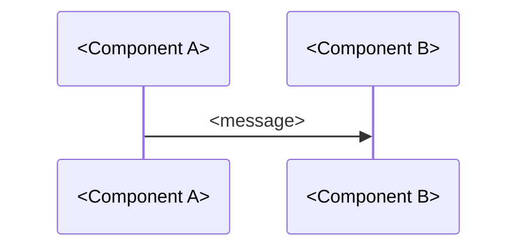

# ai-assisted-learning Skill Implementation Plan

> **For agentic workers:** REQUIRED SUB-SKILL: Use superpowers:subagent-driven-development (recommended) or superpowers:executing-plans to implement this plan task-by-task. Steps use checkbox (`- [ ]`) syntax for tracking.

**Goal:** Create a unified Kimi Skill `ai-assisted-learning` that enables AI-assisted learning from any URL (article or GitHub repo), with dialog-based learning and structured note generation into the Obsidian knowledge base.

**Architecture:** A single Skill with automatic URL type detection branching into article or repo learning paths. Shared workflow: ingest → summarize → dialog → note → git commit. References split into article and repo guides with corresponding note templates.

**Tech Stack:** Markdown, Git, Obsidian, Quartz, Mermaid

---

## File Structure Mapping

| File | Purpose |
|---|---|
| `.agents/skills/ai-assisted-learning/SKILL.md` | Main skill entry with workflow framework and URL detection logic |
| `.agents/skills/ai-assisted-learning/references/article-learning-guide.md` | Detailed article learning path guide |
| `.agents/skills/ai-assisted-learning/references/repo-learning-guide.md` | Detailed repo learning path guide |
| `.agents/skills/ai-assisted-learning/references/article-note-template.md` | Concept note template for articles |
| `.agents/skills/ai-assisted-learning/references/repo-note-template.md` | Source code note template for repos |
| `.gitignore` | Exclude `.temp/` and other transient directories |

---

### Task 1: Create Skill Directory Structure

**Files:**
- Create: `.agents/skills/ai-assisted-learning/` (directory)
- Create: `.agents/skills/ai-assisted-learning/references/` (directory)

- [ ] **Step 1: Create directories**

Run:
```bash
mkdir -p .agents/skills/ai-assisted-learning/references
```

Expected: `.agents/skills/ai-assisted-learning/references/` exists.

---

### Task 2: Create Article Learning Guide

**Files:**
- Create: `.agents/skills/ai-assisted-learning/references/article-learning-guide.md`

- [ ] **Step 1: Write article learning guide**

Write to `.agents/skills/ai-assisted-learning/references/article-learning-guide.md`:

```markdown
# Article Learning Guide

## Ingest Phase

1. Use FetchURL to read the article content
2. Save raw content to `_refs/articles/<YYYY-MM-DD>-<slug>.md`
3. Generate elevator pitch summary:
   - One-sentence thesis
   - 3 key insights
   - Target audience

## Learning Modes

### Socratic Mode
Ask guiding questions rather than giving answers:
- "What problem is the author trying to solve?"
- "Why do you think they chose this approach?"
- "What are the limitations of this method?"

### Mentor Mode
Explain with analogies and examples:
- Connect to known concepts
- Use real-world analogies
- Provide concrete examples

### Connection Mode
Link to existing knowledge base:
- Search for related notes in content/
- Suggest `[[wiki-links]]` to existing concepts
- Identify gaps in current knowledge

### Debate Mode
Challenge assumptions:
- Present counter-arguments
- Test edge cases
- Evaluate trade-offs

## Note Generation

Use template from `article-note-template.md`.

## Directory Assignment

Based on content keywords:
- Transformer/Attention/LLM → `10-LLM基础/`
- RAG/Embedding → `20-RAG工程/`
- Agent/LangGraph/MCP → `30-Agent工程/`
- Source code/AI Coding → `40-AI编码与源码/`
- Java/Spring Boot → `50-后端/`
- React/Frontend → `60-前端/`
- Docker/K8s → `70-DevOps/`
- Uncertain → `00-入门与路线图/`
```

---

### Task 3: Create Repo Learning Guide

**Files:**
- Create: `.agents/skills/ai-assisted-learning/references/repo-learning-guide.md`

- [ ] **Step 1: Write repo learning guide**

Write to `.agents/skills/ai-assisted-learning/references/repo-learning-guide.md`:

```markdown
# Repository Learning Guide

## Ingest Phase

1. Run `git clone --depth 1 <url> .temp/repos/<repo-name>/`
2. Remove `.git/` directory: `rm -rf .temp/repos/<repo-name>/.git/`
3. Move to archive: `mv .temp/repos/<repo-name>/ _refs/repos/<repo-name>/`
4. Analyze structure:
   - Read README.md
   - List top-level directories
   - Identify entry points (main.py, index.js, etc.)
   - Find configuration files (pyproject.toml, package.json, etc.)

## Learning Perspectives

### Architecture Perspective
Goal: Understand overall design

Path:
1. README → project overview
2. Top-level directories → module boundaries
3. Core interfaces → public APIs
4. Dependency graph → module relationships

Output: Mermaid architecture diagram + module responsibility table

### Feature Perspective
Goal: Understand how a specific feature works

Path:
1. Identify feature entry point
2. Trace call chain using grep/file reading
3. Identify key implementations
4. Map data flow

Output: Mermaid sequence diagram + key code snippets

### Problem Perspective
Goal: Solve a specific question/bug

Path:
1. Search for relevant code using keywords
2. Analyze context around found code
3. Trace related execution paths
4. Form hypothesis and verify

Output: Analysis notes + fix/implementation ideas

## Note Generation

Use template from `repo-note-template.md`.

## Directory Assignment

- AI/ML libraries → `30-Agent工程/` or `40-AI编码与源码/`
- Backend frameworks → `50-后端/`
- Frontend libraries → `60-前端/`
- DevOps tools → `70-DevOps/`
- General utilities → `99-工具与参考/`
```

---

### Task 4: Create Article Note Template

**Files:**
- Create: `.agents/skills/ai-assisted-learning/references/article-note-template.md`

- [ ] **Step 1: Write article note template**

Write to `.agents/skills/ai-assisted-learning/references/article-note-template.md`:

```markdown
---
title: <Article Title>
date: <YYYY-MM-DD>
source: <URL>
author: <Author>
tags:
  - <domain-tag>
  - <type-tag>
---

# <Article Title>

> 原文：[<Title>](<URL>)
> 作者：<Author>

## 一句话总结

<One-sentence thesis>

## 核心概念

### 1. <Concept Name>
<My understanding of this concept in my own words>

### 2. <Concept Name>
...

## 关键洞察

- <Key insight 1 with my extension>
- <Key insight 2 with my extension>
- <Key insight 3 with my extension>

## 与我已有知识的联系

- [[Related Note 1]] —— <connection>
- [[Related Note 2]] —— <connection>

## 待深入研究

- [ ] <Question or topic to explore further>
- [ ] <Question or topic to explore further>

## 个人思考

<My critical thinking, applications, or questions>
```

---

### Task 5: Create Repo Note Template

**Files:**
- Create: `.agents/skills/ai-assisted-learning/references/repo-note-template.md`

- [ ] **Step 1: Write repo note template**

Write to `.agents/skills/ai-assisted-learning/references/repo-note-template.md`:

```markdown
---
title: <Repo Name> 源码学习
date: <YYYY-MM-DD>
source: <GitHub URL>
tech-stack: <Languages/Frameworks>
tags:
  - <domain-tag>
  - source-code
---

# <Repo Name> 源码学习

> 仓库：[<Repo Name>](<GitHub URL>)
> 技术栈：<Tech Stack>
> Stars: <star count>

## 仓库概览

<What this repo does, its purpose and scope>

## 架构图



## 模块职责

| 模块 | 职责 | 关键文件 |
|---|---|---|
| `<module>` | <responsibility> | `<file-path>` |

## 关键流程

### <Feature Name>



**核心代码：**

```<language>
// <file-path>:<line-range>
<key code snippet with comments>
```

## 设计决策与权衡

- <Why did authors choose this design?>
- <What trade-offs were made?>

## 与我已有知识的联系

- [[Related Note 1]] —— <connection>
- [[Related Note 2]] —— <connection>

## 待深入研究

- [ ] <Question or topic to explore further>
- [ ] <Question or topic to explore further>

## 个人思考

<My critical thinking, applications, or questions>
```

---

### Task 6: Create Main SKILL.md

**Files:**
- Create: `.agents/skills/ai-assisted-learning/SKILL.md`

- [ ] **Step 1: Write main SKILL.md**

Write to `.agents/skills/ai-assisted-learning/SKILL.md`:

```markdown
---
name: ai-assisted-learning
description: Use when user wants to learn from any URL — article, paper, blog post, documentation, or GitHub repository. Automatically detects content type, ingests the source, engages in dialog-based learning, and generates structured notes into the Obsidian knowledge base. Triggered by sharing a URL with phrases like 'learn this', 'read this', 'help me understand this', or simply pasting a link.
---

# AI-Assisted Learning

## Overview

Unified skill for learning from web content and GitHub repositories. Automatically detects URL type and branches into appropriate learning path.

## Workflow

### Phase 1: Detect Content Type

Analyze the URL:
- `github.com/{user}/{repo}` or `github.com/{user}/{repo}/...` → **Repository path**
- All other URLs → **Article path**

### Phase 2: Ingest

**Article path:**
1. FetchURL to read content
2. Save to `_refs/articles/<YYYY-MM-DD>-<slug>.md`

**Repository path:**
1. `git clone --depth 1 <url> .temp/repos/<repo-name>/`
2. `rm -rf .temp/repos/<repo-name>/.git/`
3. `mv .temp/repos/<repo-name>/ _refs/repos/<repo-name>/`

### Phase 3: Pre-process

**Article:** Generate elevator pitch summary (thesis + 3 key insights)
**Repository:** Analyze directory structure, read README, identify entry points and core modules

### Phase 4: Dialog Learning

**Article modes:** Socratic / Mentor / Connection / Debate
**Repository perspectives:** Architecture / Feature / Problem

Load the appropriate guide:
- Article: `references/article-learning-guide.md`
- Repository: `references/repo-learning-guide.md`

### Phase 5: Generate Notes

Use the appropriate template:
- Article: `references/article-note-template.md`
- Repository: `references/repo-note-template.md`

Auto-assign directory based on content keywords.

### Phase 6: Commit and Push

```bash
git add content/ _refs/
git commit -m "learn(<type>): <title>"
git push origin main
```

## Note on Mermaid

Quartz natively supports Mermaid diagrams. Embed directly in notes:

```markdown

```

Generate architecture diagrams, sequence diagrams, and flowcharts in repository notes.
```

---

### Task 7: Update .gitignore

**Files:**
- Modify: `.gitignore`

- [ ] **Step 1: Add exclusions for transient directories**

Add to `.gitignore`:
```gitignore
# Temporary directories for skill processing
.temp/
```

> Note: `_refs/` is intentionally NOT in .gitignore — it should be committed as archive.

---

### Task 8: Verify Skill Structure

**Files:**
- No file changes

- [ ] **Step 1: Verify all files exist**

Run:
```bash
ls -la .agents/skills/ai-assisted-learning/
ls -la .agents/skills/ai-assisted-learning/references/
```

Expected: All 5 files present (SKILL.md + 4 references).

- [ ] **Step 2: Verify SKILL.md frontmatter**

Confirm YAML frontmatter has `name` and `description` fields.

---

### Task 9: Push to GitHub

**Files:**
- No file changes

- [ ] **Step 1: Commit skill files**

Run:
```bash
git add .agents/ .gitignore
git commit -m "feat: add ai-assisted-learning skill for article and repo learning"
```

- [ ] **Step 2: Push**

Run:
```bash
git push origin main
```

---

## Spec Coverage Check

| Design Requirement | Task |
|---|---|
| Unified skill with auto-detection | Task 6 (SKILL.md) |
| Article learning path | Task 2 |
| Repository learning path | Task 3 |
| Article note template | Task 4 |
| Repo note template | Task 5 |
| Mermaid support | Task 6 |
| Git workflow | Task 6 |
| _refs/ archiving | Task 6, 7 |
| .gitignore update | Task 7 |

---

## Placeholder Scan

- [x] No TBD/TODO
- [x] All file paths specific
- [x] Complete content in every step
