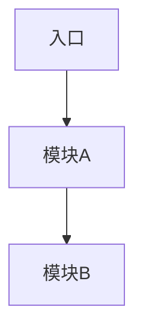

# ai-assisted-learning Skill 设计文档

> 日期：2026-05-07
> 状态：待实施
> 作者：Kimi Code CLI

---

## 1. 项目背景

用户是 Java/React/DevOps 全栈开发者，转向全栈 Agent 工程师。知识库基于 Obsidian + Quartz + Cloudflare Pages，已部署至 `notes.tsukino.dev`。

用户的核心痛点：
- 阅读英文论文/长文耗时且困难
- 学习开源仓库源码不知从何入手
- 学习内容难以结构化沉淀到知识库

---

## 2. 目标

创建一个 Kimi Skill `ai-assisted-learning`，实现：

1. **统一入口**：用户发送任意 URL，自动判断是文章还是 GitHub 仓库
2. **AI 预处理**：自动读取/克隆内容，生成摘要或仓库鸟瞰图
3. **对话学习**：支持多种学习模式（苏格拉底/导师/连接/辩论/架构/功能/问题）
4. **结构化笔记**：生成符合知识库模板的 Markdown 笔记
5. **自动归档**：保存原文到 `_refs/`，笔记存入 `content/`，自动 git 提交

---

## 3. 架构设计

### 3.1 Skill 位置

```
.agents/skills/ai-assisted-learning/
├── SKILL.md                              # 统一入口 + 工作流框架
└── references/
    ├── article-learning-guide.md         # 文章路径详细指南
    ├── repo-learning-guide.md            # 仓库路径详细指南
    ├── article-note-template.md          # 文章笔记模板
    └── repo-note-template.md             # 源码笔记模板
```

### 3.2 自动判断逻辑

```
用户发送 URL
    ↓
URL 匹配 github.com/{user}/{repo} 模式？
    ├── YES → 仓库学习路径
    │         - git clone --depth 1
    │         - 删除 .git/
    │         - 保存到 _refs/repos/<name>/
    │         - 加载 references/repo-learning-guide.md
    │
    └── NO  → 文章学习路径
              - FetchURL 读取
              - 保存到 _refs/articles/<date>-<slug>.md
              - 加载 references/article-learning-guide.md
```

### 3.3 统一工作流骨架

```
阶段 1：接收 URL → 自动判断类型
阶段 2：获取内容 → 保存到 _refs/
阶段 3：预处理    → 摘要/鸟瞰图
阶段 4：对话学习  → 多轮问答（模式可选）
阶段 5：生成笔记  → 选择对应模板
阶段 6：自动提交  → git add → commit → push
```

---

## 4. 文章学习路径

### 4.1 获取与保存

- `FetchURL` 读取原文
- 保存到 `_refs/articles/<YYYY-MM-DD>-<slug>.md`
- 生成电梯演讲摘要（核心论点 + 3 个关键洞察）

### 4.2 学习模式

| 模式 | AI 角色 | 适合场景 |
|---|---|---|
| **苏格拉底式** | 提问者 | 概念性内容，引导用户自己推导 |
| **导师式** | 讲解者 | 技术性内容，类比和图解 |
| **连接式** | 地图绘制者 | 综述性内容，关联已有笔记 |
| **辩论式** | 对手 | 有争议的观点，检验理解 |

### 4.3 笔记模板

- 一句话总结
- 核心概念（3-5 个）
- 关键洞察（原文亮点 + 个人延伸）
- 与我已有知识的联系（`[[笔记链接]]`）
- 待深入研究
- 个人思考

### 4.4 目录自动分配

| 内容关键词 | 目标目录 |
|---|---|
| Transformer/Attention/LLM 原理 | `10-LLM基础/` |
| RAG/Embedding/向量 | `20-RAG工程/` |
| Agent/LangGraph/MCP/Tool | `30-Agent工程/` |
| 源码/AI Coding | `40-AI编码与源码/` |
| Java/Spring Boot | `50-后端/` |
| React/前端 | `60-前端/` |
| Docker/K8s/DevOps | `70-DevOps/` |
| 不确定 | `00-入门与路线图/` |

---

## 5. 仓库学习路径

### 5.1 获取与保存

- `git clone --depth 1 <url> _refs/repos/<repo-name>/`
- `rm -rf _refs/repos/<repo-name>/.git/`
- 分析目录结构 + README + 关键文件

### 5.2 学习视角

| 视角 | 路径 | 输出 |
|---|---|---|
| **架构视角** | README → 顶层目录 → 核心接口 → 模块依赖 | Mermaid 架构图 + 模块职责表 |
| **功能视角** | 功能入口 → 调用链追踪 → 关键实现 → 数据流 | Mermaid 时序图 + 核心代码片段 |
| **问题视角** | 定位相关代码 → 上下文分析 → 根因/原理 | 分析笔记 + 修复思路 |

### 5.3 笔记模板

- 仓库概览（用途、技术栈、Star 数）
- 架构图（Mermaid）
- 模块职责表
- 关键流程（时序图 + 代码片段）
- 设计决策与权衡
- 与我已有知识的联系
- 待深入研究

---

## 6. Mermaid 图表支持

Quartz 原生支持 Mermaid，笔记中可直接嵌入：

```markdown

```

Skill 指导 AI 在源码笔记中生成：
- **架构图**：模块依赖关系
- **时序图**：请求处理流程
- **流程图**：算法/业务逻辑

---

## 7. 自动提交流程

```bash
# 阶段 6 自动执行
git add content/ _refs/
git commit -m "learn(<类型>): <标题> - 笔记 + 归档"
git push origin main
```

---

## 8. 成功标准

- [ ] Skill 能被正确触发（发送 URL 自动识别）
- [ ] 文章 URL 走文章路径，生成概念笔记
- [ ] 仓库 URL 走仓库路径，生成源码笔记（含 Mermaid 图）
- [ ] 原文保存到 `_refs/`，笔记保存到 `content/`
- [ ] 笔记自动链接到已有知识库内容
- [ ] 自动 git commit + push，Cloudflare Pages 更新
